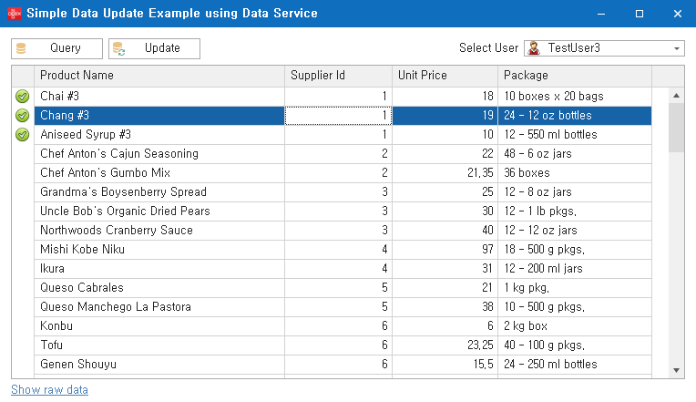

# Ambient Value Parameter

Fox Query는 개발자가 매개변수 값을 제공하지 않더라도 값이 자동으로 획득되어 쿼리가 수행될 때 사용되는 기능을 제공합니다. 이러한 매개변수를 Fox Query에서 환경 값 매개변수(Ambient Value Parameter)라고 부릅니다. 환경 값으로 사용될 수 있는 예는 현재 로그인 된 사용자 아이디, Fox Query가 수행되는 서버의 이름 등이 될 수 있습니다. 환경 값 매개변수를 사용하면 개발자의 관여(혹은 실수) 없이 일관된 값을 쿼리에서 사용할 수 있습니다.

[환경 값 매개변수 예제 코드 보러 가기](https://github.com/NeoDEEX/Samples/tree/master/Data/FoxQuery/Ambient%20Value%20Parameter)

## 개요

DB 테이블을 설계할 때 많은 경우, 데이터의 변경 사항을 추적하기 위해 마지막으로 수정(추가)한 사용자의 아이디와 최종 변경 시간을 기록하는 컬럼을 사용합니다. 이러한 테이블에 대한 추가/수정을 수행하는 쿼리를 수행할 때에는 쿼리를 수행하는 사용자 아이디를 매개변수 값으로 전달해야 합니다. Fox Query의 환경 값 매개변수를 사용하면 개발자가 명시적으로 값을 전달하지 않더라도 시스템적으로 제공되는 환경 값들을 매개변수 값으로 사용할 수 있습니다. 다음 Fox Query는 환경 값 매개변수의 예를 보여주고 있습니다.

```xml
<statement id="AmbientSample">
    <text>
        UPDATE SomeTable
        SET
            Column1 = @Parma1,
            Column2 = @Param2,
            LastWriteUser=@UserId
    </text>
    <parameters>
        <parameter name="Param1" />
        <parameter name="Param2" />
        <parameter name="UserId" property="UserInfo.UserId" ambient="true" />
    </parameters>
</statement>
```

환경 값 매개변수는 `<parameter>` 요소의 `ambient` 속성의 값이 true로 지정된 경우 적용됩니다. `ambient` 속성이 true인 경우 Fox Query의 쿼리 매퍼는 `property` 속성이 지시하는 환경 값을 매개변수 값으로 사용합니다. 위 예제에서 `property` 속성의 값으로 사용된 `UserInfo.UserId`는 `FoxUserInfoContext.Current.UserId` 값을 나타내며 이 값이 `UserId` 매개변수의 값으로 사용됩니다.

위 예제와 같은 Fox Query를 수행하는 코드의 예는 다음과 같습니다. `AmbientSample` 쿼리에 전달되는 매개변수에서 `UserId` 매개변수가 설정되지 않았음에 주목하십시오. 코드에서 명시적으로 매개변수 값을 제공하지 않았으므로 환경 값으로 설정된 `FoxUserInfoContext.Current.UserId` 값이 `UserId` 매개변수의 값으로 사용되게 됩니다.

```csharp
var dbAccess = FoxDatabaseFactory.CreateDatabase();
var parameters = new {
    Param1 = "param1 value",
    Param2 = 2
};
dbAccess.ExecuteQueryNonQuery("MyQuery.AmbientSample", parameters)
```

## 적용 시나리오

환경 값 매개변수는 서버 측에서 비즈니스 로직 코드가 존재하는 경우 그다지 유용하지 않습니다. 하지만 서버 측에서 사용자 코드가 관여되지 않는 [Fox Data Service](/webservice/dataservice/README.md)를 사용하는 경우 유용하게 사용할 수 있습니다. 특히, Fox Data Service의 `SaveDataTable` 메서드를 호출하는 상황에서 환경 값 매개변수를 활용하는 예를 살펴보겠습니다.

### 예제 개요

다음과 같은 테이블을 Fox Data Service를 통해 조회/수정하는 간단한 WinForm 앱을 생각해 봅시다. 앱은 데이터를 조회하여 데이터 그리드를 통해 수정하고 수정 사항을 SaveDataTable 메서드를 호출하여 저장합니다. `Product` 테이블에는 각 행을 최종적으로 수정한 사용자와 시간을 기록하는 `ModifiedBy` 컬럼과 `ModifiedAt` 컬럼을 가지고 있습니다.

```sql
create table Product (
   Id                   int             identity,
   ProductName          nvarchar(50)    not null,
   SupplierId           int             not null,
   UnitPrice            decimal(12,2)   null default 0,
   Package              nvarchar(30)    null,
   IsDiscontinued       bit             not null default 0,
   ModifiedBy           nvarchar(32)    null,
   ModifiedAt           datetime        null default sysdatetime()
   constraint PK_PRODUCT primary key (Id)
)
```

[예제 코드 보러 가기](https://github.com/NeoDEEX/Samples/tree/master/Data/FoxQuery/Ambient%20Value%20Parameter)



### 문제점 소개

예제 앱은 다음 Fox Query를 수행하여 조회를 수행합니다. `ModifiedBy` 및 `ModifiedAt` 컬럼은 감사(audit)에 관련된 컬럼이므로 일반적인 조회 쿼리에는 포함되지 않습니다.

```xml
<statement id="GetProducts">
  <text>
    SELECT Id, ProductName, SupplierId, UnitPrice, Package FROM Product
  </text>
</statement>
```

변경된 데이터를 저장하는 Fox Query는 다음과 같습니다. `ModifiedBy` 컬럼 값 역시 업데이트 되어야 함에 유의하십시오.

```xml
<statement id="UpdateProduct">
  <text>
    UPDATE Product
    SET ProductName = @ProductName, SupplierId = @SupplierId, UnitPrice = @UnitPrice,
    Package = @Package, ModifiedBy = @ModifiedBy, ModifiedAt = sysdatetime()
    WHERE Id = @Id
  </text>
  <parameters>
    <parameter name="Id" dbType="int"/>
    <parameter name="ProductName" dbType="nvarchar" size="50" />
    <parameter name="SupplierId" dbType="int"/>
    <parameter name="UnitPrice" dbType="decimal" size="12" precision="2" />
    <parameter name="Package" dbType="nvarchar" size="30" />
    <parameter name="ModifiedBy" dbType="nvarchar" size="32" />
  </parameters>
</statement>
```

수정된 데이터들을 간단히 저장하는 방법으로 Fox Data Service의 `SaveDataTable` 메서드를 호출하면 됩니다. 다음 코드는 그 예를 보여줍니다.

```csharp
// Ambient Valued Parameter를 사용하지 않는 레거시 구현 방식
private async void BtnUpdate_Click(object sender, EventArgs e)
{
    // 수정된 데이터만을 포함하는 데이터 테이블 생성한다.
    var dt = grdProducts.DataSource as DataTable;
    var changedDataTable = dt.GetChanges(DataRowState.Modified);
    if (changedDataTable == null || changedDataTable.Rows.Count == 0)
    {
        return null;
    }
    // 조회 시 ModifiedBy 컬럼을 포함시키지 않았지만 저장 시
    // 사용자 아이디를 포함 시켜야 하므로 컬럼을 추가 한다.
    changedDataTable.Columns.Add("ModifiedBy", typeof(string));
    // ModifiedBy 컬럼 값 설정
    foreach (DataRow row in dt.Rows)
    {
        row["ModifiedBy"] = FoxUserInfoContext.Current?.UserId;
    }
    // Fox Data Service의 SaveDataTable 메서드를 호출한다.
    using (var client = FoxClientFactory.CreateDataClient("api/dataservice"))
    {
        var response = await client.SaveDataTableAsync(null, "Legacy.UpdateProduct", null, "Common.GetProducts", null, changedDataTable);
        grdProducts.DataSource = response.DataSet.Tables[0];
    }
}
```

위 예제코드의 문제점(?)은 `ModifiedBy` 컬럼 관련 코드가 포함되어 있다는 점 입니다. `ModifiedBy` 컬럼은 앱의 핵심 비즈니스 기능이 아닌 감사 및 로깅과 관련된 데이터이지만 **클라이언트** 개발자가 이 컬럼에 관여된 코드를 신경쓰고 코드를 작성해야 한다는 점은 개발/유지/보수에 부정적인 요소가 될 수 있습니다.

### 문제점 해결

환경 값 매개변수를 사용하여 업데이트 Fox Query를 다음과 같이 수정해 봅시다. `ModifiedBy` 매개변수에 `ambient` 속성을 추가하고 그 값을 `true`로 지정하면 됩니다.

```xml
<statement id="UpdateProduct">
  <text>
    UPDATE Product
    SET ProductName = @ProductName, SupplierId = @SupplierId, UnitPrice = @UnitPrice,
    Package = @Package, ModifiedBy = @ModifiedBy, ModifiedAt = sysdatetime()
    WHERE Id = @Id
  </text>
  <parameters>
    <parameter name="Id" dbType="int"/>
    <parameter name="ProductName" dbType="nvarchar" size="50" />
    <parameter name="SupplierId" dbType="int"/>
    <parameter name="UnitPrice" dbType="decimal" size="12" precision="2" />
    <parameter name="Package" dbType="nvarchar" size="30" />
    <parameter name="ModifiedBy" property="UserInfo.UserId" dbType="nvarchar" size="32" ambient="true"/>
  </parameters>
</statement>
```

위와 같은 Fox Query를 사용하면 클라이언트는 더 이상 `ModifiedBy` 컬럼에 관련된 코드를 작성할 필요가 없습니다. 이로써 클라이언트 개발자는 앱의 핵심적인 기능을 구현하는데에만 집중할 수 있으며 이 기능을 구현하는데 불필요한 컬럼들(이 경우 `ModifiedBy` 컬럼)을 읽어올 필요도 없습니다.

```csharp
// Ambient Valued Parameter를 사용하는 경우 구현 방식
private async void BtnUpdate_Click(object sender, EventArgs e)
{
    // 수정된 데이터만을 포함하는 데이터 테이블 생성한다.
    var dt = grdProducts.DataSource as DataTable;
    var changedDataTable = dt.GetChanges(DataRowState.Modified);
    if (changedDataTable == null || changedDataTable.Rows.Count == 0)
    {
        return null;
    }
    // Fox Data Service의 SaveDataTable 메서드를 호출한다.
    using (var client = FoxClientFactory.CreateDataClient("api/dataservice"))
    {
        var response = await client.SaveDataTableAsync(null, "Ambient.UpdateProduct", null, "Common.GetProducts", null, changedDataTable);
        grdProducts.DataSource = response.DataSet.Tables[0];
    }
}
```

## 환경 값 액세스

환경 값 매개변수는 Fox Query의 `<parameter>` 요소의 `ambient` 속성 값이 `true` 인 경우 `property` 속성이 지시하는 환경 값을 매개변수의 값을 사용하는 기능입니다. 따라서 `property` 속성의 값으로 어떤 값을 사용하는가에 따라서 환경 값으로 사용되는 매개변수의 값이 달라집니다. 환경 값을 선택하는 속성 값은 다음 포맷으로 구성됩니다.

```txt
[Ambient Value Source Name].[Key]
```

환경 값 소스 이름(Ambient Value Source Name)은 일련의 환경 값들을 제공하는 소스이며 환경 값 소스는 주어진 키(Key)에 해당하는 환경 값을 반환하게 됩니다. 위 예제에서 사용된 환경 값 속성인 `UserInfo.UserId`에서 환경 값 소스 이름이 `UserInfo`가 되며 키는 `UserId`가 됩니다.

## `UserInfo` 환경 값 소스

Fox Query는 기본적으로 `UserInfo` 환경 값 소스를 제공합니다. `UserInfo` 환경 값 소스는 현재 설정된 `FoxUserInfoContext.Current` 속성이 나타내는 `FoxUserInfoContext` 객체로부터 정보를 읽어 반환합니다. 키로서 사용될 수 있는 값은 `UserId` 이며 이 이외의 키 값은 `FoxUserInfoContext` 객체의 추가 정보를 읽는데 키 값으로 사용됩니다. 다음은 `UserInfo` 환경 값 소스를 사용하는 몇 가지 예를 보여 줍니다.

* `UserInfo.UserId` == `FoxUserInfoContext.Current.UserId`
* `UserInfo.DeptId` == `FoxUserInfoContext.Current["DeptId"]`
* `UserInfo.SomeKey` == `FoxUserInfoContext.Current["SomeKey"]`

FoxUserInfoContext.Current 속성이 설정되어 있지 않다면(null), `UserInfo` 소스를 사용하는 모든 환경 값은 null을 반환합니다.

## 환경 값 오버라이드

환경 값 매개변수는 Fox Query의 매개변수 값이 제공되지 않은 경우에만 적용됩니다. 만약 환경 값 매개변수에 대해 명시적으로 매개변수 값이 제공되는 경우 Fox Query 엔진은 환경 값을 사용하지 않고 명시적으로 제공된 값을 사용합니다.

## 사용자 정의 환경 값 소스

Fox Query는 사용자 정의 환경 값 소스를 추가할 수 있는 방법을 제공합니다. `IFoxAmbientValueSource` 인터페이스를 구현하는 객체를 작성하고 이 객체를 `FoxAmbientValueManager` 클래스를 통해 등록하면 사용자 정의 환경 값을 매개변수 값으로 사용할 수 있습니다.

### `IFoxAmbientValueSource` 인터페이스

`IFoxAmbientValueSource` 인터페이스는 환경 값 소스가 반드시 구현해야 하는 인터페이스로서 다음과 같은 정의를 갖습니다.

```csharp
public interface IFoxAmbientValueSource
{
    object GetValue(string key);
}
```

Fox Query에서 환경 값이 사용되면 `GetValue` 메서드를 호출하여 환경 값을 읽게 됩니다. `GetValue` 메서드의 매개변수로 전달되는 키 값은 환경 값 소스가 제공할 환경 값을 구분하는데 사용됩니다.

다음 코드는 `IFoxAmbientValueSource` 인터페이스를 구현하는 환경 값 소스 클래스를 구현한 예를 보여주고 있습니다.

```csharp
// 커스텀 환경 값 소스 구현 예제
public class CustomValueSource : IFoxAmbientValueSource
{
    public object GetValue(string key)
    {
        switch(key)
        {
            case "Host": return Environment.MachineName;
            case "Ip": return GetLocalIPAddress();
            case "Process": return GetProcessName();
            default:
                throw new ArgumentException($"Unknown key : {key}");
        }
    }

    private static string GetLocalIPAddress()
    {
        var host = Dns.GetHostEntry(System.Net.Dns.GetHostName());
        foreach (var ip in host.AddressList)
        {
            if (ip.AddressFamily == System.Net.Sockets.AddressFamily.InterNetwork)
            {
                return ip.ToString();
            }
        }
        return null;
    }

    private string GetProcessName()
    {
        return System.Diagnostics.Process.GetCurrentProcess().ProcessName;
    }
}
```

`CustomValueSource` 클래스는 환경 값 소스로서 웹 서버의 컴퓨터 이름, IP 등의 정보를 제공합니다. 여러 대의 웹 서버가 L4 스위치로 묶여 있는 경우 Fox Query가 수행될 서버를 클라이언트가 미리 알 수 없으므로 환경 값 매개변수를 사용하면 별도의 비즈니스 로직 코드를 작성하지 않아도 됩니다.

커스텀 환경 값 소스는 `FoxAmbientValueManager` 클래스의 `AddValueSource` 메서드를 호출하여 등록해야 합니다. `AddValueSource` 메서드를 호출할 가장 좋은 곳은 `Global.asax.cs` 입니다. 환경 값 소스를 등록할 때에는 환경 값 소스 이름을 명시해야 합니다. 다음은 그 예를 보여주고 있습니다.

```csharp
public class WebApiApplication : System.Web.HttpApplication
{
    protected void Application_Start()
    {
        // Fox Biz/Data Service configuration
        TheOne.ServiceModel.Biz.FoxBizServiceConfig.Configure();

        // Register custom ambient value source
        TheOne.Data.Extensions.FoxAmbientValueManager.AddValueSource("Env", new CustomValueSource());

        GlobalConfiguration.Configure(WebApiConfig.Register);
    }
}
```

위 예제에서 `CustomValueSource` 객체는 `Env` 라는 이름으로 등록되었습니다. 따라서 `Env.Host`, `Env.Ip` 등의 속성 값으로 Fox Query내에서 사용될 수 있습니다. 다음은 `CustomValueSource` 환경 값 소스를 사용하여 웹 서버 측의 로그 메시지를 기록하는 Fox Query의 예를 보여주고 있습니다.

```xml
<statement id="WriteServerLog">
  <text>
    INSERT INTO ServerLog(Host, IP, Process, Message) VALUES(@Host, @Ip, @ProcessName, @Message)
  </text>
  <parameters>
    <parameter name="Host" property="Env.Host" ambient="true"/>
    <parameter name="Ip" property="Env.Ip" ambient="true"/>
    <parameter name="ProcessName" property="Env.Process" ambient="true"/>
    <parameter name="Message" dbType="nvarchar"/>
  </parameters>
</statement>
```

이 쿼리를 사용하는 코드는 `Message` 매개변수만을 제공하면 됩니다. Host, Ip 등의 환경 값 매개변수의 값들은 `CustomValueSource` 클래스에 의해 제공됩니다.

```csharp
using (var client = FoxClientFactory.CreateDataClient("api/dataservice"))
{
    var request = FoxDataRequest.Create("Ambient.WriteServerLog");
    request["Message"] = "Test Server Log Message #" + Environment.TickCount;
    await client.ExecuteNonQueryAsync(request);
}
```

### `FoxAmbientValueManager` 클래스

환경 값 소스 객체는 `FoxAmbientValueManager` 클래스의 `AddValueSource` 메서드를 통해 등록되어야만 환경 값 소스로서 사용될 수 있습니다. `FoxAmbientValueManager` 클래스는 기본으로 제공되는 `UserInfo` 환경 값 소스를 생성 등록하며 Fox Query 엔진이 환경 값 매개변수의 값이 필요한 경우 환경 값 소스를 호출하여 그 값을 조회 하여 반환합니다.

환경 값을 프로그램적으로 접근해야 한다면 `FoxAmbientValueManager` 클래스의 `GetAmbientValue` 메서드를 호출할 수도 있습니다. 다음 코드는 GetAmbientValue 메서드를 호출하는 예를 보여줍니다.

```csharp
var ambientValue = FoxAmbientValueManager.GetAmbientValue("UserInfo.DeptId");
```

---
