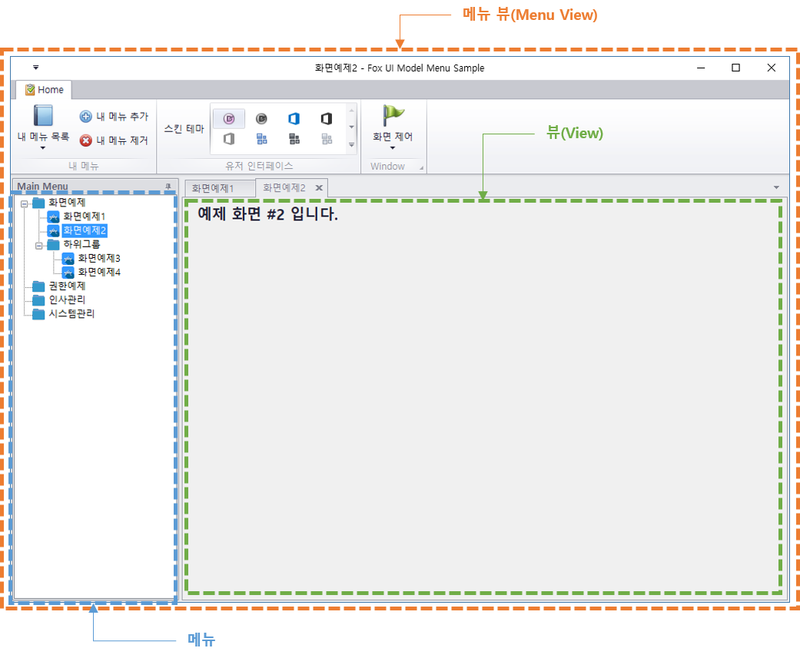

# Fox UI Model 개요

NeoDEEX 에서 사용자에게 메뉴를 제공하는 메인 화면을 메뉴 뷰(Menu View)라고 부릅니다. 메뉴 뷰는 메뉴 정보를 읽어 메뉴를 UI 적으로 화면에 표시하고 사용자가 메뉴를 선택함에 따라 해당 메뉴를 나타내는 화면을 로드하고 표시합니다. 이렇게 메뉴 선택에 의해 나타나는 개별 화면을 뷰(View)라고 부릅니다. 다음 그림은 메뉴 뷰와 뷰와의 관계를 보여주고 있습니다.

  
[그림1. 메뉴 뷰와 뷰와의 관계]

일반적으로 메뉴 뷰는 풀 다운 메뉴나 리본 메뉴를 사용하거나 트리 뷰 컨트롤을 사용하여 메뉴 정보를 UI 적으로 표시합니다. 그리고 여러 개의 뷰를 동시에 지원하는 UI 요소들을 사용합니다. 대개 MDI(Multiple Document Interface)에 기반한 UI, 혹은 탭에 기반하여 다중 뷰를 표현하며, 상용 컴포넌트에 포함된 MDI와 탭을 모두 적용하는 Tabbed MDI 컨트롤을 사용하기도 합니다.

메뉴 정보, 메뉴 뷰, 그리고 뷰는 유기적이고 복잡한 관계를 갖는 것이 일반적입니다. 또한, 개별 뷰들은 메뉴 뷰와 같은 어셈블리(EXE 혹은 DLL)내에 포함되어 있지 않은 것이 일반적입니다. 따라서 사용자가 메뉴를 선택함에 따라 적절한 DLL을 로드하고 필요로 하는 뷰 객체를 생성하는 작업도 필요합니다. 이렇게 복잡한 메뉴 화면 구성을 돕기 위해 Fox UI Model은 메뉴 정보를 로드하고 메뉴를 UI 적으로 표현하며 필요한 DLL을 로드하여 뷰를 화면 상에 표시하기 위한 기능들을 제공합니다.

Fox UI Model은 메뉴를 표시하고 메뉴 화면을 구동하기 위해 다양한 구성 요소를 사용합니다. [그림 2]는 Fox UI Model의 주요 개념을 보여 줍니다.

  
[그림2. Fox UI Model 개념도]

Fox UI Model에서 메뉴 표시를 위한 핵심은 [FoxMenuViewModel](menuview.md/#FoxMenuViewModel) 클래스 입니다. `FoxMenuViewModel` 객체는 메뉴를 표시하는 메인 화면에 의해 생성되고 메뉴 데이터를 읽어 메뉴 데이터 구조를 구축하며 메뉴 데이터 구조로부터 메뉴를 화면에 표시하도록 해줍니다. 또한, 메뉴가 선택되면 메뉴가 지시하는 DLL 을 로드하여 화면 클래스의 인스턴스를 생성해 줍니다. 메인 화면은 생성된 화면 인스턴스를 이용하여 화면 표시를 손쉽게 수행할 수 있습니다.

XML 혹은 데이터베이스에 존재하는 메뉴 데이터를 읽어 계층적인 구조를 갖추어 주기 위해 [FoxMenuManager](menudata.md#FoxMenuManager) 클래스가 제공됩니다. `FoxMenuManager` 클래스는 웹 서버 혹은 로컬 디스크에 존재하는 XML로부터 메뉴 데이터를 읽거나, `DataTable`에 존재하는 데이터를 읽어 [FoxMenuItem](menudata.md#FoxMenuItem) 객체를 생성하며 계층적인 메뉴 구조를 구축해 줍니다.

[FoxModuleLoader](moduleloader.md#FoxModuleLoader) 클래스는 `FoxMenuItem`에 기록된 URL을 이용하여 DLL을 로컬 디스크 혹은 인터넷 상에서 다운로드 하고 메모리에 적재합니다. 또한 `FoxMenuItem` 클래스에 기록된 클래스 정보를 사용하여 메뉴에 해당하는 화면 객체([IFoxView](view.md#IFoxView) 인터페이스를 구현하는 `Form`, 혹은 WPF `Window` 클래스)를 생성하여 반환합니다.

Fox UI Model은 특정 클라이언트 플랫폼에 종속되지 않습니다. 즉, WinForm, WPF, Web 등의 프리젠테이션 플랫폼에 무관하게 사용할 수 있는 클래스 라이브러리 입니다. 또한 한 종류의 메뉴 스타일을 강요하지 않습니다. 이런 이유에서 실제 메뉴 UI를 표시하는 클래스는 Fox UI Model에 포함되어 있지 않습니다. 따라서 메인 폼은 개발자가 작성해야 합니다. 하지만 개발자는 아주 적은 노력으로 메뉴 시스템을 구성할 수 있습니다.

---