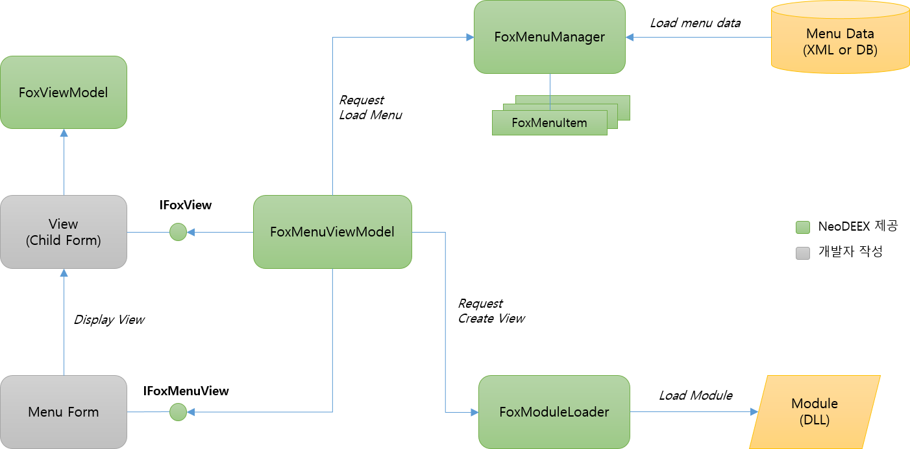

# Fox UI Model

사용자가 응용 프로그램을 사용하기 위해서는 일련의 메뉴 체계가 필요하고 이 메뉴 체계로부터 어떤 메뉴를 선택했을 때 메뉴에 해당하는 화면이 구동 되어야 합니다. 따라서 응용 프로그램은 어떤 메뉴들이 어떠한 구조로 구성되어 있는지를 관리할 수 있어야 하고, 이들 메뉴를 다양한 형태(풀다운 메뉴, 트리 메뉴, 리본 메뉴 등)로 표시할 수 있어야 하며, 메뉴가 선택되었을 때 해당 메뉴를 나타내는 화면을 표시할 수 있도록 체계를 갖추어야 합니다.

NeoDEEX에서 제공하는 **Fox UI Model은 클라이언트가 메뉴들을 관리하고 표시하며, 메뉴가 선택되었을 때 화면을 로드하고 표시할 수 있는 프레임워크를 제공**합니다. 메뉴를 로드하고 계층적으로 관리할 수 있는 `FoxMenuManager` 클래스, 메뉴와 대응되는 화면을 담고 있는 DLL을 로드하고 화면의 인스턴스를 생성할 수 있는 `FoxModuleLoader` 클래스, 화면을 나타내는 `IFoxView` 인터페이스, 그리고 이들을 서로 유기적으로 연결해 주는 `FoxMenuViewModel` 클래스를 이용하면 빠르게 계층적인 메뉴 데이터를 구축하고 메뉴를 표시하는 메인 어플리케이션과 개별 화면을 손쉽게 연결 할 수 있습니다.

## 개요

NeoDEEX 에서 사용자에게 메뉴를 제공하는 메인 화면을 메뉴 뷰(Menu View)라고 부릅니다. 메뉴 뷰는 메뉴 정보를 읽어 메뉴를 UI 적으로 화면에 표시하고 사용자가 메뉴를 선택함에 따라 해당 메뉴를 나타내는 화면을 로드하고 표시합니다. 이렇게 메뉴 선택에 의해 나타나는 개별 화면을 뷰(View)라고 부릅니다. 다음 그림은 메뉴 뷰와 뷰와의 관계를 보여주고 있습니다.

  
[그림1. 메뉴 뷰와 뷰와의 관계]

일반적으로 메뉴 뷰는 풀 다운 메뉴나 리본 메뉴를 사용하거나 트리 뷰 컨트롤을 사용하여 메뉴 정보를 UI 적으로 표시합니다. 그리고 여러 개의 뷰를 동시에 지원하는 UI 요소들을 사용합니다. 대개 MDI(Multiple Document Interface)에 기반한 UI, 혹은 탭에 기반하여 다중 뷰를 표현하며, 상용 컴포넌트에 포함된 MDI와 탭을 모두 적용하는 Tabbed MDI 컨트롤을 사용하기도 합니다.

메뉴 정보, 메뉴 뷰, 그리고 뷰는 유기적이고 복잡한 관계를 갖는 것이 일반적입니다. 또한, 개별 뷰들은 메뉴 뷰와 같은 어셈블리(EXE 혹은 DLL)내에 포함되어 있지 않은 것이 일반적입니다. 따라서 사용자가 메뉴를 선택함에 따라 적절한 DLL을 로드하고 필요로 하는 뷰 객체를 생성하는 작업도 필요합니다. 이렇게 복잡한 메뉴 화면 구성을 돕기 위해 Fox UI Model은 메뉴 정보를 로드하고 메뉴를 UI 적으로 표현하며 필요한 DLL을 로드하여 뷰를 화면 상에 표시하기 위한 기능들을 제공합니다.

Fox UI Model은 메뉴를 표시하고 메뉴 화면을 구동하기 위해 다양한 구성 요소를 사용합니다. [그림 2]는 Fox UI Model의 주요 개념을 보여 줍니다.

  
[그림2. Fox UI Model 개념도]

Fox UI Model에서 메뉴 표시를 위한 핵심은 [FoxMenuViewModel](menuview.md/#FoxMenuViewModel) 클래스 입니다. `FoxMenuViewModel` 객체는 메뉴 데이터를 읽어 메뉴 데이터 구조를 구축하고 메뉴 뷰가 메뉴를 화면에 표시하도록 해줍니다. 또한, 메뉴가 선택되면 해당 메뉴가 지시하는 DLL 을 로드하여 뷰의 인스턴스를 생성해 줍니다. 메뉴 뷰는 생성된 화면 인스턴스를 이용하여 화면 표시를 손쉽게 수행할 수 있습니다.

XML 혹은 데이터베이스에 존재하는 메뉴 데이터를 읽어 계층적인 구조를 구성하고 관리하기 위해 [FoxMenuManager](menudata.md#FoxMenuManager) 클래스가 제공됩니다. `FoxMenuManager` 클래스는 웹 서버 혹은 로컬 디스크에 존재하는 [메뉴 XML](menudata.md#메뉴-XML)로부터 메뉴 데이터를 읽거나, `DataTable`에 존재하는 데이터를 읽어 [FoxMenuItem](menudata.md#FoxMenuItem) 객체를 생성하며 계층적인 메뉴 구조를 구축해 줍니다.

[FoxModuleLoader](moduleloader.md#FoxModuleLoader) 클래스는 `FoxMenuItem`에 기록된 URL을 이용하여 DLL을 로컬 디스크 혹은 인터넷 상에서 다운로드 하고 메모리에 적재합니다. 또한 `FoxMenuItem` 클래스에 기록된 클래스 정보를 사용하여 메뉴에 해당하는 뷰([IFoxView](view.md#IFoxView) 인터페이스를 구현하는 `Form`, 혹은 WPF `Window` 클래스)를 생성하여 반환합니다. 이렇게 생성된 뷰는 [IFoxMenuView](menuview.md#IFoxMenuView) 인터페이스를 구현하는 메뉴 뷰에 의해 화면에 표시됩니다.

Fox UI Model은 특정 클라이언트 플랫폼에 종속되지 않습니다. 즉, WinForm, WPF, Web 등의 프리젠테이션 플랫폼에 무관하게 사용할 수 있는 클래스 라이브러리 입니다. 또한 한 종류의 메뉴 스타일을 강요하지 않습니다. 이런 이유에서 실제 메뉴 UI를 표시하는 클래스는 Fox UI Model에 포함되어 있지 않습니다. 따라서 메인 폼은 개발자가 작성해야 합니다. 하지만 개발자는 아주 적은 노력으로 메뉴 시스템을 구성할 수 있습니다.

## Fox UI Model 주요 내용

* [메뉴 작성 튜토리얼](tutorial.md)

    Fox UI Model을 사용하여 Windows Forms 환경에서 메뉴를 구성하는 방법 및 예제 코드를 단계적으로 설명합니다.

* [메뉴 데이터 구성](menudata.md)

    Fox UI Model의 메뉴 데이터(메뉴 XML)가 어떻게 구성되는지 설명하고 메뉴 데이터가 기록되는 `FoxMenuItem` 객체와 메뉴 관리자인 `FoxMenuManager`에 대해서 설명합니다.

* [메뉴 뷰](menuview.md)

    메뉴를 표시하는 메뉴 뷰(Menu View)를 구현하기 위한 `IFoxMenuView` 인터페이스와 메뉴를 제어하는 컨트롤러인 `FoxMenuViewModel` 클래스에 대해 상세히 설명합니다.

* [모듈 로더](moduleloader.md)

    모듈 로더인 `FoxModuleLoader` 클래스가 어떻게 DLL을 인터넷 혹은 로컬 디스크에서 로드하는지 설명하고, Fox UI Model을 사용하여 어플리케이션을 배포하는 방식에 대해 간략히 설명합니다.

* [뷰(View)](view.md)

    메뉴 화면인 뷰를 나타내는 `FoxViewModel` 클래스와 뷰의 기본 조건인 `IFoxView` 인터페이스에 대해 상세히 설명하고, 메뉴 네비게이션 기능을 설명합니다.

## Summary

NeoDEEX는 Fox UI Model을 통해 WinForm, WPF 등 UI 프레임워크에 독립적으로 메뉴 데이터를 읽어 계층 구조로 구성하고 사용자의 메뉴 선택에 따라 화면(뷰)을 담고 있는 어셈블리(DLL)을 로드하고 화면 객체를 생성하여 표시하는데 필요한 코드 뼈대를 제공합니다.

Fox UI Model 에서 메뉴와 뷰를 제어하는데 핵심적인 역할을 하는 클래스는 `FoxMenuViewModel` 입니다. `FoxMenuViewModel`은 `FoxMenuManager` 클래스를 통해 메뉴를 읽어 `FoxMenuItem` 객체의 계층적인 데이터 구조를 구성하고 메뉴를 표시하기 위한 이벤트(`DoMenuItemCreate`)를 발생합니다. `FoxMenuViewModel` 클래스는 사용자가 메뉴를 선택할 때 호출할 수 있는 `SelectMenu` 메서드를 제공하여 `FoxModuleLoader` 클래스를 호출하여 어셈블리를 로드하고 뷰를 생성합니다. 그리고 `DoViewOpen` 이벤트를 발생하여 메뉴 뷰로 하여금 뷰가 나타나도록 지시합니다. 이미 뷰가 열려 있다면 `DoViewActivate` 이벤트를 발생하여 메뉴 뷰가 열려 있는 뷰가 활성화 되도록 할 수도 있습니다.

메뉴가 선택됨에 따라 나타나는 뷰는 그 정보를 포함하는 `FoxViewModel` 객체와 1대 1로 대응되어 관리됩니다. `FoxViewModel` 객체는 뷰에 연결된 메뉴 정보, 권한 정보등을 포함하고 있으며 실제로 `FoxMenuViewModel` 클래스는 `FoxViewModel` 객체를 통해 뷰를 제어합니다. `FoxViewModel` 클래스는 뷰에 대한 정보 뿐만 아니라 메뉴들 사이를 네비게이트 할 수 있는 다양한 메서드들도 제공합니다.

개발자는 `FoxMeuViewModel`, `FoxViewModel` 클래스와 `IFoxView` 인터페이스를 통해 메뉴, 뷰의 연동을 손쉽게 관리할 수 있으며 이를 통해 강력하고 충분한 UX를 가진 메뉴 시스템을 구축할 수 있습니다.

---