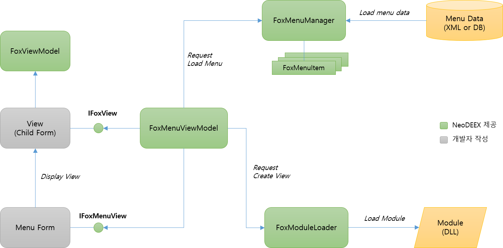
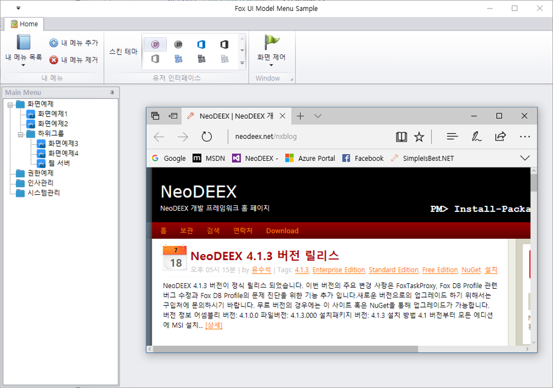
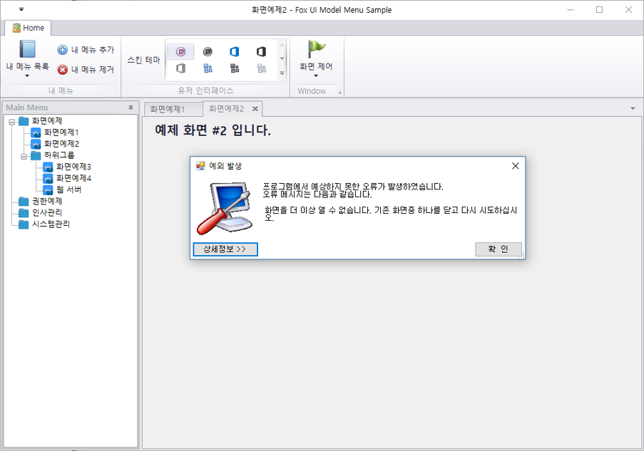

# 메뉴 뷰 (Menu View)

[Fox UI Model](introduction.md)은 메뉴를 UI 적으로 표현하는 메뉴 화면을 위한 프로그래밍 뼈대를 제공합니다. 대개 메인 화면이라 불리기도 하는 메뉴 뷰(Menu View)는 [IFoxMenuIVew](#IFoxMenuView) 인터페이스를 구현하는 UI 클래스 입니다. Windows Forms 기반의 어플리케이션이라면 `IFoxMenuView` 인터페이스를 구현하는 Form 클래스 혹은 그 파생 클래스가 메뉴 뷰 역할을 하게 되며, WPF 기반 어플리케이션 이라면 `IFoxMenuView` 인터페이스를 구현하는 Window 클래스 혹은 그 파생 클래스가 메뉴 뷰 역할을 하게 됩니다. [메뉴 작성 튜토리얼](tutorial.md)에서 `MainForm` 클래스가 바로 메뉴 뷰 입니다.

이 섹션에서는 메뉴 뷰 구현을 위해 메뉴 정보를 조직하고 사용자가 메뉴를 선택할 때 DLL을 로드하는 등의 작업을 제어하는 메뉴 뷰 모델([FoxMenuViewModel](#FoxMenuViewModel))과 메뉴 뷰를 위한 IFoxMenuView 인터페이스에 대해 살펴보도록 하겠습니다.

목차

* [IFoxMenuView 인터페이스](#IFoxMenuView)
* [FoxMenuViewModel 클래스](#FoxMenuViewModel)

## IFoxMenuView

메뉴 뷰는 `IFoxMenuView` 인터페이스를 구현하는 Windows Form의 Form, UserControl 이거나 WPF의 Window, UserConrol, Page 일 수도 있습니다. 메뉴 뷰는 `IFoxMenuView` 인터페이스를 구현하고 추후 설명할 `FoxMenuViewModel` 객체를 사용하여 메뉴를 표시하며 사용자가 메뉴를 선택함에 따라 화면을 표시 합니다.

`IFoxMenuView` 인터페이스는 다음과 같은 속성과 메서드를 가지고 있습니다.

* `CurrentViewModel` 속성

    `CurrentViewModel` 속성은 뷰 모델이 현재 표시하고 있는 뷰들 중 활성화된 뷰의 뷰 모델([FoxViewModel](view.md#FoxViewModel) 객체)을 반환합니다. 예를 들어 메뉴가 MDI 인터페이스를 사용하는 경우, `CurrentViewModel` 속성은 자식 MDI 폼들 중 현재 활성화된 폼에 연결된 `FoxViewModel` 객체를 반환하는 것입니다. `FoxViewModel` 객체는 뷰에 대한 메뉴 정보, 사용자 정보 등을 포함하는 객체 입니다. `FoxViewModel`에 대한 상세한 내용은 추후 [뷰 관련 정보](view.md)를 참고 하십시오. 다음 코드는 MDI 기반의 메뉴 뷰가 구현하는 `CurrentViewModel` 속성의 예제 입니다.

    ```csharp
    public FoxViewModel CurrentViewModel
    {
        get
        {
            var form = this.ActiveMdiChild as FoxForm;
            return form?.ViewModel;
        }
    }
    ```

* `GetView` 메서드

    매개변수로 주어진 Id를 가진 뷰 객체([IFoxView](view.md#IFoxView))를 반환합니다. `FoxViewModel`은 고유의 Id를 가지고 있으며 `FoxViewModel`은 뷰 객체와 1대 1로 대응됩니다. 주어진 Id를 가진 뷰 객체가 열려 있지 않다면 null 을 반환해야 합니다. `FoxMenuViewModel` 객체는 이 메서드를 호출하여 특정 Id를 가진 뷰가 열려 있는지 확인하거나 해당 Id를 가진 뷰를 활성화 하기도 합니다. 다음 코드는 MDI 기반의 메뉴 뷰에서 GetView 메서드를 구현하는 예제 코드 입니다.

    ```csharp
    public IFoxView GetView(string id)
    {
        foreach (IFoxView view in this.MdiChildren)
        {
            if (view.ViewModel.Id == id)
            {
                return view;
            }
        }
        return null;
    }
    ```

* `GetViewCount` 메서드

    열려 있는 뷰의 개수를 반환합니다. `FoxMenuViewModel` 객체는 이 메서드를 호출하여 열려있는 뷰의 개수를 파악하고 열수 있는 최대 뷰 개수를 초과하지 않도록 제어 합니다. 다음 코드는 MDI 기반의 메뉴 뷰에서 GetViewCount 메서드를 구현하는 예제 입니다.

    ```csharp
    public int GetViewCount()
    {
        return this.MdiChildren.Length;
    }
    ```

## FoxMenuViewModel

[Fox UI Model 개요](introduction.md)에서 살펴본 대로 메뉴 뷰가 작동하기 위해서는 다양한 클래스들의 도움을 받아야 합니다. 메뉴 정보를 담는 [FoxMenuManager](menudata.md#FoxMenuManager) 클래스, 동적으로 DLL을 로드하는 [FoxModuleLoader](moduleloader.md#FoxModuleLoader) 클래스, 뷰의 정보를 담는 [FoxViewModel](view.md#FoxViewModel) 클래스 등이 그 대표적인 예 입니다. 이러한 다양한 클래스들을 제어하는 컨트롤러 역할을 메뉴 뷰 모델이 수행합니다.

  
[Fox UI Model 개요]

`FoxMenuViewModel` 클래스는 대개 메뉴 뷰에 내부에서 인스턴스를 생성하고 관리하게 됩니다. `FoxMenuViewModel` 클래스는 메뉴 정보를 담는 [FoxMenuManager](menudata.md#FoxMenuManager) 객체를 제공하며 사용자가 메뉴를 선택하면 [FoxModuleLoader](moduleloader.md#FoxModuleLoader) 객체를 통해 DLL을 로드하고 [뷰(개별 화면)](view.md) 객체를 생성하고 `DoOpenView` 이벤트를 발생시켜 메뉴 뷰가 화면을 표시하도록 제어 합니다.

다음은 `FoxMenuViewModel` 클래스의 주요 속성/메서드/이벤트들 입니다.

* `MenuManager` 속성

    `FoxMenuManager` 클래스의 인스턴스를 제공합니다. `FoxMenuViewModel` 클래스는 기본적으로 `FoxMenuManager` 클래스의 인스턴스를 새롭게 생성하며 이 속성을 통해 이 인스턴스에 접근이 가능합니다.

* `MyMenuManager` 속성

    사용자별로 커스터마이징된 내 메뉴를 저장하는 `FoxMenuManager` 객체를 제공합니다.

* `MyMenuAutoSave` 속성

    내 메뉴에 새로운 메뉴가 추가되거나 제거될 때 자동으로 내 메뉴를 저장할 것인지 여부를 설정합니다. `FoxMenuViewModel` 클래스는 기본적으로 내 메뉴를 메뉴 XML 형태로 ‘내 문서’ 폴더에 저장합니다.

    > 자동 저장 기능은 `FoxMenuViewModel` 클래스의 `AddMyMenu` 메서드와 `RemoveMyMenu` 메서드를 호출하는 경우에만 작동합니다.

* `ModuleLoader` 속성

    사용자가 메뉴를 선택했을 때 DLL을 로드 해야 하는 경우, `ModuleLoader` 속성의 `FoxModuleLoader` 클래스를 호출하여 DLL을 로드하고 뷰 객체를 생성합니다.

* `SelectMenu` 메서드

    주어진 메뉴 정보에 따라 새로운 뷰(개별 화면)를 열거나 이미 열린 뷰를 활성화(activate)하거나 서브 메뉴 확장을 수행합니다. `SelectMenu` 메서드는 메뉴 ID 혹은 `FoxMenuItem` 객체를 매개변수로 하여 작업을 수행할 대상 메뉴를 지정합니다.

    `SelectMenu` 메서드가 호출됨에 따라 `FoxMenuViewModel` 객체는 `DoViewOpen` 이벤트, `DoViewActivate` 이벤트를 발생할 수 있습니다.

* `CloseView` 메서드

    열려 있는 뷰를 닫습니다. `CloseView` 메서드가 호출됨에 따라 `FoxMenuViewModel` 객체는 `DoViewClose` 이벤트를 발생합니다.

* `MaxViewCount` 속성

    `FoxMenuViewModel` 객체가 열 수 있는 최대 뷰의 개수를 설정 합니다. `SelectMenu` 메서드가 호출될 때 `IFoxMenuView.GetViewCount` 메서드의 결과 값이 `MaxViewCount` 속성 값보다 크다면 뷰는 열리지 않고 `InvalidOperationException` 예외가 발생합니다. `MaxViewCount` 속성의 기본값은 10 입니다.

* `CurrentViewModel` 속성

    열려 있는 뷰 중에 현재 선택된 뷰에 대한 `FoxViewModel` 객체를 반환합니다. 이 속성은 메뉴 뷰가 구현하는 `IFoxMenuView.CurrentViewModel` 속성 값을 전달합니다.

### 메뉴 뷰 모델 초기화

`FoxMenuViewModel` 클래스는 대개 메뉴 뷰의 생성자 혹은 `Load` 이벤트에서 인스턴스를 생성하여 메뉴 뷰의 필드에 기록하며 메뉴 뷰와 생명 주기를 같이 합니다. `FoxMenuViewModel`을 사용하기 위해서는 적절한 초기화를 필요로 합니다. `FoxMenuViewModel`의 초기화는 `FoxMenuManager` 객체가 메뉴를 로드하도록 하고, `FoxMenuViewModel`이 제공하는 일련의 이벤트에 대해 이벤트 핸들러를 지정해야 합니다.

다음 코드는 메뉴 뷰(`MainForm` 클래스)가 `FoxMenuViewModel` 객체를 생성하고 초기화하는 예를 보여 줍니다.

```csharp
public partial class MainForm : Form, IFoxMenuView
{
    private FoxMenuViewModel _menuViewModel;

    public MainForm()
    {
        InitializeComponent();

        // ... 다른 코드 생략 ...

        _menuViewModel = new FoxMenuViewModel(this);
        _menuViewModel.DoMenuItemCreate += CreateMenuItem;
        _menuViewModel.DoViewOpen += OpenView;
        _menuViewModel.DoViewActivate += ActivateView;
        _menuViewModel.DoMyMenuRender += CreateMyMenuItem;
    }

    // ... 다른 코드 생략 ...

    private void MainForm_Shown(object sender, EventArgs e)
    {
        _menuViewModel.MenuManager.LoadMenu("MenuData.xml");
        _menuViewModel.Initialize();

        // ... 다른 코드 생략 ...
    }
}
```

메뉴 뷰 모델의 초기화는 이벤트 핸들러를 지정하고 메뉴(추가적으로 필요하다면 내 메뉴)를 로드하며 `Initialize` 메서드를 호출하는 것이 핵심입니다. 메뉴 뷰 모델의 이벤트들은 메뉴 뷰가 언제 메뉴를 UI로써 표현할 것인지, 뷰를 어떻게 화면에 나타낼지를 알아낼 수 있는 유일한 방법입니다. `Initialize` 메서드는 주 메뉴와 내 메뉴에 대한 초기화 메서드를 호출하고 `DoMenuItemCreate` 이벤트 및 `DoMyMenuRender` 이벤트를 발생합니다.

`DoMenuItemCreate` 이벤트 핸들러는 이벤트 매개변수에 주어진 메뉴 정보를 사용하여 메뉴를 UI 적으로 표현해야 합니다. 예를 들어 풀 다운 메뉴를 구성하여 메뉴를 작성하거나 트리 뷰에 트리 노드를 추가하거나, 리본 메뉴에 버튼 아이템을 추가 하는 등의 작업입니다. 다음 코드는 `DoMenuItemCreate` 이벤트 핸들러로서 `CreateMenuItem` 메서드의 예를 보여줍니다.

```csharp
// DoMenuItemCreate 이벤트 핸들러
private void CreateMenuItem(object sender, FoxMenuItemEventArgs e)
{
    var menuInfo = e.MenuInfo;
    var node = treeView1.Nodes.Add(menuInfo.DisplayTitle);
    node.Tag = menuInfo;
    node.ImageKey = "folder";
    AddChildTreeNode(node, menuInfo);
}

// 재귀적으로 트리 컨트롤에 메뉴 노드를 추가
private void AddChildTreeNode(TreeNode parentNode, FoxMenuItem parentMenuInfo)
{
    foreach(var menuInfo in parentMenuInfo.MenuItems)
    {
        var node = parentNode.Nodes.Add(menuInfo.DisplayTitle);
        node.Tag = menuInfo;
        if (menuInfo.HasItems == true)
        {
            node.ImageKey = "folder";
            AddChildTreeNode(node, menuInfo);
        }
        else
        {
            node.ImageKey = "app";
        }
    }
}
```

`DoMenuItemCreate` 이벤트에서 주의해야 할 부분이 있습니다. 이 이벤트는 `FoxMenuManager` 객체에 등록된 메뉴 계층 구조의 최상위 메뉴(루트 메뉴)에 대해 발생합니다. 예를 들어 메뉴가 5개의 루트 메뉴를 가지고 있다면 `DoMenuItemCreate` 이벤트는 5회 발생하게 됩니다. 위 코드 예제에서 `CreateMenuItem` 이벤트도 주어진 최상위 메뉴 아이템과 그 하위 아이템만을 트리 뷰 컨트롤에 추가합니다.

한편, 내 메뉴에 대한 이벤트인 `DoMyMenuRender` 이벤트는 1회만 발생합니다. 다음은 내 메뉴를 툴 바의 서브 메뉴로 추가하는 예를 보여 줍니다. `DoMenuItemCreate` 이벤트 핸들러와는 달리 내 메뉴의 최상위 메뉴 아이템들에 대해 반복문을 돌려 메뉴 아이템을 추가하고 있음에 주목하십시오.

```csharp
// DoMyMenuRender 이벤트 핸들러
private void CreateMyMenuItem(object sender, FoxMenuItemEventArgs e)
{
    toolStripDropDownButton1.DropDownItems.Clear();
    foreach (var menuInfo in _menuViewModel.MyMenuManager.RootItems)
    {
        var menuItem = new ToolStripMenuItem();
        menuItem.Text = menuInfo.DisplayTitle;
        menuItem.Tag = menuInfo;
        menuItem.Click += MenuItem_Click;
        toolStripDropDownButton1.DropDownItems.Add(menuItem);
    }
}
```

일반적으로 `FoxMenuViewModel` 객체를 생성하고 이벤트를 설정하는 코드는 생성자 혹은 Load 이벤트에서 수행합니다. 한편, 메뉴를 로드하고 `Initialize` 메서드를 호출하는 작업은 상대적으로 긴 시간이 요구될 수 있기 때문에 UI 적으로 메뉴 뷰가 나타난 이후에 호출하는 것이 좋습니다. 초기화 예제 코드에서 `Form.Shown` 이벤트는 로드 이후 메뉴 뷰 윈도우가 나타난 직후 발생하는 이벤트로서 이 이벤트 핸들러에서 메뉴를 로드하고 Initialize 메서드를 호출하고 있습니다. 이 예제에서는 적용되지 않았지만 메뉴를 로드하고 메뉴 UI를 구성하는 동안 스플래쉬 화면을 표시할 수도 있습니다. 이러한 사용자 경험을 제공하려면 메뉴 로드 및 메뉴 렌더링은 `Form.Load` 이벤트 이후에 수행하는 것이 좋습니다. 물론, 메뉴 로드와 렌더링이 매우 빠르다면 `Load` 이벤트에서 이 작업을 수행할 수도 있습니다.

`FoxMenuViewModel` 클래스의 `Initialize` 메서드를 호출하는 대신 직접 코드를 사용하여 초기화를 수행할 수도 있습니다. 다음 코드 예제는 `OnMenuItemCreate` 이벤트와 `OnRenderMyMenu` 이벤트를 사용하는 대신 직접 초기화를 수행하고 있습니다.

```csharp
public partial class MainForm : DevExpress.XtraBars.Ribbon.RibbonForm, IFoxMenuView
{
    private FoxMenuViewModel _menuViewModel;

    public MainForm()
    {
        InitializeComponent();

        _menuViewModel = new FoxMenuViewModel(this);
        _menuViewModel.DoViewOpen += OpenView;
        _menuViewModel.DoViewActivate += ActivateView;
    }

    private void MainForm_Shown(object sender, EventArgs e)
    {
        _menuViewModel.MenuManager.LoadMenu("MenuData.xml");

        var myMenuFile = "MyMenu.xml";
        _menuViewModel.MyMenuManager.Location = myMenuFile;
        _menuViewModel.MyMenuManager.LoadMenu(myMenuFile);
        _menuViewModel.MyMenuAutoSave = true;
        // 메인 메뉴 표시
        CreateMenuItem();
        // 내 메뉴 표시
        CreateMyMenuItem();
    }

    private void CreateMenuItem()
    {
        foreach (var menuInfo in _menuViewModel.MenuManager.RootItems)
        {
            var node = treeView1.Nodes.Add(menuInfo.DisplayTitle);
            node.Tag = menuInfo;
            node.ImageKey = "folder";
            AddChildTreeNode(node, menuInfo);
        }
    }

    private void CreateMyMenuItem()
    {
        barSubItem1.ItemLinks.Clear();
        foreach (var menuInfo in _menuViewModel.MyMenuManager.RootItems)
        {
            var item = new BarButtonItem();
            item.Caption = menuInfo.DisplayTitle;
            item.Tag = menuInfo;
            item.ItemClick += (s, arg) =>
            {
                var mi = arg.Item.Tag as FoxMenuItem;
                _menuViewModel.SelectMenu(mi);
            };
            barSubItem1.ItemLinks.Add(item);
        }
    }
}
```

위와 같이 직접 초기화를 수행하는 경우, 개발자가 자유로운 순서로 메뉴 뷰와 메뉴 뷰 모델을 초기화할 수 있습니다. 하지만 `FoxMenuViewModel`이 제공하는 다양한 자동 기능들은 정상적으로 작동하지 않을 수 있으며 개발자가 해당 기능을 직접 구현해야 합니다. 예를 들어 위와 같은 코드에서 내 메뉴에 새로운 항목이 추가되는 경우 `DoRenderMyMenu` 이벤트가 발생합니다. 하지만 이 이벤트를 사용하여 내 메뉴를 업데이트 하지 않기 때문에, 내 메뉴 추가 기능을 작성할 때 내 메뉴를 다시 구성하는 코드를 작성해야 합니다.

### 메뉴 Action - Open

메뉴 뷰가 메뉴 정보를 풀 다운 메뉴, 리본 메뉴, 트리 뷰 등의 UI 적인 수단을 사용하여 표시하고 사용자가 메뉴를 선택함에 따라 메뉴 뷰는 메뉴에 알맞은 행동을 취해야 합니다. 이는 `FoxMenuItem` 객체의 `Action` 속성에 의해 결정됩니다. 메뉴 뷰 모델이 이러한 작업을 처리해 주는 `SelectMenu` 메서드를 제공합니다. 따라서 메뉴 뷰는 메뉴가 선택됨에 따라 이 메뉴와 연결되어 있는 `FoxMenuItem` 객체를 구해내고 이 객체를 이용하여 `SelectMenu` 메서드를 호출하면 됩니다. 다음 코드는 풀 다운 메뉴를 사용하는 메뉴 뷰에서 메뉴 아이템이 클릭되었을 때 메뉴 뷰 모델의 `SelectMenu` 메서드를 호출하는 예를 보여주는 코드 입니다.

```csharp
private void MenuItem_Click(object sender, EventArgs e)
{
    var menuItem = (ToolStripMenuItem)sender;
    var menuInfo = menuItem?.Tag as FoxMenuItem;
    if (menuInfo != null)
    {
        _menuViewModel.SelectMenu(menuInfo, true);
    }
}
```

`SelectMenu` 메서드는 `FoxMenuItem` 객체의 `Action` 속성 값에 따라서 서로 다른 작업을 수행합니다. `Action` 속성 값이 `Open`이면 `SelectMenu` 메서드는 `FoxMenuItem` 객체의 `Url` 속성 및 `ClassName` 속성 값을 사용하여 DLL을 로드하고 뷰 객체를 생성합니다. 그리고 이 뷰 객체에 대한 정보를 포함하는 [FoxViewModel](view.md#FoxViewModel) 객체를 생성하고 `DoOpenView` 이벤트를 발생시킵니다. 메뉴 뷰는 `DoOpenView` 이벤트 핸들러를 구현하여 이벤트 매개변수로 전달된 `FoxViewModel` 객체를 통해 뷰를 UI로 표현하게 됩니다.

다음 코드는 `DoOpenView` 이벤트 핸들러의 예를 보여주고 있습니다. 이벤트 매개변수의 `ViewModel` 속성이 바로 `FoxViewModel` 객체 입니다. 그리고 `FoxViewModel` 객체의 `View` 속성이 뷰를 나타내는 [IFoxView](view.md#IFoxView) 인터페이스입니다. 위 코드는 생성된 뷰 객체를 `FoxForm` 객체로 변환하고 MDI 인터페이스를 사용하여 뷰를 표시하고 있습니다. `FoxViewModel` 클래스와 `IFxView` 인터페이스에 대한 상세한 내용은 [뷰(View)](view.md) 항목을 참고하십시오.

```csharp
private void OpenView(object sender, FoxViewEventArgs e)
{
    var form = (FoxForm)e.ViewModel.View;
    form.Text = e.ViewModel.MenuInfo.DisplayTitle;
    form.MdiParent = this;
    form.Show();
}
```

`SelectMenu` 메서드의 두번째 매개변수는 동일한 뷰가 2개 이상 열릴 수 있는지를 결정합니다. 이 매개변수 값을 true로 지정하면 동일한 뷰가 여러 개 열릴 수 있습니다. 만약 이 매개변수 값을 false로 지정하면, 주어진 Id를 가진 뷰가 열려있는지 확인하고 열려 있다면 `DoViewActivate` 이벤트가 발생합니다. 이 이벤트 핸들러는 열려 있는 뷰 들 중에서 이벤트 매개변수로 전달된 뷰 모델 객체 및 뷰 객체를 이용하여 뷰를 활성화 할 수 있습니다. 다음 코드는 `DoViewActivate` 이벤트를 구현하는 방법을 보여주고 있습니다.

```csharp
_menuViewModel.DoViewActivate += ActivateView;

private void ActivateView(object sender, FoxViewEventArgs e)
{
    var form = e.ViewModel.View as FoxForm;
    if (form != null)
    {
        this.ActivateMdiChild(form);
    }
}
```

### 메뉴 Action - Expand

`FoxMenuItem` 객체의 `Action` 속성이 `Expand` 인 경우, `DoMenuItemExpand` 이벤트가 발생하게 됩니다. 트리 뷰 컨트롤이나 풀 다운 메뉴를 사용하는 경우 `Action` 속성을 `Expand`로 지정하거나 `DoMenuItemExpand` 이벤트를 사용할 필요가 없습니다. 하지만 이들 UI 컨트롤들처럼 자식 아이템을 확장하거나 축소하는 기능이 없는 UI 요소를 사용하여 메뉴를 표시하는 경우에는 `DoMenuItemExpand` 이벤트가 유용할 수 있습니다.

### 메뉴 Action - Custom

FoxMenuItem 객체의 Action 속성이 Custom 인 경우, DoMenuItemCustom 이벤트가 발생합니다. 이 이벤트를 사용하여 메뉴가 선택될 때 다양한 작업을 수행할 수 있습니다. Action 속성이 Custom 인 경우 FoxMenuItem 객체의 Url, ClassName 등의 속성값을 임의로 사용할 수 있기 때문입니다. 예를 들어 다음과 같은 메뉴 XML의 항목이 있다면,

```xml
<menuItem id="1033" title="웹 서버" action="Custom" url="http://www.neodeex.net" />
```

다음과 같이 DoMenuItemCustom 이벤트 핸들러를 작성하여 메뉴가 선택되면 메뉴 정보에 기록된 URL을 웹 브라우저에 표시할 수 있습니다.

```csharp
public partial class MainForm : DevExpress.XtraBars.Ribbon.RibbonForm, IFoxMenuView
{
    private FoxMenuViewModel _menuViewModel;

    public MainForm()
    {
        InitializeComponent();

        _menuViewModel = new FoxMenuViewModel(this);
        _menuViewModel.DoMenuItemCreate += CreateMenuItem;
        _menuViewModel.DoViewOpen += OpenView;
        _menuViewModel.DoViewActivate += ActivateView;
        _menuViewModel.DoMyMenuRender += CreateMyMenuItem;
        // Custom Action 이벤트 핸들러 지정
        _menuViewModel.DoMenuItemCustom += MenuCustomAction;
    }

    private void MenuCustomAction(object sender, FoxMenuItemEventArgs e)
    {
        var url = e.MenuInfo.Url;
        Process.Start(url);
    }
}
```

  
그림1. Fox UI Model을 사용하여 웹 페이지 구동

### 메뉴 Action - Auto

`FoxMenuItem` 객체의 `Action` 속성은 메뉴의 행동을 결정하는 중요한 속성이지만 필수 속성이 아닙니다. `Action` 속성이 지정되지 않으면 그 값은 `Auto`로 지정됩니다. `Action` 속성 값이 `Auto` 이면 `FoxMenuViewModel` 객체는 `FoxMenuItem` 객체에 하위 메뉴 객체가 없고 `Url` 속성과 `ClassName` 속성이 지정되어 있다면, Open과 동일하게 작동합니다. 만약 이 조건이 만족되지 않은 경우 `Expand`와 동일하게 작동합니다. 따라서 메뉴 XML을 작성할 때에는 굳이 `Action` 속성을 명시적으로 지정할 필요가 없습니다.

### 메뉴 통계

사용자가 어떤 메뉴를 사용하는지에 대한 통계는 어플리케이션에서 매우 중요한 자료 입니다. 이 자료를 통해 자주 사용되는 메뉴가 더 잘 노출되도록 메뉴 UI를 변경하거나, 자주 사용되지 않는 메뉴 화면들을 통폐합 하는 등의 작업을 고려해 볼 수 있습니다.

`FoxMenuViewModel` 클래스는 메뉴 화면이 열리거나 활성화, 비활성화, 닫힐 때 통계 정보를 기록할 수 있도록 `DoViewStatusChanged` 이벤트를 발생시킵니다. 이 이벤트 핸들러를 통해 어떤 사용자가 어떤 메뉴를 선택했는지 알 수 있으며 이 정보를 처리할 수 있습니다. 정보를 처리하는 방법은 어플리케이션마다 다릅니다. 권장되는 구현 방식은 메뉴 통계 정보를 비동기적으로 서버에 전송하여 데이터베이스에 기록하는 방식 입니다.

다음 코드는 [Fox Biz Service](/webservice/bizservice/introduction.md)를 사용하여 메뉴에 대한 통계 정보를 서버의 비즈니스 로직을 호출하는 `DoViewStatusChanged` 이벤트 핸들러 구현 예제 입니다.

```csharp
_menuViewModel.DoViewStatusChanged += ViewStatusChanged;

private async void ViewStatusChanged(object sender, FoxViewStatusEventArgs e)
{
    try
    {
        using (var svc = new FoxRestBizClient("api/bizservice"))
        {
            var parameters = new FoxServiceParameterCollection();
            parameters["Action"] = e.Action;
            parameters["MenuId"] = e.ViewModel.MenuId;
            parameters["Timestamp"] = DateTime.Now;
            parameters["UserId"] = FoxUserInfoContext.Current?.UserId;
            await svc.ExecuteAsync("MenuService", "WriteMenuStatistics", parameters);
        }
    }
    catch
    {
        // 통계 정보 기록 시 발생하는 오류는 무시한다.
    }
}
```

메뉴 통계가 수집되는 기준은 `FoxMenuViewModel` 클래스의 `ViewStatusFilter` 속성에 의해 결정됩니다. 이 속성은 `FoxViewStatus` 열거 타입으로써 기본 값은 `None` 으로써 통계 정보를 남기지 않습니다. 만약, 메뉴가 열리고 닫힐 때에만 만 메뉴 통계 정보를 남기고 싶다면 다음과 같이 속성을 설정하면 됩니다.

```csharp
_menuViewModel.ViewStatusFilter = FoxViewStatus.Open | FoxViewStatus.Close;
```

`Open`, `Close` 값 이외에도 `Activate`, `Deactivate` 값을 조합할 수 있습니다. `Activate`, `Deactivate`, `Close` 값은 메뉴 통계 정보에서 그 가치가 높지 않습니다. 따라서 다수의 데이터 전송이 발생하지 않도록 `Open` 만을 필터로 지정하는 것을 권장합니다.

### 뷰 제어

`FoxMenuViewModel` 클래스는 열려 있는 뷰의 개수를 한정하거나 현재 열려 있는 뷰에 대한 정보를 얻는 등 다양한 뷰 제어 기능을 가지고 있습니다. 뷰 제어 기능 중 중요한 속성은 `MaxViewCount` 속성 입니다. 이 속성 값은 `FoxMenuViewModel` 클래스가 열 수 있는 뷰의 최대 개수 입니다. 이 속성 값 이상의 뷰를 열려고 하면 `InvalidOperationException` 예외가 발생합니다.

다음 코드는 NeoDEEX 구성 설정 파일로부터 최대 뷰의 개수를 읽어 설정하는 코드의 예를 보여 줍니다.

```csharp
var maxCountString = System.Configuration.ConfigurationManager.AppSettings["MaxView"];
if (String.IsNullOrWhiteSpace(maxCountString) == false)
{
    int maxCount = _menuViewModel.MaxViewCount;
    if (Int32.TryParse(maxCountString, out maxCount) == true)
    {
        _menuViewModel.MaxViewCount = maxCount;
    }
}
```

최대 뷰의 개수를 초과하여 뷰를 열고자 할 때 발생하는 예외로 인해 어플리케이션이 종료되는 것을 막기 위해서는 `SelectMenu` 호출 시 `try~catch`를 통해 예외 처리를 수행하거나 [Fox WinForm](/winform/introduction.md)에서 제공하는 전역 예외 핸들러(`FoxExceptionHandler` 클래스)를 사용할 수 있습니다.

```csharp
[STAThread]
static void Main()
{
    Application.EnableVisualStyles();
    Application.SetCompatibleTextRenderingDefault(false);

    var mainForm = new MainForm();
    TheOne.Windows.Forms.FoxExceptionHandler.Register(mainForm);
    Application.Run(mainForm);
}
```

전역 예외 핸들러를 통해 어플리케이션 종료 대신 다음과 같은 대화 상자를 표시하게 됩니다.

  
[그림2. 화면 개수 초과 오류 화면]

열려 있는 뷰의 개수는 메뉴 뷰를 통해 구할 수 있습니다. 즉, `IFxMenuView.GetViewCount` 메서드를 호출해야 합니다. `IFxMenuView` 인터페이스는 `FoxMenuViewModel` 클래스의 `MenuView` 속성을 통해 알아 낼 수 있습니다.

---