# 메뉴 작성 튜토리얼

이 튜토리얼은 Fox UI Model을 사용하여 실제 메뉴를 작성하는 간단한 예를 통해 Fox UI Model에 대한 이해를 높이는 예제 입니다. 이 예제는 .Net Framework에 포함된 기본 WindForm 컨트롤만을 사용하여 메뉴를 구성해 하게 됩니다. 하지만 실제 프로젝트에서는 상용 3rd Party 컨트롤 슈트를 사용하여 보다 미려한 메뉴를 작성하는 것이 좋습니다.

목차

* [개요](#개요)
* [STEP 1 - 메뉴 뷰 뼈대 작성](#STEP-1---메뉴-뷰-뼈대-작성)
* [STEP 2 - 메뉴 로드 및 메뉴 표시](#STEP-2---메뉴-로드-및-메뉴-표시)
* [STEP 3 - 뷰 작성](#STEP-3---뷰-작성)
* [STEP 4 - 메뉴 선택 처리 및 뷰 표시](#STEP-4---메뉴-선택-처리-및-뷰-표시)
* [STEP Bonus - 기능 추가](#STEP-Bonus---기능-추가)

## 개요

메뉴 뷰는 [IFoxMenuView](menuview.md#IFoxMenuView) 인터페이스를 구현하는 UI 객체입니다. WinForm 환경에서는 대개 메인 폼이 `IFoxMenuView` 인터페이스를 구현하고 메뉴 뷰 역할을 수행합니다. `IFoxMenuView` 인터페이스는 몇 개의 메서드와 속성으로 구성되어 있으며 메뉴 뷰 모델([FoxMenuViewModel](menuview.md#FoxMenuViewModel) 클래스) 객체에게 메뉴 환경에 대한 정보를 제공하거나 특정 작동을 수행합니다.

메뉴 뷰의 또 하나 중요한 역할은 메뉴 뷰 모델 객체가 발생하는 다양한 이벤트에 대한 이벤트 핸들러를 제공하는 것입니다. 메뉴 뷰 모델 객체는 메뉴 렌더링, 뷰 객체 표시, 뷰 객체 활성화 등의 다양한 이벤트를 발생시킵니다. 메뉴 뷰는 이들 이벤트에 대해 이벤트 핸들러를 제공하여 메뉴를 표시하거나 메뉴 선택에 따라 화면을 표시하는 등의 작업을 수행합니다.

이 튜토리얼에서 작성할 메뉴 뷰는 풀 다운 메뉴를 사용하여 메뉴를 표시하고 메뉴가 선택됨에 따라 메뉴가 나타내는 UI 화면을 MDI(Multiple Document Interface)로 표시하게 될 것입니다. (그림1 참조)

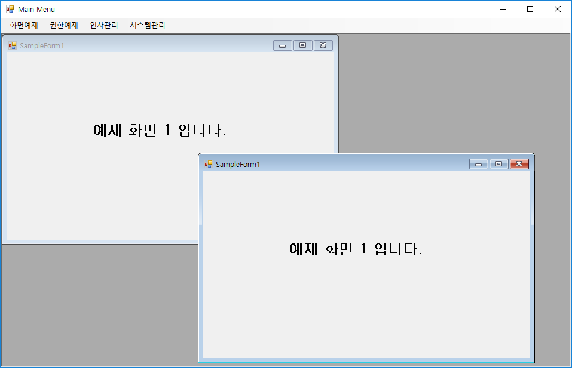  
[그림1. 예제 메뉴]

예제를 작성하기 위해 Visual Studio 에서 Windows Forms 프로젝트 템플릿을 생성합니다. 생성된 프로젝트에 다음 3개의 어셈블리를 참조합니다.

* TheOne.4.x

* TheOne.UIModel.4.x

* TheOne.Windows.Forms.4.x

> 현재 설치된 NeoDEEX의 버전에 맞는 어셈블리를 참조하십시오.

이 튜토리얼을 위해서는 3개의 어셈블리만을 참조하면 되지만 메뉴 정보를 WCF 서비스에서 읽어야 한다면 추가적으로 TheOne.ServiceModel.4.x 등을 추가적으로 참조해야 할 수도 있습니다.

그림2는 기본적인 준비를 마친 프로젝트의 구조를 보여주고 있습니다. 솔루션 이름, 프로젝트 이름, 메인 폼의 이름은 임의로 지정할 수 있습니다만 이 튜토리얼에서는 그림과 같은 이름을 사용할 것입니다. MenuSampleApp 프로젝트는 메뉴 뷰를 구현하는 WinForm EXE 프로젝트이며 UIModules 프로젝트는 메뉴에 의해 화면에 나타나게 될 화면 Form 들을 담고 있습니다.

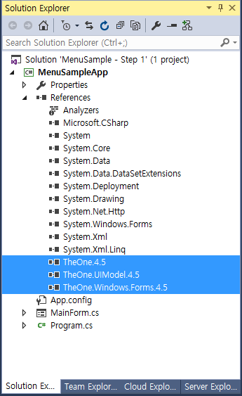  
[그림2. 프로젝트 기본 구성]

## STEP 1 - 메뉴 뷰 뼈대 작성

[STEP 1 예제 코드 보러 가기](https://github.com/NeoDEEX/Samples/tree/master/UIModel/Fox%20UI%20Model%20Sample%20-%20Step%20by%20Step%2FMenuSample%20-%20Step%201)

메뉴 뷰는 `IFoxMenuView` 인터페이스를 구현하는 UI 객체이므로 MainForm에 `IFoxMenuView` 인터페이스를 구현합니다. `TheOne.UIModel` 네임스페이스를 참조하고, `MainForm` 클래스가 `IFoxMenuView` 인터페이스를 구현하도록 다음과 같이 코드를 작성합니다.

> `IFoxMenuView` 인터페이스를 구현할 때에는 Visual Studio의 인터페이스 구현 기능을 사용하면 편리합니다.

```csharp
using TheOne.UIModel;
...... 생략 ......
public partial class MainForm : Form, IFoxMenuView
{
    public MainForm()
    {
        InitializeComponent();
    }

    #region IFoxMenuView 구현

    public FoxViewModel CurrentViewModel
    {
        get
        {
            throw new NotImplementedException();
        }
    }

    public IFoxView GetView(string id)
    {
        throw new NotImplementedException();
    }

    public int GetViewCount()
    {
        throw new NotImplementedException();
    }
    #endregion
}
```

`IFoxMenuView` 인터페이스의 속성/메서드들의 내부 구현은 일단 `NotImplementedException`을 발생하도록 해 놓습니다. 추후에 각 속성/메서드들을 차례로 구현해 나갈 것입니다.

이제, 메뉴 뷰 모델(`FoxMenuViewModel`) 객체를 생성해야 합니다. 메뉴 뷰 모델은 메뉴 뷰인 `MainForm`의 멤버 필드로 작성합니다. 이렇게 함으로써 메뉴 뷰 모델의 속성을 설정하거나 메서드를 호출하기 편리하며 메뉴 뷰 모델이 발생하는 이벤트를 손쉽게 처리할 수 있습니다.

```csharp
public partial class MainForm : Form, IFoxMenuView
{
    private FoxMenuViewModel _menuViewModel;

    public MainForm()
    {
        InitializeComponent();

        _menuViewModel = new FoxMenuViewModel(this);
    }

    #region IFoxMenuView 구현
    ...... 생략 ......
    #endregion
}
```

프로젝트를 컴파일하고 수행시켰을 때 아무런 문제가 없으면 1단계는 성공적으로 완료된 것입니다.

## STEP 2 - 메뉴 로드 및 메뉴 표시

[STEP 2 예제 코드 보러 가기](https://github.com/NeoDEEX/Samples/tree/master/UIModel/Fox%20UI%20Model%20Sample%20-%20Step%20by%20Step%2FMenuSample%20-%20Step%202)

이제 메뉴 데이터를 작성하고 로드하고 표시하는 방법에 대해 살펴볼 것입니다. Fox UI Model은 계층적인 구조의 메뉴를 위한 데이터 구조를 제공합니다. 이 데이터 구조는 `FoxMenuManager` 클래스에 의해 관리됩니다. `FoxMenuManager` 클래스는 메뉴 데이터를 로드하고 로드된 메뉴 데이터를 `FoxMenuItem` 객체의 계층 구조로 관리합니다.

Fox UI Model의 메뉴 데이터는 [메뉴 XML](menudata.md#메뉴-XML) 이라 불리는 XML로 표현됩니다. 메뉴 XML은 `<menuTree>` 요소와 `<menuItem>` 요소로 구성된 매우 간단한 스키마 구조를 가지고 있습니다. 메뉴 XML은 루트 요소로 `<menuTree>` 요소를 사용하고 하위에 중첩된 `<menuItem>` 요소를 가질 수 있습니다.

```xml
<?xml version="1.0" encoding="utf-8" ?>
<menuTree>
  <menuItem id="10" title="화면예제">
    <menuItem id="1010" title="화면예제1" />
    <menuItem id="1020" title="화면예제2" />
    <menuItem id="1030" title="하위그룹">
      <menuItem id="1031" title="화면예제3" />
      <menuItem id="1032" title="화면예제4" />
    </menuItem>
  </menuItem>
  <menuItem id="20" title="권한예제" />
  <menuItem id="30" title="인사관리" />
  <menuItem id="40" title="시스템관리"/>
</menuTree>
```

`<menuItem>` 요소의 핵심적인 속성은 `id` 입니다. 메뉴 항목들을 구분해 주는 구분자로써 메뉴 데이터(메뉴 XML)내에서 고유의 값을 가져야만 합니다. 이 외에도 `title` 속성은 메뉴를 UI로 표현하는데 사용되는 메뉴의 이름이며 `url` 속성은 메뉴 화면이 포함된 DLL의 이름을 나타냅니다. 메뉴 뷰 모델은 이 `url` 속성을 이용하여 DLL을 다운로드하고 로드하며 `class` 속성이 나타내는 클래스의 인스턴스를 생성합니다. `<menuItem>` 요소의 모든 정보는 FoxMenuItem 객체의 속성들로 표시되므로 추후 코드에서 액세스가 가능합니다.

Fox UI Model에서 메뉴 정보를 읽는 방법은 다양합니다. 로컬 XML 파일에서 메뉴를 읽어 들이거나 URL을 사용하여 서버로부터 메뉴 XML을 읽을 수도 있습니다. 서버로부터 메뉴 XML을 읽어 들이는 경우, 서버에 메뉴 XML을 미리 만들어 놓을 수도 있고 ASP.NET과 같은 서버 프로그래밍 기법을 사용하여 동적으로 메뉴 XML을 만들 수도 있습니다. 동적으로 메뉴 XML을 만드는 경우, 어플리케이션에 로그인 된 사용자의 권한에 따라 서로 다른 메뉴 XML을 반환해 줄 수도 있습니다. 혹은, 데이터베이스에서 메뉴 데이터를 `DataSet` 혹은 `DataTable` 형태로 읽은 후 `DataRow`들에서 메뉴를 읽어들일 수도 있습니다.

이 튜토리얼에서는 로컬 XML 파일을 사용하도록 하겠습니다. XML 파일을 프로젝트에 추가하고 메뉴 XML을 추가합니다. 그리고 빌드 수행 시 메뉴 XML 파일이 자동으로 복사되도록 프로젝트 설정을 다음과 같이 수행합니다.

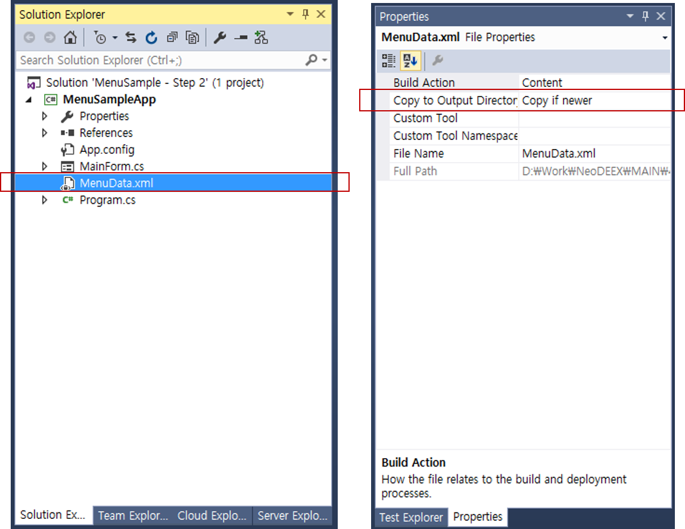  
[그림3. 메뉴 XML 파일 프로젝트 설정]

이제, 메뉴 뷰 모델 객체가 메뉴 XML을 로드하고 초기화 해야 합니다. 메뉴를 로드하고 초기화를 수행하는 가장 좋은 시점은 메인 폼이 화면에 표시되었을 때 입니다. 폼의 `Shown` 이벤트 핸들러에서 메뉴 XML을 로드하고 초기화를 수행하도록 다음과 같이 코드를 작성합니다.

```csharp
private void MainForm_Shown(object sender, EventArgs e)
{
    _menuViewModel.MenuManager.LoadMenu("MenuData.xml");
    _menuViewModel.Initialize();
}
```

로드 된 메뉴 데이터를 UI를 통해 표시하기 위해서는 메뉴 뷰 모델 객체가 발생하는 `DoCreateMenuItem` 이벤트를 처리하면 됩니다. 메뉴 뷰 모델은 FoxMenuViewModel 클래스의 `Initialize` 메서드가 호출되면 초기화를 수행하고 메뉴 뷰가 메뉴를 화면에 표시하도록 `DoCreateMenuItem` 이벤트를 발생합니다. 따라서 다음과 같이 이벤트 핸들러를 작성하면 됩니다.

```csharp
public partial class MainForm : Form, IFoxMenuView
{
    private FoxMenuViewModel _menuViewModel;

    public MainForm()
    {
        InitializeComponent();

        _menuViewModel = new FoxMenuViewModel(this);
        _menuViewModel.DoMenuItemCreate += CreateMenuItem;
    }

    #region IFoxMenuView 구현
    ...... 생략 ......
    #endregion

    private void CreateMenuItem(object sender, FoxMenuItemEventArgs e)
    {
        // e.MenuInfo 속성을 이용하여 메뉴 표시 수행
    }
    ...... 생략 ......
}
```

메뉴를 어떻게 화면상에 표시할 것인가는 어플리케이션마다 서로 다릅니다. 리본 메뉴를 사용할 수 있고, 전통적인 풀다운 메뉴나 트리 뷰 컨트롤을 사용할 수도 있습니다. 이 튜토리얼은 풀 다운 메뉴를 사용할 것이므로 MainForm에 MenuStrip 컨트롤을 추가하고 `CreateMenuItem` 메서드의 내용을 다음과 같이 추가합니다.

```csharp
    private void CreateMenuItem(object sender, FoxMenuItemEventArgs e)
    {
        var topLevelMenuItem = new ToolStripMenuItem();
        topLevelMenuItem.Text = e.MenuInfo.DisplayTitle;
        menuStrip1.Items.Add(topLevelMenuItem);
        AddChildMenuItem(topLevelMenuItem, e.MenuInfo);
    }

    private void AddChildMenuItem(ToolStripMenuItem parentMenuItem, FoxMenuItem parentMenuInfo)
    {
        foreach (var menuInfo in parentMenuInfo.MenuItems)
        {
            var menuItem = new ToolStripMenuItem();
            menuItem.Text = menuInfo.DisplayTitle;
            parentMenuItem.DropDownItems.Add(menuItem);
            AddChildMenuItem(menuItem, menuInfo);
        }
    }
```

`DoCreateMenuItem` 이벤트는 메뉴 데이터의 최상위 메뉴 항목들에 대해 여러 차례 발생합니다. 앞서 보였던 메뉴 데이터의 경우 최상위 `<menuItem>` 항목의 개수가 4개 이므로 4회의 이벤트가 발생할 것입니다. `CreateMenuItem` 이벤트 핸들러는 이벤트 매개변수인 `FoxMenuItemEventArgs` 객체의 `MenuInfo` 속성(`FoxMenuItem` 클래스 타입)을 통해 `<menuItem>` 요소의 정보들에 모두 접근이 가능합니다. 위 코드는 최상위 메뉴에 대해 `CreateMenuItem` 메서드가 호출되면 MenuStrip 컨트롤의 최상위 메뉴를 추가하고 재귀적으로(recursive) 하위 메뉴들을 추가하고 있습니다.

이제 코드를 컴파일하고 수행하면 다음과 같은 수행 결과를 얻을 수 있습니다.

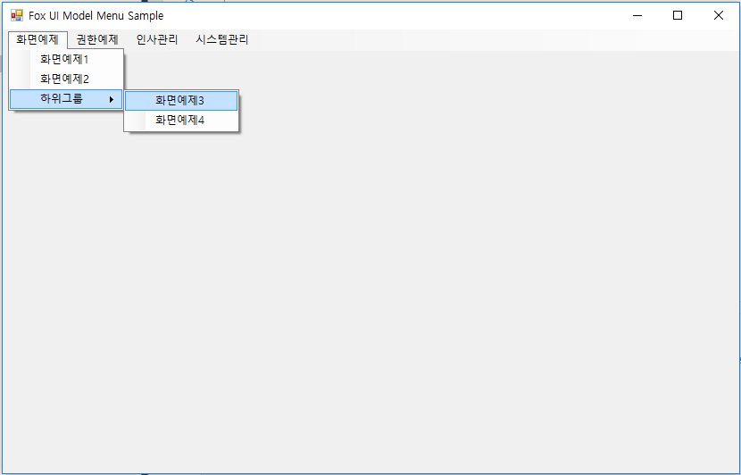  
[그림4. STEP2 수행 결과]

## STEP 3 - 뷰 작성

[STEP 3 예제 코드 보러 가기](https://github.com/NeoDEEX/Samples/tree/master/UIModel/Fox%20UI%20Model%20Sample%20-%20Step%20by%20Step%2FMenuSample%20-%20Step%203)

메뉴가 선택될 때 나타나는 개별 화면을 Fox UI Model에서는 뷰(view)라고 지칭합니다. 뷰는 [IFoxView](view.md#IFoxView) 인터페이스를 구현하는 UI 객체 입니다. WinForm 메뉴 환경이라면 `IFoxView` 인터페이스를 구현하는 `Form` 이나 `UserControl` 객체가 뷰가 될 것입니다 . 메뉴 뷰 모델(`FoxMenuViewModel`) 객체는 메뉴 정보를 통해 뷰 객체를 생성하고 뷰에 대한 정보를 뷰 모델(`FoxViewModel`) 객체에 기록하고 관리합니다. 메뉴 뷰 모델은 메뉴 뷰(`MainForm`)에게 생성된 뷰를 화면에 표시하도록 요청합니다.

> WPF라면 Window 혹은 Page 객체가 `IFoxView` 인터페이스를 구현할 수 있습니다. 하이브리드 환경에서는 메뉴 뷰가 WPF이고 뷰는 `Form` 이나 `UserControl`로 구현하는 것도 가능합니다.

뷰는 대개 별도의 DLL에 존재하게 됩니다. 이렇게 함으로써 메뉴가 선택될 때 뷰를 포함하는 DLL이 배포되고 로드 되도록 하여 필요한 경우에만 DLL이 로드 되도록 할 수 있습니다. 메뉴 뷰는 메뉴가 로드 된 이후에 어떤 뷰가 어떤 DLL에 존재하는가 알 수 있기 때문에 메뉴 뷰 프로젝트(대개 EXE)가 뷰 프로젝트를 직접 참조할 수 없는 경우가 대부분입니다. 따라서 `FoxMenuLoader` 객체가 메뉴 정보를 바탕으로 DLL을 동적으로 로드하고 뷰 객체를 생성하는 역할을 수행합니다.

이 튜토리얼에서는 별도의 DLL 프로젝트에 뷰를 생성해보도록 하겠습니다. 이를 위해 기존 솔루션에 다음과 같이 DLL 프로젝트를 추가하고 필요한 어셈블리들을 참조합니다.

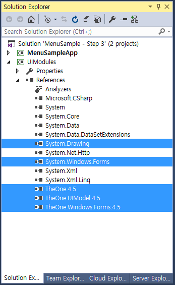  
[그림5. 솔루션에 UI 모듈 추가]

모든 뷰는 `IFoxView` 인터페이스를 구현해야 하고 이 인터페이스 구현은 동일한 경우가 많기 때문에 뷰들의 베이스 클래스를 만들고 이 베이스 클래스에서 `IFoxView` 인터페이스를 구현하는 것이 여러 모로 편리합니다. 또한 베이스 클래스는 여러 뷰들의 공통적인 기능을 구현하여 제공하는 것도 가능합니다. Fox WinForm은 `IFoxView` 인터페이스의 기본 구현을 제공하는 `FoxForm` 클래스를 제공합니다. 따라서 `Form` 기반의 어플리케이션을 제작한다면 `IFoxView` 인터페이스를 모두 구현할 필요없이 `FoxForm`에서 파생된 폼을 사용하면 편리합니다. 이 튜토리얼에서는 `FoxForm` 클래스에서 파생된 폼을 사용할 것입니다.

뷰를 작성하기 위해 UIModules 프로젝트에 새로운 폼(Form)을 추가합니다. 폼 클래스의 이름은 중요한데, 그 이유는 메뉴 XML에 이 클래스의 이름을 명시해야 하기 때문입니다. 여기서는 `SampleForm1` 이라고 사용하였으나 실제 프로젝트에서는 다수의 폼을 사용하기 때문에 찾기 쉽고 업무 화면의 연관성을 고려하여 작성하는 것이 좋습니다. 폼을 추가했으면 기본적인 디자인을 수행합니다. 이 튜토리얼은 간단한 예제이므로 `Label` 컨트롤을 올려놓고 `Label` 컨트롤의 `Text` 속성과 `Font` 속성을 설정하였습니다.

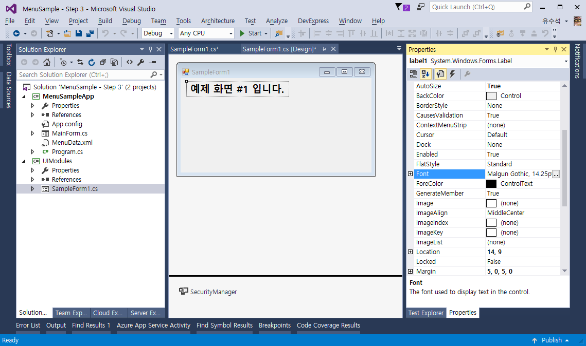  
[그림6. 폼 디자인]

이제 `SampleForm1` 클래스의 베이스 클래스를 다음과 같이 수정합니다.

```csharp
public partial class SampleForm1 : FoxForm
{
    public SampleForm1()
    {
        InitializeComponent();
    }
}
```

이 튜토리얼은 간단한 예제이므로 추가적인 코드 작성은 하지 않을 것입니다. 동일한 방법으로 `SampleForm2`, `SampleForm3`, `SampleForm4`를 작성하여 다음 단계에서 메뉴와 하는데 사용하도록 하겠습니다. 혼동을 막기 위해 각 화면의 Label 컨트롤의 Text 속성도 적절하게 수정해 주는 것이 좋습니다.

필수적인 작업은 아니지만 지금부터 설명하는 부분은 개발 시 발생할 수 있는 불필요한 혼동을 막기 위한 작업입니다. 메뉴 뷰 프로젝트(`MenuSampleApp`)와 뷰 프로젝트(`UIModules`)가 직접 참조 관계가 아니므로 빌드 순서가 명확하지 않아 테스트 및 디버깅에 혼란이 올 수 있습니다. 따라서 메뉴 뷰 프로젝트 보다 뷰 프로젝트가 먼저 빌드 되도록 다음과 같이 프로젝트 의존성(Project Dependencies) 설정을 해 두는 것이 좋습니다.

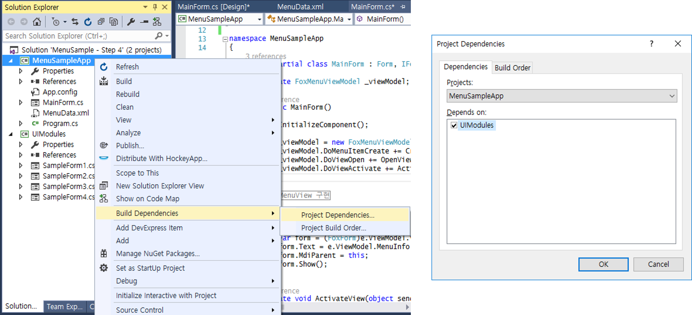  
[그림7. 프로젝트 의존 성 설정]

또한 뷰 프로젝트의 컴파일 결과(DLL)가 메뉴 뷰 프로젝트의 결과 폴더로 복사되도록 하여 메뉴 로더(`FoxMenuLoader`)가 DLL을 찾기 쉽게 하는 것이 편리합니다. 물론 메뉴 로더는 메뉴 뷰 프로젝트의 폴더로부터 상대 경로를 사용하여 뷰 프로젝트의 DLL을 참조할 수 있지만 개발 환경과 운영 환경에 따라 이 상대 경로는 달라질 수 있으므로 하드 코드로 상대 경로를 지정하는 것이 좋지 않기 때문입니다.

뷰 프로젝트의 컴파일 결과물을 Copy 하는 PostBuildEvent를 사용할 수도 있지만 이 튜토리얼에서는 뷰 프로젝트(`UIModules`)와 메뉴 뷰 프로젝트(`MenuSampleApp`)의 프로젝트 결과 폴더 설정을 다음과 같이 동일하게 설합니다.

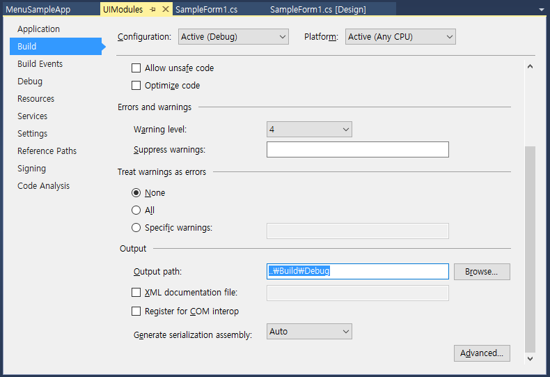  
[그림8. 프로젝트 Output 폴더 설정]

여러 프로젝트들이 결과 폴더를 하나의 폴더로 설정해 놓으면 참조 관계의 혼동을 막기 쉽고 참조 경로가 단일화 될 뿐만 아니라 디스크 공간의 중복 사용을 막을 수 있으며, 빌드 결과물을 다른 컴퓨터로 옮기는 것도 용이합니다. 다음 스크린 캡처는 출력 경로인 Build 폴더에 메인 메뉴 어플리케이션과 UI 모듈이 모두 존재하는 상황을 보여주고 있습니다.

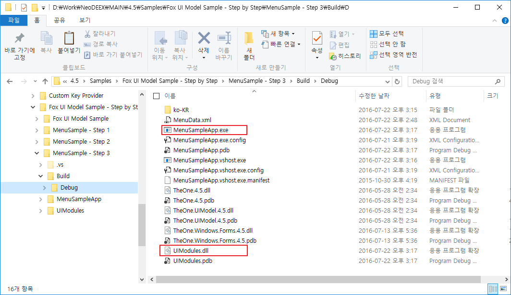  
[그림9. 빌드 결과 폴더]

## STEP 4 - 메뉴 선택 처리 및 뷰 표시

[STEP 4 예제 코드 보러 가기](https://github.com/NeoDEEX/Samples/tree/master/UIModel/Fox%20UI%20Model%20Sample%20-%20Step%20by%20Step%2FMenuSample%20-%20Step%204)

이제, 풀다운 메뉴가 선택되었을 때 해당 화면을 로드하고 표시 하도록 메뉴 뷰를 수정해 보겠습니다.

### 메뉴 XML 수정

메뉴가 선택되었을 때 어떤 화면이 로드 될 것인가는 메뉴 XML의 [`<menuItem>`](menudata.md#menuItem-요소) 요소의 `url` 속성과 `class` 속성에 의해 결정됩니다. 앞서 STEP 2에서 작성한 메뉴 XML에는 단순히 메뉴의 이름만을 표시하였었습니다. 이제 메뉴 XML을 수정하여 어떤 메뉴가 어떤 화면을 로드하는 가를 지정해 주어야 합니다. 다음은 변경된 메뉴 XML을 보여 줍니다.

```xml
<?xml version="1.0" encoding="utf-8" ?>
<menuTree>
  <menuItem id="10" title="화면예제">
    <menuItem id="1010" title="화면예제1" url="UIModules.dll" class="UIModules.SampleForm1" />
    <menuItem id="1020" title="화면예제2" url="UIModules.dll" class="UIModules.SampleForm2" />
    <menuItem id="1030" title="하위그룹">
      <menuItem id="1031" title="화면예제3" url="UIModules.dll" class="UIModules.SampleForm3" />
      <menuItem id="1032" title="화면예제4" url="UIModules.dll" class="UIModules.SampleForm4" />
    </menuItem>
  </menuItem>
  <menuItem id="20" title="권한예제" />
  <menuItem id="30" title="인사관리" />
  <menuItem id="40" title="시스템관리"/>
</menuTree>
```

위 메뉴 XML에서 ID가 1010인 “화면예제1” 메뉴는 `class` 속성을 통해 STEP3에서 만들었던 `UIModules.SampleForm1` 클래스를 로드하도록 지시하고 있습니다. 그리고 이 클래스가 존재하는 모듈은 `url` 속성을 통해 `UIModules.dll` 임을 나타냅니다.

모듈을 로드하고 클래스의 인스턴스를 생성하는 역할은 모듈 로더인 `FoxModuleLoader` 객체에 의해 수행됩니다. `FoxModuleLoader`는 url 속성이 절대 경로(URL과 로컬 파일 경로를 모두 인식 합니다)인 경우, 이 경로에서 DLL을 로드 합니다. 물론 HTTP 기반의 URL이 사용되었다면 NTD(No Touch Deployment)를 사용하여 DLL을 다운로드하고 캐시합니다.

만약 `url` 속성이 상대 경로인 경우, EXE가 어떻게 구동되었는가에 따라 기준 위치가 달라집니다. EXE가 Click-Once를 통해 배포되었다면 Click-Once에 사용된 .manifest 파일의 URL로부터 상대 경로를 사용하여 DLL을 로드 합니다. 한편, EXE가 로컬 파일 시스템에서 구동되었다면 `AppDomain`의 베이스 디렉터리(대개 EXE 파일이 존재하는 디렉터리)로부터의 상대 경로 입니다.

이 튜토리얼의 경우, STEP 3에서 `MainApp.exe` 파일과 `UIModules.dll` 파일이 동일 디렉터리에 존재하므로 상대 경로를 명시할 필요가 없습니다. 만약, STEP 3에서 출력 폴더를 바꾸지 않았다면 `url` 속성의 값은 “..\\..\\..\\UIModules\\bin\\Debug\\UIModules.dll” 이 되어야 할 것입니다.

### 메뉴 핸들러 작성

이제 풀다운 메뉴가 클릭되면 메뉴 뷰 모델(`FoxMenuViewModel`)로 하여금 해당 메뉴를 로드 하도록 지시해야 합니다. 이를 위해서는 풀다운 메뉴의 `Click` 이벤트 핸들러를 작성해야 합니다. STEP2 에서 작성했던 `AddChildMenuItem` 메서드에서 메뉴 아이템의 `Click` 이벤트 핸들러를 다음과 같이 추가합니다.

```csharp
private void AddChildMenuItem(ToolStripMenuItem parentMenuItem, FoxMenuItem parentMenuInfo)
{
    foreach (var menuInfo in parentMenuInfo.MenuItems)
    {
        var menuItem = new ToolStripMenuItem();
        menuItem.Text = menuInfo.DisplayTitle;
        menuItem.Tag = menuInfo;
        menuItem.Click += MenuItem_Click;
        parentMenuItem.DropDownItems.Add(menuItem);
        AddChildMenuItem(menuItem, menuInfo);
    }
}
```

모든 메뉴가 동일한 `Click` 이벤트 핸들러를 사용하므로 이벤트 핸들러가 어떤 메뉴인가를 파악하기 위해 `Tag` 속성에 `FoxMenuItem` 객체를 설정해 놓았음에 주목합시다. 이제 `Click` 이벤트 핸들러를 다음과 같이 작성합니다.

```csharp
private void MenuItem_Click(object sender, EventArgs e)
{
    var menuItem = (ToolStripMenuItem)sender;
    var menuInfo = menuItem?.Tag as FoxMenuItem;
    if (menuInfo != null)
    {
        _menuViewModel.SelectMenu(menuInfo);
    }
}
```

`Click` 이벤트 핸들러는 선택된 풀다운 메뉴 객체(`ToolStripMenuItem` 객체)의 `Tag` 속성에서 `FoxMenuItem` 객체를 구하고, 메뉴 뷰 모델 객체의 `SelectMenu` 메서드를 호출하여 해당 메뉴에 알맞은 행동을 수행하도록 지시합니다.

메뉴 뷰 모델 객체는 `FoxMenuItem` 객체의 `Action` 속성에 의해 메뉴 선택에 따른 적당한 행동을 수행합니다. `Action` 속성은 `<menuItem>` 요소의 `action` 속성을 통해 설정이 가능하지만 굳이 그러한 행동을 명시적으로 지정할 필요는 없습니다. 메뉴 뷰 모델 객체는 `FoxMenuItem` 객체의 `Url` 속성과 `Class` 속성의 값을 검사하여 두 속성의 값이 모두 설정된 경우, 모듈 로더(`FoxModuleLoader`)를 호출하여 모듈을 로드하고 클래스의 인스턴스를 생성하여 뷰를 생성하게 됩니다.

### DoViewOpen 이벤트 핸들러 작성

메뉴 뷰 모델 객체는 메뉴에 지정된 뷰의 인스턴스를 생성할 수 있지만 이 뷰를 메인 메뉴 내에 표시하는 방법은 알지 못합니다. 메뉴 뷰가 어떤 형태로 화면들을 관리하는지 알지 못하기 때문입니다. 따라서 메뉴 뷰 모델 객체는 `DoViewOpen` 이벤트를 발생시켜 생성한 뷰를 UI로 표시하도록 합니다. 따라서 우리는 `DoViewOpen` 이벤트에 대한 핸들러를 작성해야 합니다. 다음 코드는 `DoViewOpen` 이벤트 핸들러를 지정하고 구현하는 방법을 보여줍니다.

```csharp
public MainForm()
{
    InitializeComponent();

    _menuViewModel = new FoxMenuViewModel(this);
    _menuViewModel.DoMenuItemCreate += CreateMenuItem;
    _menuViewModel.DoViewOpen += OpenView;
}

private void OpenView(object sender, FoxViewEventArgs e)
{
    var form = (FoxForm)e.ViewModel.View;
    form.Text = e.ViewModel.MenuInfo.DisplayTitle;
    form.MdiParent = this;
    form.Show();
}
```

이 코드의 `OpenView` 메서드는 이벤트 매개변수인 `FoxViewEventArgs` 객체의 `ViewModel` 속성에서 `FoxViewModel` 객체를 획득하고 이 객체의 `View` 속성으로부터 뷰 객체를 알아냅니다. `FoxViewModel` 객체는 뷰에 대한 다양한 정보와 메뉴에 대한 정보를 가지고 있습니다. STEP 3에서 뷰를 작성할 때 뷰 객체는 `FoxForm`에서 파생된 폼 이었기 때문에 안전하게 `FoxForm` 클래스로 형 변환을 수행할 수 있습니다. 따라서 `FoxForm` 객체의 `Text` 속성과 `MdiParent` 속성을 지정하고 `Show` 메서드를 호출하여 폼을 MDI 자식 윈도우로 표시할 수 있습니다. 물론, 위 코드가 문제없이 작동하기 위해서는 먼저 메인 폼(`MainForm`)의 `IsMdiContainer` 속성의 값을 True로 지정해 주어야 합니다.

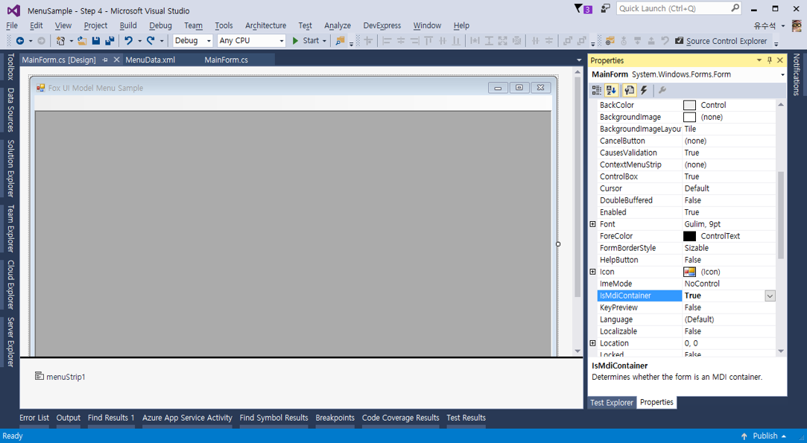  
[그림10. IsMdiContainer 속성 설정]

### IFoxMenuView 인터페이스 구현

`DoViewOpen` 이벤트 핸들러를 작성하는 것과 더불어 미루어왔던 `IFoxMenuView` 인터페이스에 대한 작성을 해야 할 차례 입니다.

메뉴 뷰 모델 객체는 뷰를 열기 전에 이미 동일한 뷰가 열려 있는지 확인합니다. 이를 위해 `IFoxMenuView` 인터페이스의 `GetView` 메서드를 호출하여 메뉴 뷰에 주어진 뷰 모델(`FoxViewModel`) Id를 가진 뷰를 반환하도록 요청합니다. 따라서 `IFoxMenuView.GetView` 메서드의 구현은 다음과 같이 구현할 수 있습니다.

```csharp
public IFoxView GetView(string id)
{
    foreach (IFoxView view in this.MdiChildren)
    {
        if (view.ViewModel.Id == id)
        {
            return view;
        }
    }
    return null;
}
```

이 튜토리얼은 MDI를 사용하므로 `MdiChildren` 속성을 통해 열려 있는 자식 폼들의 컬렉션을 알 수 있습니다. 그리고 자식 폼들은 모두 `FoxForm`에서 파생되었고 `FoxForm`은 뷰의 최소 요구 사항인 `IFoxView` 인터페이스를 구현하고 있으므로 `MdiChildren` 속성에 대해 위 코드와 같은 foreach 문을 작성할 수 있습니다. 참고로 `GetView` 메서드에 전달되는 매개변수인 id는 뷰 모델(`FoxViewModel`) 객체의 id 입니다. `FoxViewModel` 객체는 메뉴 뷰 모델 객체에 의해 생성되며 `IFoxView` 인터페이스를 통해 각 뷰가 내부적으로 유지하는 객체입니다(이 구현은 `FoxForm`에 의해 구현되어 있습니다). `GetView` 메서드는 주어진 뷰 모델 id를 가진 뷰가 존재하지 않는 경우 null을 반환해야 합니다.

메뉴 뷰 모델(`FoxMenuVewModel`) 객체는 너무 많은 뷰가 열리지 않도록 기본적인 제한을 가지고 있습니다. 이 제한은 `FoxMenuViewModel` 클래스의 `MaxViewCount` 속성에 의해 제어됩니다(디폴트 값은 10 입니다). 따라서 메뉴 뷰 모델은 현재 열려 있는 뷰의 개수를 알아낼 필요가 있고, 이를 위해 `IFoxMenuView` 인터페이스의 `GetViewCount` 메서드를 호출합니다. 이 튜토리얼은 MDI 기반이기 때문에 열려있는 뷰의 개수를 MdiChildren 속성을 통해 손쉽게 알아낼 수 있습니다.

```csharp
public int GetViewCount()
{
    return this.MdiChildren.Length;
}
```

이 튜토리얼에서는 사용하지 않지만, `IFoxMenuView` 인터페이스의 마지막 멤버인 `CurrentViewModel` 속성은 현재 활성화되어 있는 뷰를 반환하는 속성입니다. MDI 환경이라면 현재 활성화된 MDI 자식 폼과 연관된 뷰 모델 객체(`FoxViewModel`)를 반환하거나 탭 기반 다중 문서 환경이라면 현재 활성화된 탭과 연관된 뷰 모델 객체를 반환하면 됩니다.

```csharp
public FoxViewModel CurrentViewModel
{
    get
    {
        var form = this.ActiveMdiChild as FoxForm;
        return form?.ViewModel;
    }
}
```

다음은 `IFoxMenuView` 인터페이스 구현에 대한 전체 코드 입니다.

```csharp
#region IFoxMenuView 구현

public FoxViewModel CurrentViewModel
{
    get
    {
        var form = this.ActiveMdiChild as FoxForm;
        return form?.ViewModel;
    }
}

public IFoxView GetView(string id)
{
    foreach (IFoxView view in this.MdiChildren)
    {
        if (view.ViewModel.Id == id)
        {
            return view;
        }
    }
    return null;
}

public int GetViewCount()
{
    return this.MdiChildren.Length;
}

#endregion
```

### DoViewActivate 이벤트 핸들러 작성

지금까지 튜토리얼을 제대로 따라 했다면, 메뉴를 선택함에 따라 다음과 같이 화면들이 로드 되고 표시되는 것을 확인할 수 있을 것입니다.

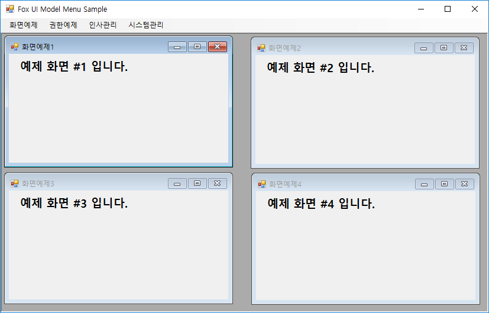  
[그림12. 여러 뷰가 열린 상황]

이렇게 뷰 들이 로드 된 상황에서 동일한 메뉴를 선택하는 경우를 생각해 봅시다. 즉, 위 스크린 캡처와 같은 상황에서 “화면예제4” 메뉴가 다시 선택되는 경우입니다. 이미 열려 있는 뷰가 존재하는 상황에서 동일한 메뉴가 선택되면 메뉴 뷰 모델은 메뉴가 지시하는 뷰를 활성화 하거나 동일한 뷰를 하나 더 로드 합니다. 기본적으로 메뉴 뷰 모델은 이미 열려 있는 뷰를 활성화하게 됩니다. 이 때 메뉴 뷰 모델 `DoViewActivate` 이벤트를 발생시켜 메뉴 뷰(MainForm)가 뷰를 활성화 할 것을 지시하게 됩니다. 앞서 `DoViewOpen` 이벤트를 구현했던 방법과 동일하게 다음과 같이 `DoViewActivate` 이벤트를 작성할 수 있습니다.

```csharp
public MainForm()
{
    InitializeComponent();

    _menuViewModel = new FoxMenuViewModel(this);
    _menuViewModel.DoMenuItemCreate += CreateMenuItem;
    _menuViewModel.DoViewOpen += OpenView;
    _menuViewModel.DoViewActivate += ActivateView;
}

private void ActivateView(object sender, FoxViewEventArgs e)
{
    var form = e.ViewModel.View as FoxForm;
    if (form != null)
    {
        form.Activate();
    }
}
```

`ActivateView` 메서드는 이벤트 매개변수인 `FoxViewEventArgs` 객체로부터 활성화 할 뷰를 알아내고 이 뷰를 `FoxForm`으로 형 변환한 후, `Activate` 메서드를 호출하여 활성화를 수행합니다. 이제 이미 열려 있는 뷰에 대한 메뉴가 다시 선택되면 해당 뷰가 활성화 될 것입니다.

열려 있는 뷰의 활성화 대신 동일한 뷰를 여러 개 열고자 한다면 `SelectMenu` 메서드 호출 시 추가적인 매개변수를 제공하면 됩니다. 다음 코드는 `FoxMenuItem` 객체가 지시하는 뷰가 이미 존재하더라도 뷰를 열도록 `SelectMenu` 메서드에 `newOpen` 매개변수에 true를 제공하고 있습니다.

```csharp
private void MenuItem_Click(object sender, EventArgs e)
{
    var menuItem = (ToolStripMenuItem)sender;
    var menuInfo = menuItem?.Tag as FoxMenuItem;
    if (menuInfo != null)
    {
        _menuViewModel.SelectMenu(menuInfo, true);
    }
}
```

위와 같이 코드를 수정하면 다음과 같이 “예제화면1” 메뉴를 반복적으로 선택하여 동일한 뷰를 여러 개 표시하는 것이 가능합니다. 이 경우, `DoViewActivate` 이벤트는 발생하지 않습니다.

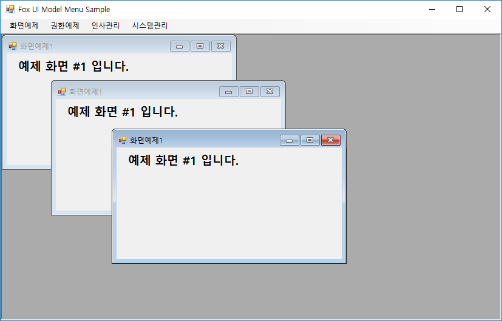  
[그림12. 동일한 뷰 열기 결과]

## STEP Bonus - 기능 추가

[STEP Bonus 예제 보러 가기](https://github.com/NeoDEEX/Samples/tree/master/UIModel/Fox%20UI%20Model%20Sample%20-%20Step%20by%20Step/MenuSample%20-%20Step%20Bonus)

지금까지의 예제는 닷넷 프레임워크의 기본 Windows Forms에 포함된 기능들 만을 사용하여 메뉴 뷰를 구성하였었습니다. 하지만 이들 기능만으로는 미려한 UI를 구성하기 어려우며 최신 트랜드의 사용자 경험(UX)을 구성하기 어렵습니다. 이번 예제는 기존 코드를 일부 수정하여 보다 미려한 메뉴 뷰를 작성해 볼 것입니다. 이 예제는 상용 컴포넌트인 DevExpress 컴포넌트를 사용할 것입니다. 이 예제에서 사용한 DevExpress 컴포넌트들은 Ribbon Control, Dock Manager, Document Manager 등 입니다. 이 문서에서 이들 컴포넌트에 대한 상세한 설명은 하지 않을 것입니다. DevExpress 컴포넌트 대신 Infragistics 나 Telerik, 그리고 ComponentOne 과 같은 상용 컴포넌트들도 모두 유사한 기능을 제공하기 때문에 어렵지 않게 비슷한 메뉴 뷰를 구성할 수 있습니다.

이 예제에서 사용할 메뉴 뷰는 다음과 같습니다. 상단에는 리본 메뉴를 가지고 있으며 전체적인 화면 레이아웃은 도킹 관리자를 사용합니다. 상단 리본 메뉴는 어플리케이션의 메뉴를 표시하지 않고 내 메뉴를 관리하는 버튼들과 DevExpress의 스킨들을 선택하는 메뉴 그리고 MDI 관리 메뉴만을 포함합니다. 좌측 패널에는 트리 뷰 컨트롤을 사용하여 메뉴를 표시하며 문서 부분은 탭과 MDI 인터페이스를 모두 지원하는 Tabbed MDI를 사용하여 뷰를 표시하고 있습니다.

> 스킨 기능과 MDI 메뉴는 특정 컴포넌트가 제공하는 고유 기능이므로 이 문서에서 설명하지 않습니다.

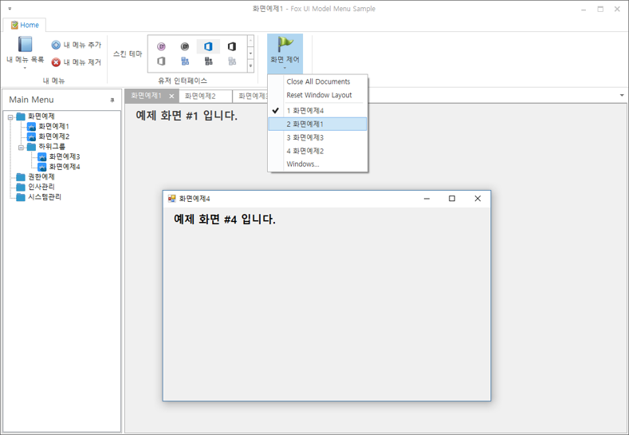  
[그림12. 미려한 UI를 갖는 메뉴 구현]

### 트리 기반 메뉴 구현

메뉴는 이전 예제와 달리 풀 다운 메뉴 대신 트리 뷰(`TreeView`) 컨트롤을 사용합니다. 다음은 트리 뷰 컨트롤을 사용하여 메뉴를 구성하는 코드를 보여 줍니다.

```csharp
private void CreateMenuItem(object sender, FoxMenuItemEventArgs e)
{
    var menuInfo = e.MenuInfo;
    var node = treeView1.Nodes.Add(menuInfo.DisplayTitle);
    node.Tag = menuInfo;
    node.ImageKey = "folder";
    AddChildTreeNode(node, menuInfo);
    if (menuInfo.Expanded)
        {
            node.Expand();
        }
}

private void AddChildTreeNode(TreeNode parentNode, FoxMenuItem parentMenuInfo)
{
    foreach(var menuInfo in parentMenuInfo.MenuItems)
    {
        var node = parentNode.Nodes.Add(menuInfo.DisplayTitle);
        node.Tag = menuInfo;
        if (menuInfo.HasItems == true)
        {
            node.ImageKey = "folder";
            AddChildTreeNode(node, menuInfo);
        }
        else
        {
            node.ImageKey = "app";
        }
        if (menuInfo.Expanded)
        {
            node.Expand();
        }
    }
}
```

메뉴 아이템과 그 하위 아이템에 대해 재귀 호출을 사용하여 트리 뷰의 노드 들을 추가하고 노드의 이미지나 확장(expand) 여부를 지정하면 됩니다. 이는 풀다운 메뉴를 구성하는 것과 매우 유사한 패턴입니다. 이처럼 메뉴 뷰가 메뉴 정보를 어떤 UI 컨트롤로 표현 하는가에 따라 코드 작성은 달라질 수 있습니다.

트리 뷰 메뉴에서 메뉴가 선택되면 호출되는 이벤트 핸들러는 다음과 같이 작성할 수 있습니다.

```csharp
private void treeView1_NodeMouseClick(object sender, TreeNodeMouseClickEventArgs e)
{
    var menuInfo = e.Node?.Tag as FoxMenuItem;
    if (menuInfo != null)
    {
        _menuViewModel.SelectMenu(menuInfo);
    }
}
```

### 내 메뉴 기능 구현

이 예제는 Fox UI Model의 개념을 이해하기 위한 간단한 예제이기 때문에, 내 메뉴 기능은 현재 열려 있는 메뉴를 내 메뉴에 포함시키거나 제거하는 방식 정도로 구현하겠습니다.

내 메뉴를 사용하는 가장 쉬운 방법은 FoxMenuViewModel 클래스의 MyMenuManager 속성을 통해 제공되는 FoxMenuManager 객체를 사용하는 것입니다. 기본적으로 FoxMenuManager가 제공하는 메뉴 로드/저장 기능을 사용할 수 있습니다.

다음 코드는 내 메뉴를 초기화하는 예를 보여 줍니다. MyMenuManager 속성에서 내 메뉴를 저장할 파일 이름을 지정하면 ‘내 문서’ 폴더에 주어진 이름의 메뉴 XML 파일이 생성됩니다.

```csharp
private void MainForm_Shown(object sender, EventArgs e)
{
    _menuViewModel.MenuManager.LoadMenu("MenuData.xml");
    _menuViewModel.MyMenuManager.Location = "MyMenu.xml";
    _menuViewModel.MyMenuAutoSave = true;
    _menuViewModel.Initialize();
}
```

내 메뉴를 UI로 표시하는 방법은 메인 메뉴를 표현하는 방법과 비슷합니다. 내 메뉴는 `DoRenderMyMenu` 이벤트를 사용할 수 있습니다. 다음 코드는 생성자에서 `FoxMenuViewModel` 객체에서 제공하는 `DoRenderMyMenu` 이벤트의 핸들러를 설정하고 DevExpress 리본 컨트롤의 리본 서브 메뉴를 사용하여 내 메뉴를 표현 하고 있습니다.

```csharp
public MainForm()
{
    InitializeComponent();

    _menuViewModel = new FoxMenuViewModel(this);
    _menuViewModel.DoMenuItemCreate += CreateMenuItem;
    _menuViewModel.DoViewOpen += OpenView;
    _menuViewModel.DoViewActivate += ActivateView;
    _menuViewModel.DoMyMenuRender += CreateMyMenuItem;
}

private void CreateMyMenuItem(object sender, FoxMenuItemEventArgs e)
{
    barSubItem1.ItemLinks.Clear();
    foreach (var menuInfo in _menuViewModel.MyMenuManager.RootItems)
    {
        var item = new BarButtonItem();
        item.Caption = menuInfo.DisplayTitle;
        item.Tag = menuInfo;
        item.ItemClick += (s, arg) =>
        {
            var mi = arg.Item.Tag as FoxMenuItem;
            _menuViewModel.SelectMenu(mi);
        };
        barSubItem1.ItemLinks.Add(item);
    }
}
```

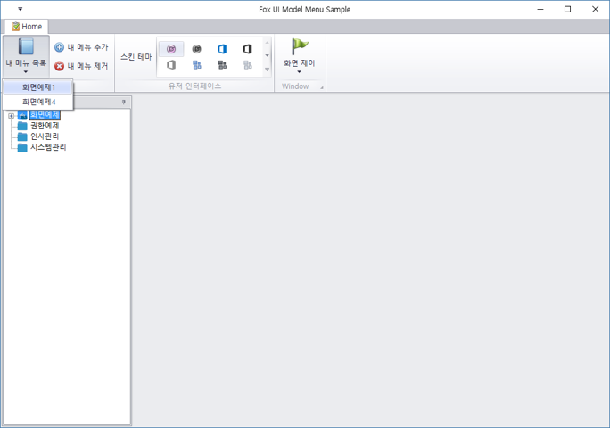  
[그림14. 구현된 내 메뉴 기능]

내 메뉴에 메뉴를 추가하거나 제거하기 위해서는 `FoxMenuViewModel`의 `MyMenuManager` 속성에 직접 `FoxMenuItem` 객체를 추가/제거하면 됩니다. 하지만 `FoxMenuViewModel`의 `AddMyMenu` 메서드와 `RemoveFromMyMenu` 메서드를 사용하면 좀 더 편리 합니다. 이들 두 메서드는 내 메뉴에 메뉴를 추가/제거해 줄 뿐만 아니라 내 메뉴가 변경됨에 따라 내 메뉴를 저장해 주며 `DoRenderMyMenu` 이벤트도 발생해 주기 때문입니다.

다음 코드는 내 메뉴 추가 버튼이 클릭될 때 발생하는 이벤트의 핸들러 코드입니다. `FoxMenuViewModel` 클래스의 `CurrentViewModel` 속성을 사용하여 현재 열려 있는 뷰에 대한 뷰 모델 정보(`FoxViewModel` 객체)를 구하고 여기에서 다시 메뉴 정보(`FoxMenuItem` 객체)를 구하여 `AddToMyMenu` 메서드를 호출하고 있습니다. 이 메서드는 새로운 메뉴 정보를 내 메뉴의 최상위 항목으로 추가해 줍니다.

```csharp
private void barButtonItem1_ItemClick(object sender, ItemClickEventArgs e)
{
    var viewModel = _menuViewModel.CurrentViewModel;
    if (viewModel != null)
    {
        _menuViewModel.AddToMyMenu(null, viewModel.MenuInfo);
    }
}
```

내 메뉴 제거 버튼의 핸들러는 다음과 같습니다. `RemoveFromMyMenu` 메서드를 호출할 때 주의할 점은 이 메서드의 매개변수가 내 메뉴에 포함된 `FoxMenuItem` 객체이어야 한다는 것입니다. 따라서 다음 예제 코드에서는 현재 열려 있는 메뉴의 Id를 사용하여 내 메뉴의 `FoxMenuManager` 객체로부터 `FoxMenuItem` 객체를 찾고 있습니다.

```csharp
private void barButtonItem2_ItemClick(object sender, ItemClickEventArgs e)
{
    var viewModel = _menuViewModel.CurrentViewModel;
    if (viewModel != null)
    {
        var menuInfo = _menuViewModel.MyMenuManager.GetMenuItem(viewModel.MenuId);
        _menuViewModel.RemoveFromMyMenu(menuInfo);
    }
}
```

### 기타 메뉴 기능 확장

다양한 어플리케이션에서 메뉴만큼이나 요구사항이 다양하고 기능이 다양한 부분을 찾기 어렵습니다. Fox UI Model은 메뉴의 가장 핵심적인 기능인 메뉴 정보를 UI으로 표현하고 사용자가 메뉴를 선택 함에 따라 알맞은 작업을 할 수 있는 프레임워크를 제공합니다.

이 예제에서 다루지 않는 메뉴의 추가적인 기능들(메뉴 바로 가기, 메뉴 검색 등등)은 어플리케이션의 요구에 맞추어 기능을 다양하게 추가할 수 있으며 이 부분은 Fox UI Model에서 커버하지 않는 영역입니다.

---