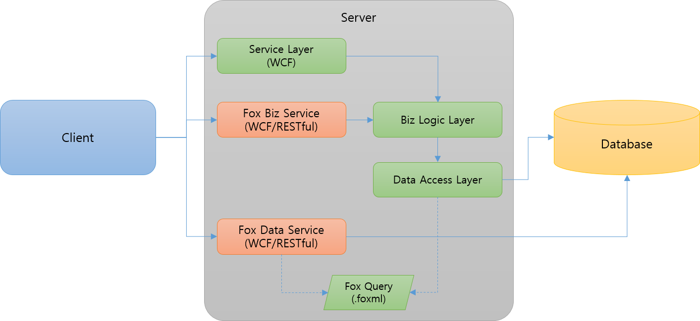

# Fox Web Services 개요

Fox Web Services는 다 계층(n-tier) 분산 어플리케이션에서 클라이언트와 서버 사이의 연결을 지원하는 NeoDEEX의 네트워킹 연결 기능입니다. Fox Web Services는 Fox Data Service를 통해 클라이언트가 DB 액세스를 손쉽게 수행할 수 있도록 해주며 Fox Biz Service를 통해 비즈니스 로직 호출에서 서비스 계층을 작성하지 않아도 되도록 해줍니다. 또한, 서비스 계층을 작성해야 할 때에도 복잡한 구성 설정 없이 WCF를 통해 서버에 접근할 수 있도록 해줍니다.

  
[그림1. Fox Web Services 개요]

이 문서는 Fox Web Services에서 제공하는 WCF 지원 기능, Fox Biz Service, Fox Data Service에 대한 설명을 제공합니다.

개발자 가이드 목차

* [전통적인 WCF 서비스 기반 어플리케이션의 문제점](wcf/problems.md)

    WCF 서비스를 작성할 때 부딛힐 수 있는 다양한 문제점들을 설명하고 Fox Web Service를 사용하여 이들 문제를 어떻게 해결할 수 있는지 설명합니다.

* [Fox Web Services를 사용하는 WCF 서비스 구성 예제](wcf/step-by-step.md)

    Fox Web Service의 기능을 사용하여 WCF 서비스를 작성하는 Step-by-Step 예제를 서비스/클라이언트로 나누어 설명합니다. 이 예제에서 Fox Web Service가 제공하는 WCF 기능들에 대한 간략한 소개와 설명을 수행합니다.

  * [How-to: WCF 서비스 구성](wcf/howto-service.md)

  * [How-to: WCF 클라이언트 구성](wcf/howto-service.md)

* [WCF 지원 기능들](wcf/features.md)

    Fox Web Service에서 제공하는 다양한 WCF 지원 기능들을 상세하게 설명합니다.

  * [서비스 호스트 팩터리](servicefactory.md)

    서비스 측에서 구성 설정을 최소화하면서 다량의 WCF 서비스를 구성하도록 해주는 서비스 호스트 팩터리에 대해 설명합니다.

  * [바인딩 맵](bindingmap.md)

    WCF 서비스와 클라이언트에서 반복적으로 사용되는 바인딩 구성 및 서비스/종점 동작(service/endpoint behavior)를 간편하게 수행할 수 있도록 해주는 바인딩 맵에 대해 설명합니다.

  * [주소 맵](addressmap.md)

    클라이언트 측에서 WCF 서비스의 주소를 간편하게 지정하여 개발자 PC/개발 서버/운영 서버 간의 전환을 손쉽게 해주는 주소 맵에 대해 설명합니다.

  * [WCF 서비스 인증](authentication.md)

    WCF 서비스 호출 시 Fox Web Service가 제공하는 클라이언트 인증 기능에 대해 설명합니다.

  * [클라이언트 팩터리(FoxClientFactory)](clientfactory.md)

    WCF 클라이언트에서 Visual Studio의 `서비스 참조(Service Reference)` 기능을 사용하지 않고도 WCF 서비스 호출이 가능하도록 해주는 FoxClientFactory 클래스의 기능을 설명합니다.

  * [메시지 압축](compress.md)

    Fox Web Service 기반의 WCF 서비스에서 송/수신되는 메시지를 압축하는 방법에 대해 설명합니다.

* [Fox Biz Service](bizservice/README.md)

  * [서버 구성](bizservice/serverconfig.md)

    * [How To : WCF 서비스 및 클라이언트 구성](bizservice/howto-wcf.md)

    * [How To : REST API 서비스 및 클라이언트 구성](bizservice/howto-rest.md)

* [Fox Data Service](dataservice/README.md)

  * [서버 구성](dataservice/serverconfig.md)

    * [How To : WCF 서비스 및 클라이언트 구성](dataservice/howto-wcf.md)

    * [How To : REST API 서비스 및 클라이언트 구성](dataservice/howto-rest.md)

---