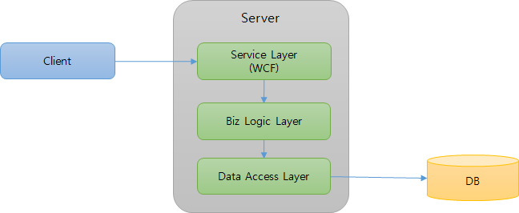
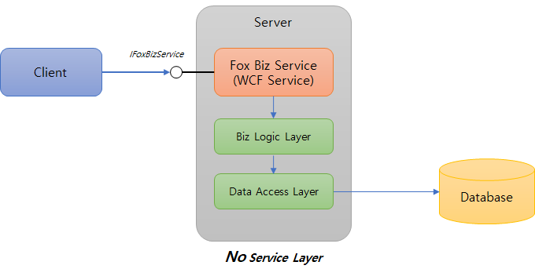

# Fox Biz Service 개요

Fox Biz Service는 서비스 계층을 작성하지 않고도 간단한 설정과 코드를 사용하여 서버 상에 존재하는 비즈니스 로직을 손쉽게 호출하고 그 결과를 받아 볼 수 있게 해 주는 [Fox Web Service](../README.md)의 한 기능입니다.

## Why Fox Biz Service

NeoDEEX 기반의 어플리케이션에서 서버 측 구현은 일반적으로 서비스 계층, 비즈니스 계층, 데이터 계층을 포함합니다. 서비스 계층은 WCF 서비스로 구성되어 클라이언트 호출을 수신합니다. 서비스 계층은 비즈니스 계층의 비즈니스 컴포넌트 혹은 데이터 액세스 컴포넌트를 생성하고 이 컴포넌트를 호출하여 클라이언트로부터 전송된 매개변수를 전달 합니다. 비즈니스 계층은 다시 데이터 계층(데이터베이스)을 액세스하고 그 결과를 서비스 계층으로 반환하며 서비스 계층은 다시 그 결과를 클라이언트에게 반환 합니다.



그러나 어플리케이션이 제공하는 서비스 계층의 절대 다수는 단순히 데이터베이스의 쿼리를 수행하고 그 결과를 반환하는 단순 서비스입니다.
**비즈니스 로직이 존재하는 소수의 경우에도 서비스 계층은 단순히 클라이언트로부터 매개변수를 받아 비즈니스 로직 계층으로 전달하는 역할 만을 수행합니다.** 따라서 개발자는 재미없고 지루한 WCF 서비스를 다수 작성해야 합니다.

**Fox Biz Service는 단순 서비스에서 요구하는 서비스 계층을 NeoDEEX 프레임워크에서 제공하여 개발자들의 부담을 크게 줄여주는 것을 목표**로 합니다. 또한, WCF 나 RESTful 등 서비스 호출에 필요한 네트워킹/통신에 대한 상세한 내용을 개발자들에게 감추어 줄 수 있기 때문에 상대적으로 숙련되지 않은 개발자들도 높은 생산성 하에서 개발이 가능합니다.

## Fox Biz Service 구조

Fox Biz Service(이하 비즈 서비스)는 NeoDEEX 4.5에서 제공하는 WCF/REST 서비스로서 서버 측 비즈니스 로직을 담는 메서드를 호출해 주는 기능을 제공합니다.

> 비즈 서비스는 기본적으로 WCF를 사용하도록 설계/구현되어 있으므로 별도의 설명없이 비즈 서비스라고 지칭하면 WCF를 사용하는 서비스를 말합니다. 한편 HTTP/JSON을 사용하는 RESTful 서비스는 **비즈 서비스 REST API** 라고 부릅니다.

비즈니스 로직을 구현하고 이 비즈니스 로직을 호출하기 위해 서비스 계층을 구현할 필요 없이 비즈 서비스를 호출하기만 하면 됩니다.



비즈 서비스는 다음과 같은 주요 구성 요소를 가지고 있습니다.

### 클라이언트/서버 공통 구성 요소

서버와 클라이언트에서 모두 사용되는 구성 요소로서 `TheOne.ServiceModel` 어셈블리의 `TheOne.ServiceModel.Biz` 네임스페이스에 존재하는 클래스/인터페이스들 입니다. 다음은 주요 클래스/인터페이스들에 대한 간략한 설명 입니다.

* `IFoxBizService` 인터페이스

  * WCF를 사용하여 비즈 서비스를 호출하는 경우 사용하는 인터페이스 입니다. Fox Biz Service는 `IFoxBizService` 인터페이스를 구현하며 Fox Biz Service 클라이언트는 이 인터페이스를 **사용**하여 비즈니스 로직을 호출하게 됩니다.

* DTO 객체들

  * `FoxBizRequest`/`FoxBizRequestCollection` 클래스는 비즈 서비스가
    수행해야 할 비즈니스 로직 클래스/메서드 정보, 매개변수 등을 포함합니다.

  * `FoxBizResponse`/`FoxBizResponseCollection` 클래스는 비즈 서비스가 비즈니스 로직 메서드를 수행한 결과를 클라이언트에게 반환할 때 사용됩니다.

  * `FoxServiceParameter`/`FoxServiceParameterCollection` 클래스는 ``FoxBizRequest`` 혹은 `FoxBizResponse` 객체 내에서 매개변수를 전달하는데 사용되는 키/값을 저장 합니다.

### 서버 구성 요소

서버 측에서 비즈 서비스를 구성하여 WCF 혹은 RESTful 서비스를 제공하는데 사용되는 클래스 입니다. 개발자는 비즈니스 로직만을 구현하면 되며 서비스 계층은 Fox Biz Service에서 제공하는 클래스들을 사용하기만 하면 됩니다. 상세한 서버 구성 방법의 예는 [서버 구성 방법](serverconfig.md)을 참고 하십시오.

* `FoxBizService` 클래스

  * 비즈 서비스를 구현하는 핵심 클래스로서 WCF 서비스 클래스 입니다.

  * 개발자는 이 클래스를 그대로 사용하거나 파생하여 일부 작동 방식을 커스터마이징 할 수 있습니다.

* `FoxBizServiceController` 클래스

  * 비즈 서비스의 REST API 기능을 제공하는 Web API 컨트롤러 클래스 입니다.

  * 개발자는 Web API 구성 설정을 통해 이 클래스를 그대로 사용하거나 파생하여 일부 작동 방식을 커스터마이징 할 수 있습니다.

* `FoxBizClassAttribute`/`FoxBizMethodAttribute`

  * 클라이언트가 호출할 수 있는 비즈니스 로직 클래스/메서드임을 명시하기 위한 Attribute 입니다.

  * 개발자는 자신이 작성한 비즈니스 로직 클래스/메서드가 비즈 서비스를 통해 클라이언트에게 노출하기 위해서 이 특성을 명시해야 합니다.

### 클라이언트 구성 요소

클라이언트가 비즈 서비스를 호출할 때 사용되는 클라이언트 헬퍼 클래스 입니다.

* `FoxBizClient`

  * 비즈 서비스에 대한 WCF 클라이언트 기능을 제공합니다.

* `FoxRestBizClient`

  * 비즈 서비스에 대한 REST API 클라이언트 기능을 제공합니다.

## 비즈니스 로직 예제 코드

다음은 클라이언트에서 호출할 수 있는 비즈니스 로직 예제 코드를 보여 줍니다.

```cs
namespace Namespace
{
    [FoxBizClass]
    public class Class1
    {
        [FoxBizMethod]
        public DataSet Method1()
        {
            // 비즈니스 로직 코드 (생략)
        }

        [FoxBizMethod]
        public string Method2(int param1, string param2)
        {
            // 비즈니스 로직 코드 (생략)
        }
    }
}
```

비즈니스 로직 클래스는 `FoxBizClassAttribute`를 사용하여 이 클래스가 비즈니스 로직 클래스로 사용된다는 것을 표시해야 하며, 비즈니스 로직 클래스의 메서드들 역시 클라이언트가 호출할 수 있는 메서드들에 `FoxBizMethodAttribute`를 사용해야 합니다.

## 클라이언트 예제 코드

다음은 WCF 기반 비즈 서비스를 호출하는 가장 간단한 예제 코드를 보여 줍니다.

```cs
private async void button1_Click(object sender, EventArgs e)
{
    using(var client = new FoxBizClient("MyAddrName", "bizservice.svc"))
    {
        var response = await client.ExecuteAsync("Namespace.Class1", "Method1");
        dataGrid1.DataSource = response.DataSet.Tables[0];
    }
}
```

위 코드는 서버 상에 존재하는 `Namesapce.Class1` 이라는 클래스의 `Method1` 이라는 메서드를 호출하고(매개변수가 없는 메서드) 그 결과로서 반환된 데이터셋을 데이터 그리드에 바인딩 합니다. 비즈 서비스의 URL을 구성하는 방법은 `FoxClientFactory.CreateChannel` 메서드를 호출할 때와 동일하게 [주소 맵(address map)](../wcf/addressmap.md)과 [바인딩 맵(binding map)](../wcf/bindingmap.md)을 사용합니다.

다음 코드는 비즈 서비스의 REST API를 사용하는 예제를 보여 줍니다.

```cs
private async void button2_Click(object sender, EventArgs e)
{
    using(var client = new FoxRestBizClient("MyAddrName", "restservice"))
    {
        var request = new FoxBizRequest("Namespace.Class1", "Method2");
        request.Parameters["param1"] = 1;
        request.Parameters["param2"] = "Data2";
        var response = await client.ExecuteAsync(request);
        MessageBox.Show($"서버 반환 값: {response.Result}");
    }
}
```

위 코드는 비즈 서비스의 REST API를 사용하여 `Namesapce.Class1` 클래스의 `Method2` 메서드(2개의 매개변수)를 수행하고 그 결과를 메시지 박스로 표시합니다. REST API 역시 [주소 맵](../wcf/addressmap.md)을 사용하여 서비스 주소를 지정하지만 항상 HTTP/JSON을 사용하기 때문에 WCF와 달리 [바인딩 맵](../wcf/bindingmap.md)은 사용하지 않습니다.

## 주요 기능

비즈 서비스의 주요 기능들은 다음과 같습니다. 각 기능들에 대한 상세한 설명은 별도의 기술 문서들을 참고하십시오.

### 비즈니스 로직 액세스 메서드

비즈 서비스는 비즈니스 로직 클래스의 메서드를 수행하고 그 결과를 반환하기 위한 다음 메서드들을 제공합니다.

* `Execute` 메서드

  * 비즈니스 로직 메서드를 수행하고 그 결과를 object 로 반환합니다.

* `ExecuteMultiple` 메서드

  * 여러 `FoxBizRequest` 객체를 배열로 전송하여 여러 개의 비즈니스 로직 메서드를 순차적을 수행 합니다.

### 진단 기능들

비즈 서비스는 프레임워크 내부에 구현되어 있고 개발자의 코드가 관여되지 않기 때문에 오류가 발생했을 때 오류의 원인을 찾기 어려울 수 있습니다. 비즈 서비스 내부까지 디버깅을 시도하거나 중단점을 지정하기 어렵기 때문입니다. 따라서 비즈 서비스는 풍부한 로그를 남길 뿐만 아니라 많은 양의 로그에서 쿼리의 수행을 추적하기 편리한 로그 추적 ID를 사용합니다.

또한, 클라이언트는 자신이 요청한 쿼리가 수행되면서 발생되는 로그를 `FoxBizResponse` 객체에 반환해 줄 것을 요청할 수 있습니다. 이러한 서비스 로그 기능은 운영 단계에서 쿼리에서 오류가 발생했을 때, 로그 파일에서 문제의 쿼리 로그를 찾는 것 보다 쉬우며 즉각적인 대처가 가능하도록 해 줍니다. 다음은 서비스 로그 기능을 사용하는 예제와 비즈 서비스에서 반환하는 서비스 로그의 예를 보여줍니다.

```cs
using(var client = new FoxBizClient("MyAddrName", "bizservice.svc"))
{
    var request = new FoxBizRequest("Namespace.Class1", "Method1");
    // 비즈 서비스가 로그를 반환하도록 플래그 지정
    request.Diagnostics = FoxBizRequestDiagnostics.ServiceLog;
    var response = await client.ExecuteAsync(request);
    foreach(var line in response.ServiceLog)
    {
        Console.WriteLine(line);
    }
}
```

```log
I 2017-04-17 14:56:57.75843 [FoxBizService] #00006:11183252#>> Biz Service Start: Execute  Requests=1  UserId=Tester#14467203  ClientMachine=MONSTERWORK  ClientIP=10.1.1.1;192.168.1.75  ClientMAC=0-15-5D-DB-A4-0;28-E3-47-50-B6-9A
V 2017-04-17 14:56:57.76043 [FoxBizService] #00006:11183252#    Before Execute BizMethod: ClassId=Namespace.Class1  MethodId=Method1  Type=Namespace.Class1  Method=Method1  in-params=0
V 2017-04-17 14:56:57.81088 [FoxBizService] #00006:11183252#    After Invoke: elpased = 50 msec, out-params:0
I 2017-04-17 14:56:57.81188 [FoxBizService] #00006:11183252#>> Biz Service End: Execute  elapsed = 57 msec
```

## Summary

비즈 서비스는 반복적이고 지루한 서비스 계층의 코드 작성을 최소화 해줄 뿐만 풍부한 기능을 제공하여 개발 생산성을 크게 높여 줍니다. 개발자는 불필요한 코드 작성보다 비즈니스 로직 작성에 집중할 수 있으며, 관리해야 할 서비스 계층을 크게 줄일 수 있기 때문에 운영 시 발생할 수 있는 다양한 관리 포인트를 획기적으로 줄여 줄 수 있습니다.

---