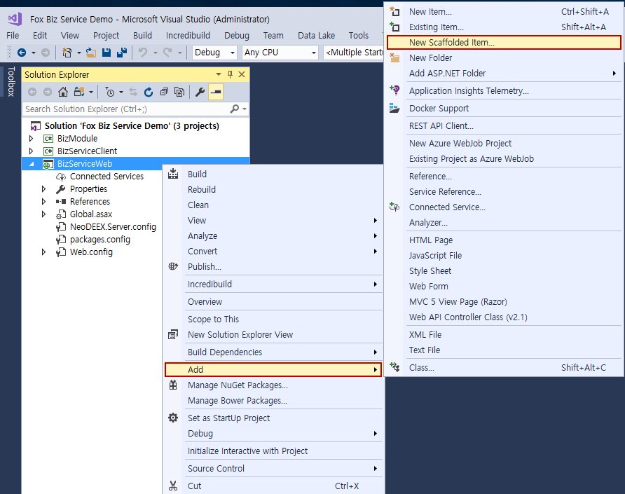
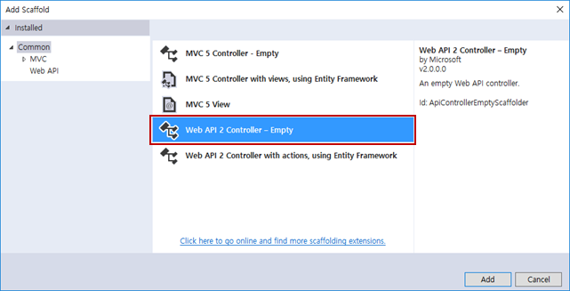
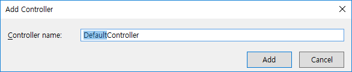
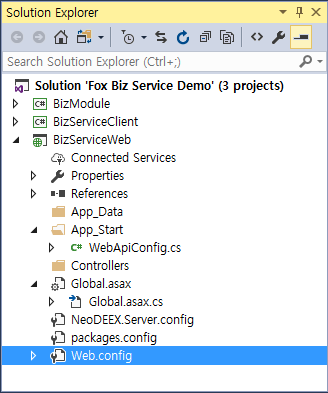
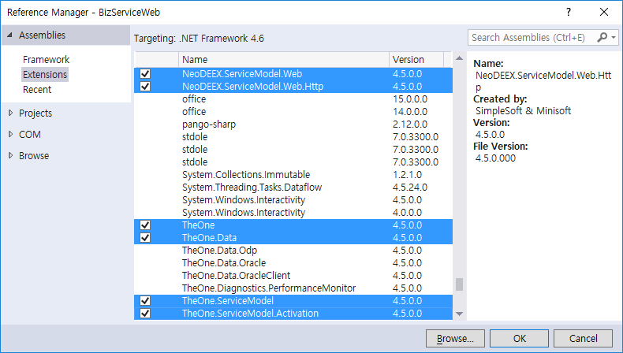
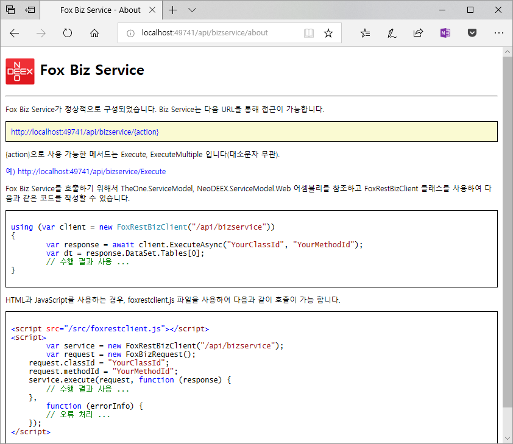
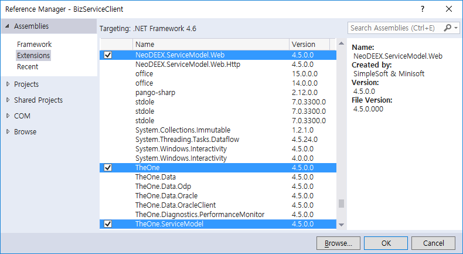

# How To : Fox Biz Service REST API 서비스 구성

이 문서는 Fox Biz Service(이하 비즈 서비스) REST API 를 작성하고 테스트를 위한 클라이언트 작성 방법을 단계적인 방법으로 설명합니다.

비즈 서비스 REST API는 ASP.NET Web API(이하 Web API)를 사용하기 때문에 Web API에 대한 구성이 선행되어야 합니다. REST API를 위해 새로운 웹 사이트를 작성할 수도 있지만 기존 웹 사이트에 REST API 기능을 추가할 수도 있습니다. 이 예제는 [WCF를 사용하는 비즈 서비스 구성 예제](howto-wcf.md)에서 작성한 웹 사이트(웹 프로젝트)에 REST API 기능을 추가하도록 하겠습니다.

* [Fox Biz Service WCF 서비스 구성 예제 보러 가기](https://github.com/NeoDEEX/Samples/tree/master/WebService/BizService/Fox%20Biz%20Service%20REST%20Demo)

* 목차

  * [웹 사이트 작성](#웹-사이트-작성)

  * [REST API 구성](#REST-API-구성)

  * [NuGet 패키지 버전 설정](#NuGet-패키지-버전-설정)

  * [비즈니스 클래스 작성](#비즈니스-클래스-작성)

  * [REST API 클라이언트 작성](#REST-API-클라이언트-작성)

  * [문제 진단](#문제-진단)

  * [요약](#요약)

## 웹 사이트 작성

이 단계는 비즈 서비스 REST API를 제공할 웹 사이트에 Web API 기능을 추가하고 REST API를 위해 필요한 설정을 살펴보겠습니다.

> 주) 웹 사이트(웹 프로젝트)가 이미 Web API를 사용할 수 있도록 구성되어 있다면 곧바로 3단계부터 시작하면 됩니다.

웹 프로젝트에 Web API 기능을 추가하기 위해서는 닷넷 프레임워크 4.5 이상을 지원하는 Visual Studio 버전을 사용할 수 있습니다만 이 예제는 Visual Studio 2017을 사용할 것입니다.
다른 버전의 Visual Studio를 사용하더라도 설정 방법은 거의 동일 합니다.

1. 웹 프로젝트에서 추가 메뉴를 선택하고 `스캐폴드 추가(New Scaffolded Item)` 메뉴를 선택 합니다.

    > 주) 웹 프로젝트 작성 시 Web API 기능을 활성화했다면 이 단계는 필요하지 않습니다.

    

2. 스캐폴드 추가 대화 상자에서 `Web API 2 Controller - Empty`를 선택하고 추가 버튼을 클릭 합니다. 컨트롤러 추가 대화 상자가 나타나면 추가 버튼을 클릭 합니다.

    > 주) 웹 프로젝트 작성 시 Web API 기능을 활성화했다면 이 단계는 필요하지 않습니다.

    

    

    * Web API 스캐폴드 추가 메뉴는 Web API에 필요한 어셈블리들을 NuGet 서버로부터 추가해 주며, `Global.asax`, `Global.asax.cs`, `WebApiConfig.cs` 파일과 필요한 디렉터리들을 생성해 줍니다.

    주) 단순한 `Web API Controller 추가` 메뉴는 Web API 관련된 어셈블리 참조와 컨트롤러 클래스를 추가해 주지만 설정에 필요한 파일이나 디렉터리를 추가해 주지 않습니다.

3. 컨트롤러 추가에 의해 새로이 추가된 컨트롤러 클래스(이 예제의 경우 `DefaultController.cs`)는 사용되지 않으므로 삭제 합니다. 설정이 완료된 웹 프로젝트는 다음과 비슷한 구조를 갖게 됩니다.

    

> 주) 스캐폴드 추가 시 `Global.asax.cs` 파일이 이미 존재하는 경우, 이 파일에 적절한 변경이 수행되지 않을 수 있습니다. 따라서 `Global.asax.cs` 파일의 `Application_Start` 메서드의 존재 여부를 확인하고 Web API 초기화 코드와 비즈 서비스 초기화 코드가 모두 존재하는지 확인해야 합니다. 만약 다음과 같은 코드가 존재하지 않는다면 수동으로 추가해 넣도록 합니다.

```cs
using System.Web.Http;

public class Global : System.Web.HttpApplication
{
    protected void Application_Start(object sender, EventArgs e)
    {
        // Web API 초기화
        GlobalConfiguration.Configure(WebApiConfig.Register);
        // Fox Biz Service 초기화
        TheOne.ServiceModel.Biz.FoxBizServiceConfig.Configure();
    }
    // ......
}
```

## REST API 구성

웹 프로젝트가 Web API를 사용할 수 있도록 구성되었다면 이제 비즈 서비스 REST API를 사용가능 하도록 구성해야 합니다.

1. `NeoDEEX.ServiceModel.Web`, `NeoDEEX.ServiceModel.Web.Http` 어셈블리를 참조 합니다. [WCF를 사용하는 비즈 서비스 구성 예제](howto-wcf.md)에서 작성한 웹 프로젝트를 사용하지 않고 새로이 웹 프로젝트를 생성했다면 `TheOne`, `TheOne.Data`, `TheOne.ServiceModel`, `TheOne.ServiceModel.Activation` 어셈블리도 참조를 추가해야 합니다.

    

2. `WebApiConfig.cs` 파일을 열고 REST API를 위한 URL 라우팅 설정을 추가하거나 기존 설정을 변경 합니다. 다음은 `~/api/bizservice` 에서 REST API를 서비스하도록 라우팅을 설정하는 예제 코드 입니다. 비즈 서비스 REST API는 단일 Web API 컨트롤러만을 사용하므로 `{controller}`와 같은 템플릿을 사용할 필요가 없습니다.

    ```cs
    public static class WebApiConfig
    {
        public static void Register(HttpConfiguration config)
        {
            config.MapHttpAttributeRoutes();

            // Fox Biz Service REST API 라우팅 설정
            config.Routes.MapHttpRoute(
                name: "FoxBizServiceRoute",
                routeTemplate: "api/bizservice/{action}",
                defaults: new { controller = "FoxBizService" }
            );
        }
    }
    ```

    > 주) REST API를 위한 Web API 컨트롤러 클래스는 `FoxBizServiceController` 클래스 입니다. 하지만 컨트롤러의 이름은 Controller 접미사를 포함하지 않습니다. 따라서 위 라우팅 설정에서 컨트롤러의 이름으로 `controller` 속성에 `FoxBizService`라는 이름이 사용되었습니다.

3. 웹 브라우저를 구동하고 REST API의 URL을 입력하고 다음과 같은 정보 페이지가 나타나는지 확인합니다. REST API의 정보 페이지 URL은 `{action}` 템플릿으로 `about`를 사용하면 됩니다. 이 예제의 경우 URL은 `http://localhost:49741/api/bizservice/about`가 됩니다.

    

## NuGet 패키지 버전 설정

WCF를 사용하는 것과 달리 REST API는 Web API를 사용하며, Web API는 NuGet으로부터 다양한 패키지를 사용합니다. Fox Biz Service REST API는 다음 패키지(어셈블리)에 대해 의존성을 갖습니다.

* Microsoft.AspNet.WebApi.Client(`System.Net.Http.Formatting`) 버전 5.2.3 이상

* Microsoft.AspNet.WebApi.Core(`System.Web.Http`) 버전 5.2.3 이상

* Newtonsoft.Json(`Newtonsoft.Json`) 버전 6.0.4 이상

>주) NeoDEEX는 외부 패키지에 대해 최대한 낮은 버전을 사용합니다. NeoDEEX가 낮은 버전을 사용하는 이유는 이미 개발된 어플리케이션에 NeoDEEX를 적용하고자 할 때 이 어플리케이션이 사용하는 패키지를 업그레이드 하지 않아도 되도록 하기 위함입니다.

웹 프로젝트에서 Web API를 사용하도록 설정함에 따라서 Visual Studio는 자동적으로 Web API에 필요한 NuGet 패키지들을 사용하도록 설정합니다. 이 때 Visual Studio가 설정해 주는 NuGet 패키지 버전(최신 버전 사용)과 Fox Biz Service REST API가 의존성을 갖는 패키지 버전이 다를 수 있습니다.

예를 들어, 웹 프로젝트가 Newtonsoft.Json 패키지 버전 12.0.2 을 사용한다면 Fox Biz Service REST API가 사용하는 6.0.4 버전과 충돌이 발생하며 프로젝트 빌드 시 경고가 발생하며 런타임 시에는 어셈블리를 찾을 수 없다는 예외가 발생할 수 있습니다.

버전 충돌 문제는 바인딩 재지정(binding redirection)을 통해 해결이 가능합니다. 다음과 같이 바인딩을 재지정 함으로써 Fox Biz Service가 요구하는 버전 대신 웹 프로젝트가 사용하는 버전을 사용하도록 지정이 가능합니다.

```xml
  <runtime>
    <assemblyBinding xmlns="urn:schemas-microsoft-com:asm.v1">
      <dependentAssembly>
        <assemblyIdentity name="System.Net.Http.Formatting" publicKeyToken="31bf3856ad364e35" culture="neutral" />
        <bindingRedirect oldVersion="0.0.0.0-5.2.7.0" newVersion="5.2.7.0" />
      </dependentAssembly>
      <dependentAssembly>
        <assemblyIdentity name="System.Web.Http" publicKeyToken="31bf3856ad364e35" culture="neutral" />
        <bindingRedirect oldVersion="0.0.0.0-5.2.7.0" newVersion="5.2.7.0" />
      </dependentAssembly>
      <dependentAssembly>
        <assemblyIdentity name="Newtonsoft.Json" publicKeyToken="30ad4fe6b2a6aeed" culture="neutral" />
        <bindingRedirect oldVersion="0.0.0.0-12.0.0.0" newVersion="12.0.0.0" />
      </dependentAssembly>
    </assemblyBinding>
  </runtime>
```

>주) 웹 프로젝트가 Fox Biz Service REST API와 동일한 패키지 버전을 사용한다면 위와 같은 바인딩 재지정은 수행할 필요가 없습니다.

## 비즈니스 클래스 작성

이 예제는 이미 작성된 WCF 비즈 서비스에 REST API를 추가한 것이므로 비즈니스 클래스/메서드를 작성할 필요가 없습니다. 만약 새로이 웹 프로젝트를 작성한 것이라면 [WCF 예제의 비즈니스 클래스 작성 항목](howto-wcf.md#비즈니스-클래스-작성)을 참고하여 비즈니스 클래스/메서드를 작성하십시오.

## REST API 클라이언트 작성

비즈 서비스 REST API에 대한 클라이언트 작성 방법은 WCF와 매우 유사 합니다. `FoxBizClient` 클래스 대신 `FoxRestBizClient` 클래스를 사용하면 됩니다. 이 예제에서는 [WCF를 사용하는 비즈 서비스 구성 예제](howto-wcf.md)에서 작성한 클라이언트에 REST API 클라이언트 기능을 추가하도록 하겠습니다.

1. NuGet 패키지 관리자를 구동하여 클라이언트 프로젝트에 `Microsoft.AspNet.WebApi.Client` 패키지를 설치 합니다.

    

2. REST API 클라이언트를 위한 NeoDEEX 어셈블리를 추가 합니다. 필요한 어셈블리는 `TheOne`, `TheOne.ServiceModel`, `NeoDEEX.ServiceModel.Web` 입니다.

    

3. `NeoDEEX.client.config`에서 필요한 [주소 맵(address map)](../wcf/addressmap.md)이 존재하는지 확인하고 필요하다면 추가 합니다.

    > 주) `NeoDEEX.client.config` 구성 설정 파일을 추가하는 과정은 WCF 예제에서 이미 수행되었기 때문에 구체적인 방법은 [WCF 비즈 서비스 예제의 클라이언트 설정](howto-wcf.md#테스트용-클라이언트-작성) 항목을 참고 하십시오.

    ```xml
    <?xml version="1.0" encoding="utf-8" ?>
    <theone.configuration  xmlns="http://schema.theonetech.co.kr/fx/config/2011/04/">
      <service defaultAddress="Default" defaultBindingMap="Default">
        <addresses>
          <address name="Default" baseUrl="http://localhost:49741" />
        </addresses>
        ... 생략 ...
      </service>
    </theone.configuration>
    ```

    > 주) 비즈 서비스 REST API는 WCF 서비스가 아니기 때문에 WCF에 관련된 바인딩 맵, 바인딩 설정등을 요구하지 않습니다.

4. `FoxRestBizClient` 클래스를 사용하여 서비스를 호출합니다. REST API의 URI는 Web API 라우팅 설정에 사용했던 상대 주소를 사용하면 됩니다. 다음 코드는 WCF 기반 비즈 서비스와 비즈 서비스 REST API를 모두 호출하는 클라이언트 예제를 보여주고 있습니다.

    ```cs
    using System;
    using TheOne.Security;
    using TheOne.ServiceModel.Biz;
    using TheOne.ServiceModel.Web;

    namespace BizServiceClient
    {
        class Program
        {
            static void Main(string[] args)
            {
                // Request 객체 구성
                var request = new FoxBizRequest("데모비즈", "Echo");
                request.Parameters["input"] = "Wow!";

                // 비즈 서비스(WCF) 호출
                using (var client = new FoxBizClient("BizService.svc"))
                {
                    var response = client.Execute(request);
                    Console.WriteLine($"Result: {response.Result}");
                }

                // 비즈 서비스 REST API 호출
                using (var client = new FoxRestBizClient("api/bizservice"))
                {
                    var response = client.Execute(request);
                    Console.WriteLine($"Result: {response.Result}");
                }
            }
        }
    }
    ```

5. 코드를 컴파일 하고 수행하여 비즈 서비스 호출이 정상적으로 수행되는지 확인합니다. 위 클라이언트 코드의 수행 결과는 다음과 같습니다.

    ```txt
    Result: Hello Fox Biz Service: Wow!
    Result: Hello Fox Biz Service: Wow!
    ```

## 문제 진단

비스 서비스 REST API를 구성하고 호출하는데 문제가 발생하는 경우, 비즈 서비스의 진단 기능을 통해 문제의 원인을 파악하고 해결할 수 있습니다.

REST API는 서비스의 호출 방식만 RESTful 방식을 사용하는 것이므로 WCF 비즈 서비스와 동일한 서버 측 기능을 사용합니다. 따라서 [WCF 비스 서비스 예제 항목에서 다루었던 진단 설정](howto-wcf.md#문제-진단)을 동일하게 사용하여 진단이 가능합니다.

## 요약

REST API는 인터넷에서 플랫폼에 무관하게 사용할 수 있는 HTTP와 JSON 기반의 RESTful 서비스를 제공하기 때문에 다양한 클라이언트들이 비즈 서비스를 사용할 수 있도록 해줍니다. WCF 기반 비즈 서비스에 비해 구성 방법이 상대적으로 간단하지만 동등한 기능을 제공할 뿐만 아니라 JSON 포맷 덕택에 더 빠르고 작은 데이터를 송/수신 하게 됩니다.

---