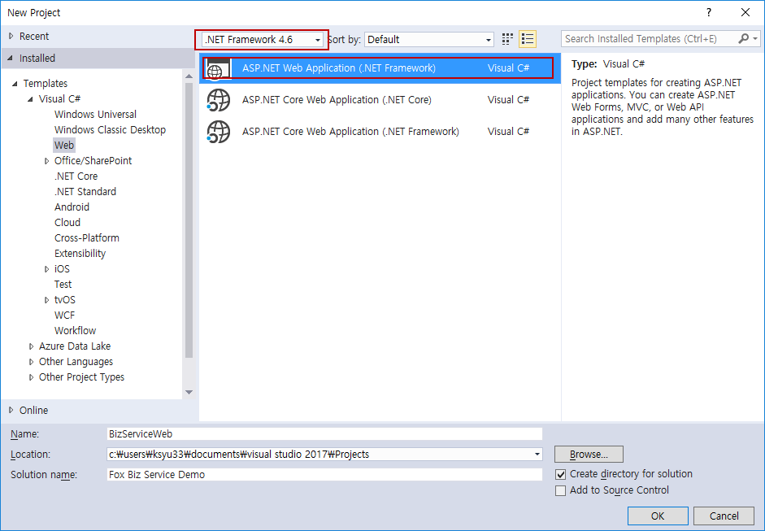
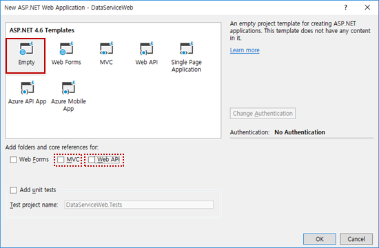
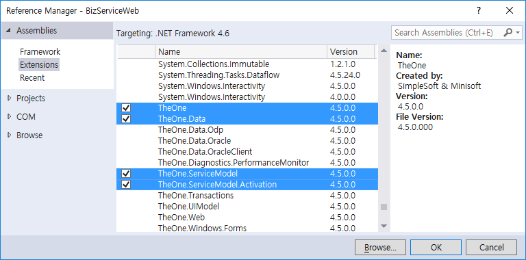
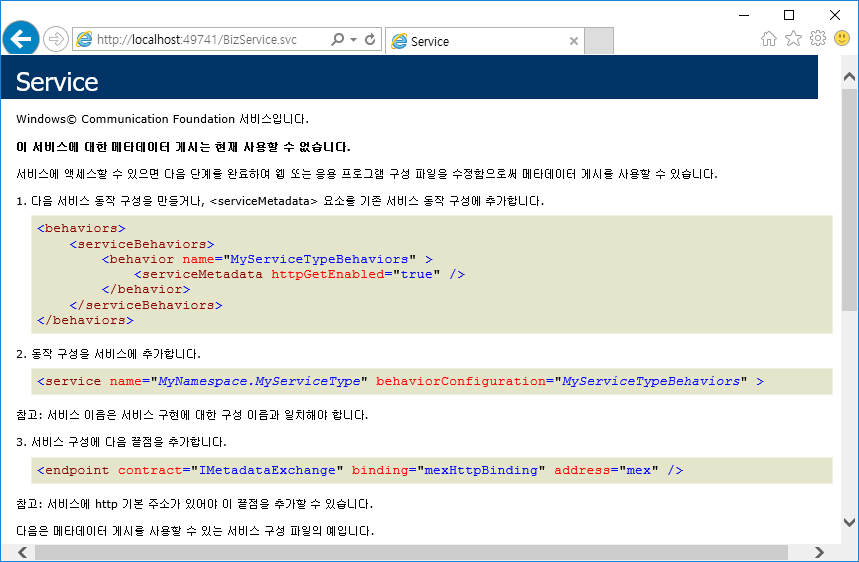
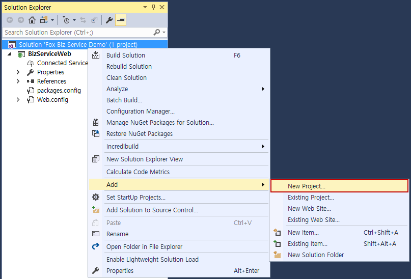
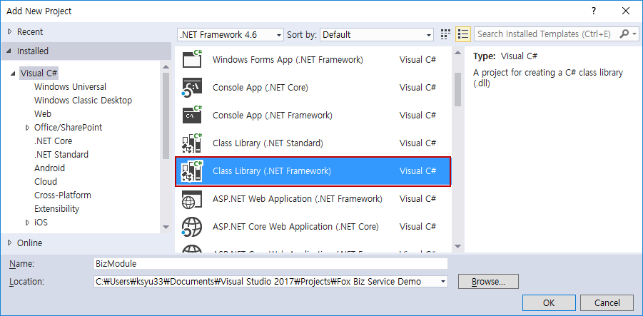
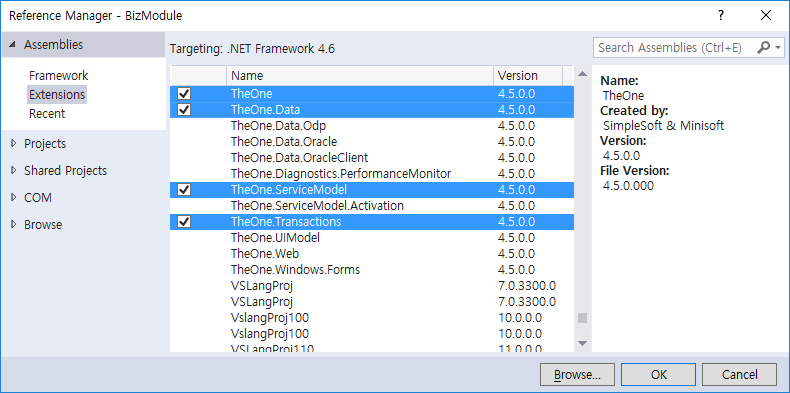
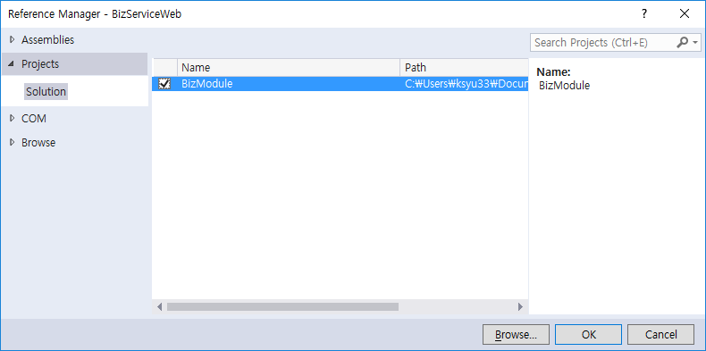
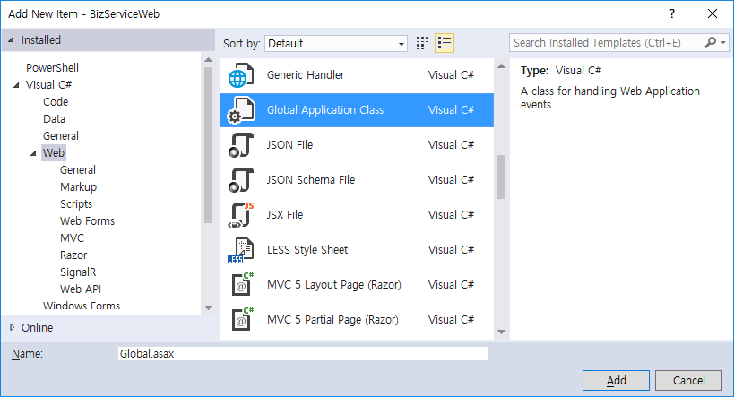

# How To : Fox Biz Service WCF 서비스 구성

이 문서는 Fox Biz Service(이하 비즈 서비스)를 위한 WCF 서비스를 작성하고 테스트를 위한 클라이언트 작성 방법을
단계적인 방법으로 설명합니다.

## 웹 사이트 작성

이 단계는 비즈 서비스를 제공할 새로운 웹 사이트를 작성하는 방법을 살펴 봅니다.

> 비즈 서비스는 기존의 웹 사이트에 어셈블리들을 복사하고 web.config를 수정하는 것만으로도 충분하며, 존재하는 임의의 웹 프로젝트(WebForm, MVC, Web API 등)에 추가하는 것도 가능합니다만 이 예제에서는 새로운 웹 사이트를 작성하는 것부터 시작할 것입니다.

웹 프로젝트를 작성하기 위해서는 닷넷 프레임워크 4.5 이상을 지원하는 Visual Studio 버전을 사용할 수 있습니다만 이 예제는 Visual Studio 2017을 사용할 것입니다.
다른 버전의 Visual Studio를 사용하더라도 웹 프로젝트의 생성 방법은 거의 동일 합니다.

1. New Project 메뉴를 선택하고 프로젝트 템플릿에서 ASP.NET Web Application 템플릿을 선택 합니다. 닷넷 프레임워크 버전은 4.5 이상이면 충분하지만 4.6 버전 이상을 사용하는 것이 좋습니다.

    

2. ASP.NET Web Project 대화 상자에서 Empty 를 선택하고 확인을 클릭 합니다.
    * 웹 프로젝트에서 비즈 서비스 REST API 도 같이 제공하고자 한다면 Web API 옵션을 선택합니다.
    * 웹 프로젝트에서 HTML 컨텐츠를 제공하고자 한다면 MVC 옵션을 선택합니다.
    * Azure에 웹 사이트를 게시하고자 한다면 Azure 관련 옵션을 선택할 수 있습니다.

    

## 비즈 서비스 구성

비즈 서비스를 사용하기 위해서 필요한 어셈블리를 추가하고 WCF 서비스 구성 설정을 수행 합니다.

1. TheOne, TheOne.Data, TheOne.ServiceModel, TheOne.ServiceModel.Activation 어셈블리를 참조 추가 합니다.

    

2. Web.config 구성 설정에 비즈 서비스를 추가 합니다.

    서비스 클래스로 TheOne.ServiceModel.Biz.FoxBizService 클래스를 사용하고, 상대 주소 값으로는 .svc로 종료되는 임의의 값을 사용할 수 있습니다. 이 예제는 ~/BizService.svc을 사용하여 `http://xxxx/BizService.svc` 주소로 비즈 서비스를 사용할 수 있습니다.

    ```xml
    <?xml version="1.0" encoding="utf-8"?>
    <configuration>
      <!-- 다른 구성 설정들 (생략) -->
      <system.serviceModel>
        <serviceHostingEnvironment>
          <serviceActivations>
            <add service="TheOne.ServiceModel.Biz.FoxBizService"
                relativeAddress="~/BizService.svc"/>
          </serviceActivations>
        </serviceHostingEnvironment>
      </system.serviceModel>
    </configuration>
    ```

    > 주의) WCF 서비스를 구성하는 방법은 다양합니다. 위 예제와 같이 Web.config 파일에 `<serviceActivations>` 항목을 통해 ServiceHost를 구성할 수도 있지만, 전통적인 방법으로 .svc 파일을 작성하고 `<servies>` 항목에 `<service>` 항목을 추가할 수도 있습니다.

3. 웹 브라우저를 구동하여 비즈 서비스의 주소를 입력하고 다음과 유사한 WCF 서비스 정보가 나타나는지 확인합니다. 이 화면이 정상적으로 나타나면 비즈 서비스 구성이 정상적으로 완료된 것입니다.

    

## 비즈니스 클래스 작성

비즈 서비스는 서버 상에 존재하는 비즈니스 로직을 클라이언트가 호출할 수 있도록 해주는 WCF 서비스 입니다. 따라서 비즈니스 로직을 작성하는 것이 우선되어야 합니다.

비즈니스 로직을 작성하기 위해서는 임의의 public 클래스를 사용할 수 있습니다.
하지만 여러 데이터 원본(데이터베이스, 파일, 외부 서비스 등)을 액세스하고 그 결과들을 취합/변형 해야 하는 비즈니스 로직의 특성 상 분산/로컬 트랜잭션을 자동으로 관리해 주며, 손쉽게 성능 측정이 가능한 Fox Transaction 기능을 사용하는 것이 편리합니다. 이 예제에서는 Fox Transaction이 제공하는 FoxBizBase 클래스로부터 파생된 비즈니스 로직 클래스를 작성할 것입니다.

1. 비즈니스 로직을 담기 위해 별도의 클래스 라이브러리 프로젝트를 솔루션에 추가 합니다.

    
    

2. Fox Transaction을 사용하기 위해 TheOne, TheOne.Data, TheOne.Transactions 어셈블리를 참조 추가 합니다.

    

3. 프로젝트 템플릿이 추가해 준 Class1.cs 파일을 제거 하고 BizClass.cs을 새로이 추가하고 다음과 같은 코드를 작성합니다. FoxBizClassAttribute와 FoxBizMethodAttribute를 사용하여 비즈 클래스와 비즈 메서드를 표시하고 있음에 주목하십시오.

    ```cs
    using TheOne.ServiceModel.Biz;
    using TheOne.Transactions;

    namespace BizModule
    {
        [FoxBizClass("데모비즈")]
        public class BizClass : FoxBizBase
        {
            [FoxBizMethod]
            public string Echo(string input)
            {
                return $"Hello Fox Biz Service: {input}";
            }
        }
    }
    ```

    > 주) FoxBizClassAttribute에는 비즈 클래스의 Id로 '데모비즈'를 사용하고 있습니다. 명시적으로 ClassId를 제공하지 않는 경우, 클래스의 전체 이름(이 경우 BizModule.BizClass)이 ClassId로 사용됩니다. 이는 FoxBizMethodAttribute에도 적용됩니다. 명시적으로 MethodId를 사용하지 않으면, 메서드 이름이 MethodId로 사용됩니다.

4. 웹 프로젝트가 비즈니스 로직 모듈(프로젝트)를 사용할 수 있도록 프로젝트 참조를 추가 합니다.

    

    > 주) 비즈 서비스에서 비즈니스 로직 모듈을 사용하기 위해서 반드시 참조를 추가할 필요는 없습니다. 비즈 서비스가 포함된 프로젝트(웹 프로젝트)가 비즈니스 로직 모듈(어셈블리)을 로드(Load)할 수 있는 위치에 DLL이 존재하기만 하면 됩니다. 다만 이 예제에서는 비즈니스 로직 모듈의 복사 과정을 단순화하기 위해 참조를 추가했을 뿐입니다.

5. 프로젝트에 새로운 XML 파일을 추가하여 NeoDEEX 구성 설정 파일을 생성 합니다. 파일 이름은 임의의 이름을 사용할 수 있지만 서버 측 구성 설정 파일은 .config 확장자를 갖는 것이 좋습니다. 이 예제는 NeoDEEX.Server.config 라는 이름을 사용하겠습니다. 또, NeoDEEX 구성 설정 파일을 사용하도록 Web.config에 다음 설정을 추가 합니다.

    ```xml
    <configuration>
      <!-- 다른 설정 생략 -->
      <appSettings>
        <add key="ConfigurationFile" value="NeoDEEX.Server.config" />
      </appSettings>
      <!-- 다른 설정 생략 -->
    </configuration>
    ```

6. NeoDEEX.Server.config 파일을 편집하여 비즈 서비스가 로드할 비즈니스 로직 모듈을 추가 합니다.

    ```xml
    <?xml version="1.0" encoding="utf-8" ?>
    <theone.configuration  xmlns="http://schema.theonetech.co.kr/fx/config/2011/04/">
      <service>
        <bizService>
          <modules>
            <add name="BizModule" />
          </modules>
        </bizService>
      </service>
    </theone.configuration>
    ```

7. Global.asax를 추가하고 Global.asax.cs 에 다음 코드를 추가 합니다.

    

    ```cs
    public class Global : System.Web.HttpApplication
    {
        protected void Application_Start(object sender, EventArgs e)
        {
            // 비즈 서비스를 구성합니다.
            TheOne.ServiceModel.Biz.FoxBizServiceConfig.Configure();
        }
        // ... 이하 코드 생략 ...
    }
    ```

    이로써 비즈 서비스 구성이 완료 되었습니다.

    간단한 비즈 서비스 구성은 이처럼 간단하지만 어플리케이션이 다른 WCF 서비스를 사용하거나 WCF 메시지 압축, 인증 설정 등이 추가되면 좀 더 복잡한 모습일 수도 있습니다.

    > 주) 기본적으로 비즈 서비스는 인증 확인을 수행합니다. 이는 권한이 없는 임의의 클라이언트가 비즈니스 로직을 호출할 수 없도록 하기 위함 입니다. 구성 설정을 통해 비즈 서비스 인증을 off 시킬 수 없습니다. 만약 인증을 사용하지 않도록 하려면 FoxBizService 클래스에서 파생된 클래스를 작성하고 FoxAuthenticationAttribute를 사용하거나 web.config 구성 설정을 사용하여 인증을 사용하지 않도록 구성해야 합니다 (권장하지 않음).

## 테스트용 클라이언트 작성

간단한 테스트를 위해 Console Application 클라이언트를 작성하는 방법을 설명합니다.

1. 기존 솔루션에 추가하거나 새로운 솔루션을 작성하여 Console Application 프로젝트를 생성합니다.

2. TheOne, TheOne.SeviceModel, System.ServiceModel 어셈블리를 참조 추가 합니다.

3. App.config 파일을 편집하여 NeoDEEX 구성 설정과 비즈 서비스 호출에 사용할 WCF 바인딩을 구성합니다.

    ```xml
    <configuration>
      <appSettings>
        <add key="ConfigurationFileName" value="NeoDEEX.Client.config"/>
      </appSettings>
      <system.serviceModel>
        <bindings>
          <basicHttpBinding>
            <binding name="BasicHttpBinding">
              <security mode="None" />
            </binding>
          </basicHttpBinding>
        </bindings>
      </system.serviceModel>
    </configuration>
    ```

4. NeoDEEX 구성 설정을 위해 NeoDEEX.Client.config 파일을 추가하여 비즈 서비스의 주소와 바인딩 맵을 구성 합니다.

    ```xml
    <?xml version="1.0" encoding="utf-8" ?>
    <theone.configuration  xmlns="http://schema.theonetech.co.kr/fx/config/2011/04/">
      <service defaultAddress="Default" defaultBindingMap="Default">
        <addresses>
          <address name="Default" baseUrl="http://localhost:49741" />
        </addresses>
        <bindingMaps>
          <bindingMap name="Default" bindingName="BasicHttpBinding"/>
        </bindingMaps>
      </service>
    </theone.configuration>
    ```

    > 주) NeoDEEX 구성 파일이 .exe 파일이 존재하는 디렉터리와 같은 디렉터리에 존재하도록 구성 파일의 속성 윈도우에서 `Copy to Output Directory`를 `Copy if newer`로 설정해 주어야 합니다.

5. 다음과 같이 비즈 서비스를 호출하는 코드를 작성합니다. FoxBizClient 클래스의 인스턴스를 작성하고 Execute 메서드들을 호출하면 됩니다.

    ```cs
    using System;
    using TheOne.Security;
    using TheOne.ServiceModel.Biz;

    namespace BizServiceClient
    {
        class Program
        {
            static void Main(string[] args)
            {
                using (FoxUserInfoContext.CreateScope(new FoxUserInfoContext("TempUser")))
                using (var client = new FoxBizClient("BizService.svc"))
                {
                    var request = new FoxBizRequest("데모비즈", "Echo");
                    // 매개변수를 설정 합니다.
                    request.Parameters["input"] = "Wow!";

                    var response = client.Execute(request);
                    Console.WriteLine($"Result: {response.Result}");
                }
            }
        }
    }
    ```

6. 코드를 컴파일 하고 수행하여 비즈 서비스의 작동 여부를 확인합니다.

    > 주) 인증 오류가 발생하면 FoxUserInfoContext 객체를 생성하고 SetCallContext 메서드를 호출하여 클라이언트 인증을 에뮬레이션 하도록 합니다.

## Summary

비즈 서비스는 NeoDEEX 프레임워크 내에 WCF 서비스를 구현하여 제공함으로써 간단한 구성 설정 만으로 서버 상에 존재하는 비즈니스 로직 코드를 수행할 수 있는 환경을 구성할 수 있습니다. 비즈 서비스를 사용하면 단순히 비즈니스 로직 코드를 작성하는 것만으로 클라이언트가 손쉽게 비즈니스 로직을 호출할 수 있도록 해줍니다.
