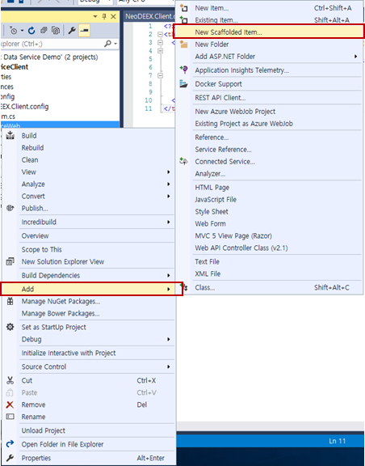
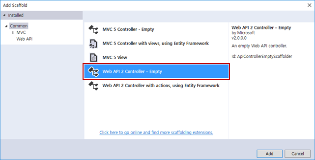
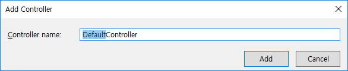
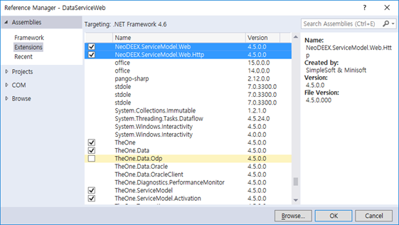
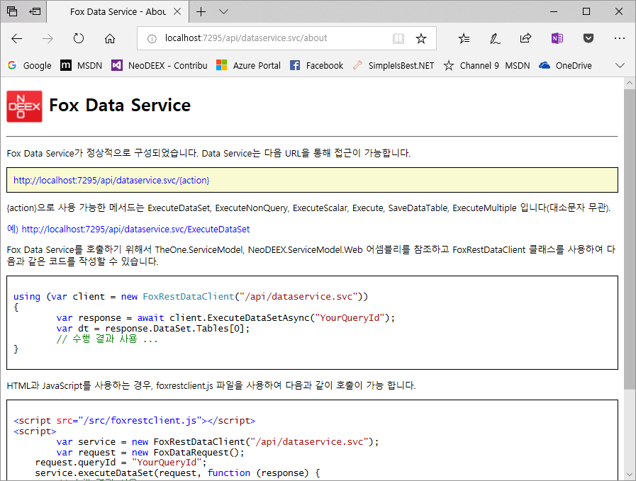
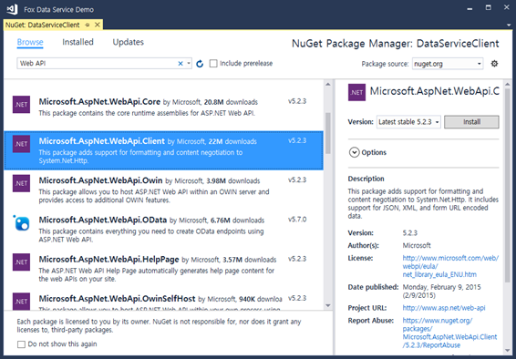
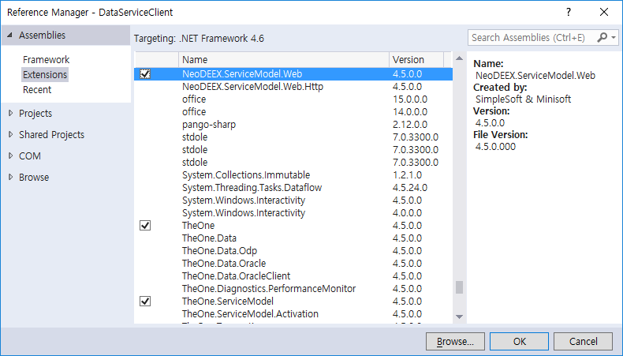

# How To : Fox Data Service REST API 서비스 구성

이 문서는 Fox Data Service(이하 데이터 서비스) REST API를 작성하고 클라이언트를 작성하는 방법을 구체적이고 단계적으로 설명합니다.

데이터 서비스 REST API는 ASP.NET Web API 2.0을 사용하기 때문에 Web API에 대한 구성이 선행되어야 합니다. REST API를 위해 새로운 웹 사이트를 작성할 수도 있지만 기존 웹 사이트에 REST API 기능을 추가할 수도 있습니다. 이 예제는 [WCF를 사용하는 데이터 서비스 구성 예제](howto-wcf.md)에서 작성한 웹 사이트(웹 프로젝트)에 REST API 기능을 추가하도록 하겠습니다.

## 웹 사이트 구성

이 단계는 데이터 서비스 REST API를 제공할 웹 사이트에 Web API 기능을 추가하고 REST API를 위해 필요한 설정을 살펴보겠습니다.

> 주) 웹 사이트(웹 프로젝트)가 이미 Web API를 사용할 수 있도록 구성되어 있다면 곧바로 3단계부터 시작하면 됩니다.

웹 프로젝트에 Web API 기능을 추가하기 위해서는 닷넷 프레임워크 4.5 이상을 지원하는 Visual Studio 버전을 사용할 수 있습니다만 이 예제는 Visual Studio 2017을 사용할 것입니다. 다른 버전의 Visual Studio를 사용하더라도 설정 방법은 거의 동일 합니다.

1. 웹 프로젝트에서 추가 메뉴를 선택하고 `스캐폴드 추가(New Scaffolded Item)` 메뉴를 선택 합니다.

    

2. 스캐폴드 추가 대화 상자에서 `Web API 2 Controller - Empty`를 선택하고 추가 버튼을 클릭 합니다. 컨트롤러 추가 대화 상자가 나타나면 추가 버튼을 클릭 합니다.

    

    

    Web API 스캐폴드 추가 메뉴는 Web API에 필요한 어셈블리들을 NuGet 서버로부터 추가해 주며, `Global.asax`, `Global.asax.cs`, `WebApiConfig.cs` 파일과 필요한 디렉터리들을 생성해 줍니다.

    > 주) 단순한 Web API Controller 추가 메뉴는 Web API 관련된 어셈블리 참조와 컨트롤러 클래스를 추가해 주지만 설정에 필요한 파일이나 디렉터리를 추가해 주지 않습니다.

3. 컨트롤러 추가에 의해 새로이 추가된 컨트롤러 클래스(이 예제의 경우 `DefaultController.cs`)는 사용되지 않으므로 삭제 합니다. 설정이 완료된 웹 프로젝트는 다음과 비슷한 구조를 갖게 됩니다.

    

## REST API 구성

웹 프로젝트가 Web API를 사용할 수 있도록 구성되었다면 이제 데이터 서비스 REST API를 사용가능 하도록 구성해야 합니다.

1. `NeoDEEX.ServiceModel.Web`, `NeoDEEX.ServiceModel.Web.Http` 어셈블리를 참조 합니다. [WCF를 사용하는 데이터 서비스 구성 예제](howto-wcf.md)에서 작성한 웹 프로젝트를 사용하지 않고 새로이 웹 프로젝트를 생성했다면 `TheOne`, `TheOne.Data`, `TheOne.ServiceModel`, `TheOne.ServiceModel.Activation` 어셈블리도 참조를 추가해야 합니다.

    

2. `WebApiConfig.cs` 파일을 열고 REST API를 위한 URL 라우팅 설정을 추가하거나 기존 설정을 변경 합니다. 다음은 `~/api/dataservice` 에서 REST API를 서비스하도록 라우팅을 설정하는 예제 코드 입니다. 데이터 서비스 REST API는 단일 Web API 컨트롤러만을 사용하므로 `{controller}` 와 같은 템플릿을 사용할 필요가 없습니다.

    ```cs
    public static class WebApiConfig
    {
        public static void Register(HttpConfiguration config)
        {
            config.MapHttpAttributeRoutes();

            config.Routes.MapHttpRoute(
                name: "FoxDataServiceRoute",
                routeTemplate: "api/dataservice/{action}",
                defaults: new { controller = "FoxDataService" }
            );
        }
    }
    ```

    > 주) REST API를 위한 Web API 컨트롤러 클래스는 `FoxDataServiceController` 클래스 입니다. 하지만 컨트롤러의 이름은 ~Controller 접미사를 포함하지 않습니다. 따라서 위 라우팅 설정에서 컨트롤러의 이름으로 `FoxDataService`라는 이름이 사용되었습니다.

3. 웹 브라우저를 구동하여 데이터 서비스 About 페이지 URL을 입력하고 다음과 유사한 REST-API 서비스 정보가 나타나는지 확인합니다. 이 화면이 정상적으로 나타나면 데이터 서비스 구성이 정상적으로 완료된 것입니다.

    > 데이터 서비스의 About 페이지 URL은 앞서 URL 라우팅 설정에서 `action` 템플릿 값으로 `about`를 사용하면 됩니다. 위 코드 상에서 About 페이지의 상대 주소는 `~/api/dataservice/about` 입니다.

    

## REST API 클라이언트 작성

데이터 서비스 REST API에 대한 클라이언트 작성 방법은 WCF와 매우 유사 합니다. FoxDataClient 클래스 대신 FoxRestDataClient 클래스를 사용하면 됩니다. 이 예제에서는 [WCF를 사용하는 데이터 서비스 구성 예제](howto-wcf.md)에서 작성한 클라이언트에 REST API 클라이언트 기능을 추가하도록 하겠습니다.

1. NuGet 패키지 관리자를 구동하여 클라이언트 프로젝트에 Microsoft.AspNet.WebApi.Client 패키지를 설치 합니다.

    

2. REST API 클라이언트를 위한 NeoDEEX 어셈블리를 추가 합니다. 필요한 어셈블리는 `TheOne`, `TheOne.ServiceModel`, `NeoDEEX.ServiceModel.Web` 입니다.

    

3. `FoxRestDataClient` 클래스를 사용하여 서비스를 호출합니다. REST API의 URI는 Web API 라우팅 설정에 사용했던 상대 주소를 사용하면 됩니다. 다음 코드는 WCF 기반 데이터 서비스와 데이터 서비스 REST API를 모두 호출하는 클라이언트 예제를 보여주고 있습니다.

    ```csharp
    class Program
    {
        static void Main(string[] args)
        {
            // 데이터 서비스 (WCF) 호출
            using (var client = new FoxDataClient("DataService.svc"))
            {
                var response = client.ExecuteDataSet("TestQuery.GetProducts");
                Console.WriteLine($"Records={response.DataSet.Tables[0].Rows.Count}");
            }
            // 데이터 서비스 REST API 호출
            using (var client = new FoxRestDataClient("api/dataservice"))
            {
                var response = client.ExecuteDataSet("TestQuery.GetProducts");
                Console.WriteLine($"Records={response.DataSet.Tables[0].Rows.Count}");
            }
        }
    }
    ```

## Summary

REST API는 인터넷에서 플랫폼에 무관하게 사용할 수 있는 HTTP와 JSON 기반의 RESTful 서비스를 제공하기 때문에 다양한 클라이언트들이 데이터 서비스를 사용할 수 있도록 해줍니다. WCF 기반 데이터 서비스에 비해 구성 방법이 상대적으로 간단하지만 동등한 기능을 제공할 뿐만 아니라 JSON 포맷 덕택에 더 빠르고 작은 데이터를 송/수신 하게 됩니다.

---