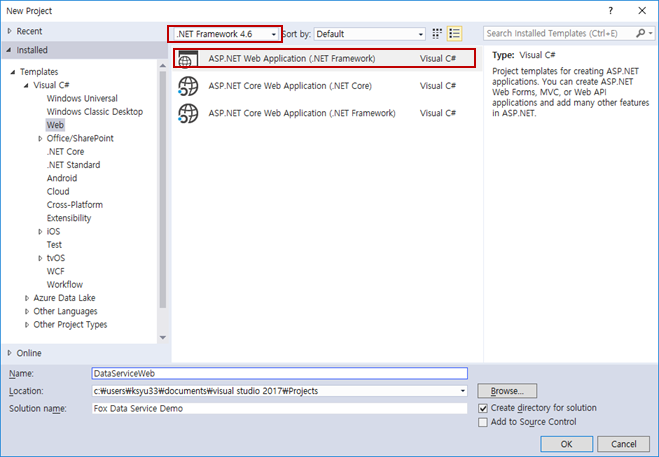
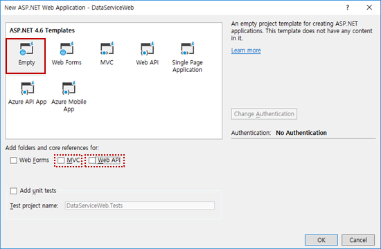
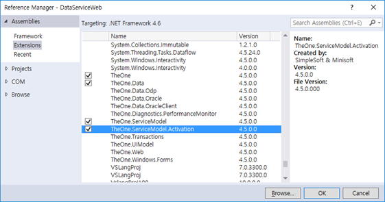
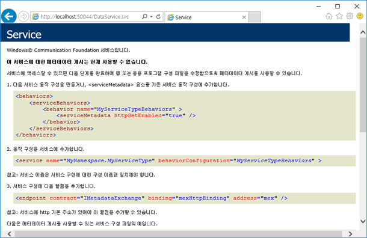
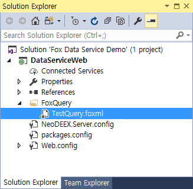

# How To : Fox Data Service WCF 서비스 구성

이 문서는 Fox Data Service(이하 데이터 서비스)를 위한 WCF 서비스를 작성하고 클라이언트를 작성하는 방법을 구체적이고 단계적으로 설명합니다.

## 웹 사이트 작성

이 단계는 데이터 서비스를 제공할 새로운 웹 사이트를 작성하는 방법을 살펴 봅니다.

> 데이터 서비스는 기존의 웹 사이트에 어셈블리들을 복사하고 web.config를 수정하는 것만으로도 충분하며, 존재하는 임의의 웹 프로젝트(WebForm, MVC, Web API 등)에 추가하는 것도 가능합니다만 이 예제에서는 새로운 웹 사이트를 작성하는 것부터 시작할 것입니다.

웹 프로젝트를 작성하기 위해서는 닷넷 프레임워크 4.5 이상을 지원하는 Visual Studio 버전을 사용할 수 있습니다만 이 예제는 Visual Studio 2017을 사용할 것입니다. 다른 버전의 Visual Studio를 사용하더라도 웹 프로젝트의 생성 방법은 거의 동일 합니다.

1. New Project 메뉴를 선택하고 프로젝트 템플릿에서 ASP.NET Web Application 템플릿을 선택 합니다. 닷넷 프레임워크 버전은 4.5 이상이면 충분하지만 4.6 버전 이상을 사용하는 것이 좋습니다.

    

2. ASP.NET Web Project 대화 상자에서 Empty 를 선택하고 확인을 클릭 합니다.

    * 웹 프로젝트에서 데이터 서비스 REST API 도 같이 제공하고자 한다면 Web API 옵션을 선택합니다.
  
    * 웹 프로젝트에서 HTML 컨텐츠를 제공하고자 한다면 MVC 옵션을 선택합니다.
  
    * Azure에 웹 사이트를 게시하고자 한다면 Azure 관련 옵션을 선택할 수 있습니다.

    

## 데이터 서비스 구성

데이터 서비스를 사용하기 위해서 필요한 어셈블리를 추가하고 WCF 서비스 구성 설정을 수행 합니다.

1. `TheOne`, `TheOne.Data`, `TheOne.ServiceModel`, `TheOne.ServiceModel.Activation` 어셈블리를 참조 추가 합니다.

    

2. `Web.config` 구성 설정에 데이터 서비스를 추가 합니다. 서비스 클래스로 `TheOne.ServiceModel.Data.FoxDataService` 클래스를 사용하고, 상대 주소 값으로는 .svc로 종료되는 임의의 값을 사용할 수 있습니다. 이 예제는 ~/`DataService.svc`을 사용하여 `http://xxxx/DataService.svc` 주소로 데이터 서비스를 사용할 수 있습니다.

    ```xml
    <?xml version="1.0" encoding="utf-8"?>
    <configuration>
      <!-- 다른 구성 설정들 (생략) -->
      <system.serviceModel>
        <serviceHostingEnvironment>
          <serviceActivations>
            <add service="TheOne.ServiceModel.Data.FoxDataService"
                relativeAddress="~/DataService.svc"/>
          </serviceActivations>
        </serviceHostingEnvironment>
      </system.serviceModel>
    </configuration>
    ```

    > 주) WCF 서비스를 구성하는 방법은 다양합니다. 위 예제와 같이 `Web.config` 파일에 `<serviceActivations>` 항목을 통해 `ServiceHost`를 구성할 수도 있지만, 전통적인 방법으로 .svc 파일을 작성하고 `<servies>` 항목에 `<service>` 항목을 추가할 수도 있습니다.

3. 웹 브라우저를 구동하여 데이터 서비스의 주소를 입력하고 다음과 유사한 WCF 서비스 정보가 나타나는지 확인합니다. 이 화면이 정상적으로 나타나면 데이터 서비스 구성이 정상적으로 완료된 것입니다.

    

    > 데이터 서비스가 정상적으로 구성되었다 할지라도 데이터 서비스 호출 결과가 오류를 반환할 수 있습니다. 이는 서비스 호출이 데이터 서비스까지 도달하였으나 DB 연결 문자열 오류, DB 클라이언트 설정 등의 원인으로 오류가 유발되었을 수 있습니다. 데이터 서비스의 로그 등을 확인하여 오류를 수정해야 합니다.

## Fox Query 구성

데이터 서비스는 [Fox Query](/comingsoon.md) 를 사용하여 데이터베이스 액세스 기능을 곧바로 클라이언트에게 제공하는 WCF 서비스 입니다. 따라서 데이터 서비스가 효용을 가지려면 .foxml 파일에 쿼리를 작성하고 데이터베이스 연결을 위한 구성이 필요합니다.

1. 프로젝트에 새로운 XML 파일을 추가하여 NeoDEEX 구성 설정 파일을 생성 합니다. 파일 이름은 임의의 이름을 사용할 수 있지만 서버 측 구성 설정 파일은 .config 확장자를 갖는 것이 좋습니다. 이 예제는 `NeoDEEX.Server.config` 라는 이름을 사용하겠습니다. 또, NeoDEEX 구성 설정 파일을 사용하도록 `Web.config`에 다음 설정을 추가 합니다.

    ```xml
    <configuration>
      <!-- 다른 설정 생략 -->
      <appSettings>
        <add key="ConfigurationFile" value="NeoDEEX.Server.config" />
      </appSettings>
      <!-- 다른 설정 생략 -->
    </configuration>
    ```

2. `NeoDEEX.Server.config` 파일을 편집하여 데이터베이스 연결 문자열과 쿼리 매퍼 설정을 작성합니다. 다음은 SQL SERVER에 접근하는 데이터베이스 연결 문자열과 웹 어플리케이션의 하위 디렉터리인 `~/FoxQuery` 폴더에 .foxml 파일들을 사용하도록 하는 예제 입니다.

    ```xml
    <?xml version="1.0" encoding="utf-8" ?>
    <theone.configuration  xmlns="http://schema.theonetech.co.kr/fx/config/2011/04/">
      <database defaultConnectionString="DefaultDB">
        <connectionStrings>
          <add name="DefaultDB"
              type="TheOne.Data.SqlClient.FoxSqlDbAccess"
              connectionString="<...your connection string...>"
              queryMapper="DefaultMapper" />
        </connectionStrings>
        <queryMappers>
          <queryMapper name="DefaultMapper">
            <queryMaps>
              <directories>
                <directory path="./FoxQuery" includeSubdirectories="true"/>
              </directories>
            </queryMaps>
          </queryMapper>
        </queryMappers>
      </database>
    </theone.configuration>
    ```

3. 웹 프로젝트에 `FoxQuery` 폴더를 추가 하고 XML 파일을 추가 하여 파일 확장자를 .foxml 로 지정 합니다. 파일 이름은 쿼리를 수행할 때 쿼리 ID의 일부로 사용됩니다. 예를 들어 다음과 같이 TestQuery.foxml을 추가 했다면, TestQuery.GetProducts 라는 쿼리 ID를 사용하여 데이터 서비스를 호출할 수 있습니다.

    ```xml
    <?xml version="1.0" encoding="utf-8" ?>
    <queryMap xmlns="http://schema.theonetech.co.kr/fx/mapping/2011/04/">
      <statements>
        <statement id="GetProducts">
          <text>
            SELECT * FROM Products
          </text>
        </statement>
      </statements>
    </queryMap>
    ```

이로써 데이터 서비스 구성이 완료 되었습니다. 간단한 데이터 서비스 구성은 이처럼 간단하지만 어플리케이션이 다른 WCF 서비스를 사용하거나 WCF 메시지 압축, 인증 설정 등이 추가되면 좀 더 복잡한 설정이 필요할 수도 있습니다.



## 테스트용 클라이언트 작성

간단한 테스트를 위해 Console Application 클라이언트를 작성하는 방법을 설명합니다.

1. 기존 솔루션에 추가하거나 새로운 솔루션을 작성하여 Console Application 프로젝트를 생성합니다.

2. `TheOne`, `TheOne.SeviceModel`, `System.ServiceModel` 어셈블리를 참조 추가 합니다.

3. `App.config` 파일을 편집하여 NeoDEEX 구성 설정과 데이터 서비스 호출에 사용할 WCF 바인딩을 구성합니다.

    ```xml
    <configuration>
      <appSettings>
        <add key="ConfigurationFileName" value="NeoDEEX.Client.config"/>
      </appSettings>
      <system.serviceModel>
        <bindings>
          <basicHttpBinding>
            <binding name="BasicHttpBinding">
              <security mode="None" />
            </binding>
          </basicHttpBinding>
        </bindings>
      </system.serviceModel>
    </configuration>
    ```

4. NeoDEEX 구성 설정을 위해 `NeoDEEX.Client.config` 파일을 추가하여 데이터 서비스의 주소와 바인딩 맵을 구성 합니다.

    ```xml
    <?xml version="1.0" encoding="utf-8" ?>
    <theone.configuration  xmlns="http://schema.theonetech.co.kr/fx/config/2011/04/">
      <service defaultAddress="Default" defaultBindingMap="Default">
        <addresses>
          <address name="Default" baseUrl="http://localhost:50044" />
        </addresses>
        <bindingMaps>
          <bindingMap name="Default" bindingName="BasicHttpBinding"/>
        </bindingMaps>
      </service>
    </theone.configuration>
    ```

    > 주) NeoDEEX 구성 파일이 .exe 파일이 존재하는 디렉터리와 같은 디렉터리에 존재하도록 구성 파일의 속성 윈도우에서 `Copy to Output Directory` 속성을 `Copy if newer`로 설정해 주어야 합니다.

5. 다음과 같이 데이터 서비스를 호출하는 코드를 작성합니다. `FoxDataClient` 클래스의 인스턴스를 작성하고 ExecuteXXX 메서드들을 호출하면 됩니다.

    ```cs
    using System;
    using System.ServiceModel;
    using TheOne.Security;
    using TheOne.ServiceModel.Data;

    namespace DataServiceClient
    {
        class Program
        {
            static void Main(string[] args)
            {
                using (var client = new FoxDataClient("DataService.svc"))
                {
                    var response = client.ExecuteDataSet("TestQuery.GetProducts");
                    Console.WriteLine($"Records={response.DataSet.Tables[0].Rows.Count}");
                }
            }
        }
    }
    ```

6. 코드를 컴파일 하고 수행하여 데이터 서비스의 작동 여부를 확인합니다.

## Summary

데이터 서비스는 NeoDEEX 프레임워크 내에 WCF 서비스를 구현하여 제공함으로써 간단한 구성 설정 만으로 서버 상에 존재하는 FOXML 쿼리를 수행할 수 있는 환경을 구성할 수 있습니다. 데이터 서비스를 사용하면 서버 측에 어떤 코드도 작성할 필요없이 .foxml 파일을 작성하는 것만으로 클라이언트가 손쉽게 데이터베이스에 접근할 수 있게 됩니다.

---