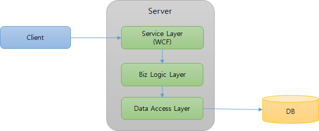

# Fox Data Service 개요

Fox Data Service는 간단한 설정과 코드를 사용하여 서버 상에 존재하는 FOXML을 손쉽게 수행하고 그 결과를 받아 볼 수 있게 해 줍니다.

## Why Fox Data Service

NeoDEEX 기반의 어플리케이션에서 서버 측 구현은 일반적으로 서비스 계층, 비즈니스 계층, 데이터 계층을 포함합니다. 서비스 계층은 WCF 서비스로 구성되어 클라이언트 호출을 수신합니다. 서비스 계층은 비즈니스 계층의 비즈니스 컴포넌트 혹은 데이터 액세스 컴포넌트를 생성하고 이 컴포넌트를 호출하여 클라이언트로부터 전송된 매개변수를 전달 합니다. 비즈니스 계층은 다시 데이터 계층(데이터베이스)을 액세스하고 그 결과를 서비스 계층으로 반환하며 서비스 계층은 다시 그 결과를 클라이언트에게 반환 합니다.

  
[그림1. 기본 서버 계층 구조]

그러나 어플리케이션이 제공하는 **서버 기능의 절대 다수는 단순히 데이터베이스의 쿼리를 수행하고 그 결과를 반환하는 단순 서비스**입니다.
이러한 단순 서비스의 서비스 계층 및 비즈니스 계층은 특별한 로직을 포함하지 않고 클라이언트로부터 전송된 매개변수를 다음 계층으로 전달하는 역할이 전부입니다. 어쩔 수 없이 개발자는 재미없고 지루한 WCF 서비스, 비즈니스 컴포넌트, 데이터 액세스 컴포넌트를 다수 작성하곤 합니다.

**Fox Data Service는 단순 서비스에서 요구하는 서비스 계층과 비즈니스 계층을 NeoDEEX 프레임워크에서 제공하여 개발자들의 부담을 크게 줄여주는 것을 목표**로 합니다.

## Fox Data Service 구조

Fox Data Service(이하 데이터 서비스)는 NeoDEEX 4.5에서 제공하는 WCF/REST 서비스로서 FOXML 상에 존재하는 데이터베이스 쿼리를 수행하고 그 결과를 반환해 줍니다.

> 데이터 서비스는 기본적으로 WCF를 사용하도록 설계/구현되어 있으므로 별도의 설명없이 데이터 서비스라고 지칭하면 WCF를 사용하는 서비스를 말합니다. 한편 HTTP/JSON을 사용하는 RESTful 서비스는 데이터 서비스 REST API 라고 부릅니다.

단순한 SQL 문장을 수행하거나 저장 프로시저를 호출하기 위해서 WCF 서비스나 비즈니스 컴포넌트, 데이터 액세스 컴포넌트를 작성할 필요 없이 데이터 서비스를 호출하기만 하면 됩니다.

  
[그림2. Fox Data Service 기본 구조]

데이터 서비스는 다음과 같은 주요 구성 요소를 가지고 있습니다.

### 클라이언트/서버 공통 구성 요소

서버와 클라이언트에서 모두 사용되는 구성 요소로서 `TheOne.ServiceModel` 어셈블리의 `TheOne.ServiceModel.Data` 네임스페이스에 존재하는 클래스/인터페이스들 입니다. 다음은 주요 클래스/인터페이스들에 대한 간략한 설명 입니다.

* `IFoxDataService` 인터페이스

  * WCF를 사용하여 데이터 서비스를 호출하는 경우 사용하는 인터페이스 입니다.

* DTO 객체들

  * `FoxDataRequest`/`FoxDataRequestCollection` 클래스는 데이터 서비스가 수행해야 할 FOXML 쿼리, 매개변수 등을 포함합니다.

  * `FoxDataResponse`/`FoxDataResponseCollection` 클래스는 데이터 서비스가 FOXML 쿼리를 수행한 결과를 클라이언트에게 반환할 때 사용됩니다.

  * `FoxServiceParameter`/`FoxServiceParameterCollection` 클래스는 `FoxDataRequest` 혹은 `FoxDataResponse` 객체 내에서 매개변수를 전달하는데 사용되는 키/값을 저장 합니다.

### 서버 구성 요소

서버 측에서 데이터 서비스를 구성하여 WCF 혹은 RESTful 서비스를 제공하는데 사용되는 클래스 입니다.
상세한 서버 구성 방법은 [서버 구성 방법](serverconfig.md)을 참고 하십시오.

* `FoxDataService` 클래스

  * 데이터 서비스를 구현하는 핵심 클래스로서 WCF 서비스 클래스 입니다.

  * 개발자는 이 클래스를 직접 사용하거나 파생하여 일부 작동 방식을 커스터마이징 할 수 있습니다.

* FoxDataServiceController 클래스

  * 데이터 서비스의 REST API 기능을 제공하는 Web API 컨트롤러 클래스 입니다.

### 클라이언트 구성 요소

클라이언트가 데이터 서비스를 호출할 때 사용되는 클라이언트 헬퍼 클래스 입니다.

* FoxDataClient

  * 데이터 서비스에 대한 WCF 클라이언트 기능을 제공합니다.

* FoxRestDataClient

  * 데이터 서비스에 대한 REST API 클라이언트 기능을 제공합니다.

## 클라이언트 예제 코드

다음은 WCF 기반 데이터 서비스를 호출하는 가장 간단한 예제 코드를 보여 줍니다.

```csharp
private async void button1_Click(object sender, EventArgs e)
{
    using(var client = new FoxDataClient("MyAddrName", "dataservice.svc"))
    {
        var response = await client.ExecuteDataSetAsync("Query.SelectData");
        dataGrid1.DataSource = response.DataSet.Tables[0];
    }
}
```

위 코드는 서버 상에 존재하는 `Query.foxml` 파일의 `SelectData` 라는 id를 가진 쿼리를 수행하고 그 결과를 데이터 그리드에 바인딩 합니다. 데이터 서비스의 URL을 구성하는 방법은 `FoxClientFactory.CreateChannel` 메서드를 호출할 때와 동일한 방법을 사용합니다.

다음 코드는 데이터 서비스의 REST API를 사용하는 예제를 보여 줍니다.

```csharp
private async void button2_Click(object sender, EventArgs e)
{
    using(var client = new FoxRestDataClient("MyAddrName", "restservice"))
    {
        var request = new FoxDataRequest("Query.InsertData");
        request.Parameters["Column1"] = 1;
        request.Parameters["Column2"] = "Data2";
        var response = await client.ExecuteNonQueryAsync(request);
        MessageBox.Show($"{response.AffectedRows} 건의 데이터를 추가 하였습니다.");
    }
}
```

위 코드는 데이터 서비스의 REST API를 사용하여 `Query.foxml` 파일의 `InsertData` 라는 id를 가진 쿼리를 수행하고 그 결과를 메시지 박스로 표시합니다.

## 주요 기능

데이터 서비스의 주요 기능들은 다음과 같습니다. 각 기능들에 대한 상세한 설명은 별도의 기술 문서들을 참고하십시오.

### 데이터 액세스 메서드

데이터 서비스는 FOXML 쿼리를 수행하고 그 결과를 반환하기 위한 다양한 메서드들을 제공합니다.

* `ExecuteDataSet`, `ExecuteNonQuery`, `ExecuteScalar` 메서드

  * 쿼리를 수행하고 그 결과를 `DataSet` 이나 `Scalar` 값, 혹은 output 매개변수로 반환합니다.

  * Fox Data Access의 `FoxDbAccess` 객체가 제공하는 ExecuteXXX 메서드와 동일한 의미를 갖습니다.

* `Execute` 메서드

  * `FoxDataRequest` 객체의 `Operation` 속성에 수행할 ExecuteXXX 메서드 종류를 명시하여 호출합니다.

  * 쿼리 수행 결과의 종류(`DataSet`, `Scalar` 등)를 동적으로 설정해야 하거나, 여러 쿼리를 수행할 때 사용됩니다.

* `SaveDataTable` 메서드

  * `FoxDataRequest` 객체의 `DataSet`에 포함된 `DataTable` 변경 사항을 데이터베이스에 저장합니다.

    > `DataTable`의 변경 사항(추가/수정/삭제)은 `DataTable.GetChanges` 메서드 호출에 의해 얻어집니다.

  * `FoxDataRequest` 객체의 `InsertQueryId`, `UpdateQueryId`, `DeleteQueryId` 속성에 의해 개별 `DataRow`를 추가/수정/삭제 합니다.

  * Loop 문(`foreach`)을 사용하거나 batch update를 사용하는 등 저장 방식 지정이 가능합니다.

* `ExecuteMultiple` 메서드

  * 여러 `FoxDataRequest` 객체를 배열로 전송하여 여러 개의 쿼리를 순차적을 수행 합니다.

  * 단일 데이터베이스 연결에 대해 여러 개의 쿼리를 수행하거나 개별 `FoxDataRequest` 별로 서로 다른 데이터베이스 연결을 사용할 수 있습니다.

### 쿼리 제어

데이터 서비스는 `FoxDataRequest`에 의해 요청된 쿼리를 수행할 때 다양한 제어가 가능합니다.

* 커맨드 타임아웃

* 트랜잭션 사용 여부

  * 로컬 트랜잭션

  * 분산 트랜잭션

* 트랜잭션 격리 수준 제어

* 트랜잭션 타임 아웃 제어

### 다양한 트랜잭션 지원

데이터 서비스는 `ExecuteDataSet`이나 `ExecuteNonQuery` 등 단일 Request 객체에 의한 쿼리 수행 뿐만 아니라 `ExecuteMultiple` 메서드에 의해 여러 개의 쿼리가 수행되는 상황에서도 트랜잭션을 처리해 줍니다. 특히, `ExecuteMultple` 메서드에 의해 여러 개의 쿼리가 수행될 때 이들 쿼리가 하나의 트랜잭션 하에서 수행되도록 하거나 개별적으로 트랜잭션이 수행되도록 제어할 수 있습니다. 또한 트랜잭션이 로컬 트랜잭션을 사용하거나 분산 트랜잭션을 사용하도록 제어하는 것도 가능합니다.

### 진단 기능

데이터 서비스는 **프레임워크 내부에 구현되어 있고 개발자의 코드가 관여되지 않기 때문에 오류가 발생했을 때 오류의 원인을 찾기 어려울 수 있습니다**. 데이터 서비스 내부까지 디버깅을 시도하거나 중단점을 지정하기 어렵기 때문입니다. 따라서 데이터 서비스는 풍부한 로그를 남길 뿐만 아니라 많은 양의 로그에서 쿼리의 수행을 추적하기 편리한 로그 추적 ID를 사용합니다.

또한, 클라이언트는 자신이 요청한 쿼리가 수행되면서 발생되는 로그를 `FoxDataResponse` 객체에 반환해 줄 것을 요청할 수 있습니다. 이러한 서비스 로그 기능은 운영 단계에서 쿼리에서 오류가 발생했을 때, 로그 파일에서 문제의 쿼리 로그를 찾는 것 보다 쉬우며 즉각적인 대처가 가능하도록 해 줍니다. 다음은 서비스 로그 기능을 사용하는 예제와 데이터 서비스에서 반환하는 서비스 로그의 예를 보여줍니다.

```csharp
using(var client = new FoxDataClient("MyAddrName", "dataservice.svc"))
{
    var request = new FoxDataRequest("Query.SelectData");
    // 데이터 서비스가 로그를 반환하도록 플래그 지정
    request.Diagnostics = FoxDataRequestDiagnostics.ServiceLog;
    var response = await client.ExecuteDataSetAsync(request);
    foreach(var line in response.ServiceLog)
    {
        Console.WriteLine(line);
    }
}
```

```txt
I 2017-03-16 13:15:42.72730 [FoxDataService] #00012:60542136#>> Start: ExecuteDataSet Requests=1 UserId=TestUser ClientMachine=null ClientIP=null ClientMAC=null
V 2017-03-16 13:15:42.72730 [FoxDataService] #00012:60542136# & EXPLICITLY Open Database Connection...
V 2017-03-16 13:15:42.72730 [FoxDataService] #00012:60542136# Before Invoke: DbAccess.ExecuteDataSet() qid=DataServiceQuery.GetProducts in-param=0
V 2017-03-16 13:15:42.77419 [FoxDataService] #00012:60542136# After Invoke: DbAccess.ExecuteDataSet() elpased = 41 msec
V 2017-03-16 13:15:42.77419 [FoxDataService] #00012:60542136# & EXPLICITLY Close Database Connection...
I 2017-03-16 13:15:42.77419 [FoxDataService] #00012:60542136#>> End: ExecuteDataSet elapsed = 45 msec
```

## Summary

데이터 서비스는 반복적이고 지루한 서비스 계층, 비즈니스 계층의 코드 작성을 최소화 해줄 뿐만 풍부한 기능을 제공하여 개발 생산성을 크게 높여 줍니다. 개발자는 불필요한 코드 작성보다 쿼리 작성에 집중할 수 있으며, 쿼리가 변경되더라도 코드 변화 없이 .foxml 파일만을 수정하면 되기 때문에 운영 시 발생할 수 있는 다양한 관리 포인트를 획기적으로 줄여 줄 수 있습니다.
