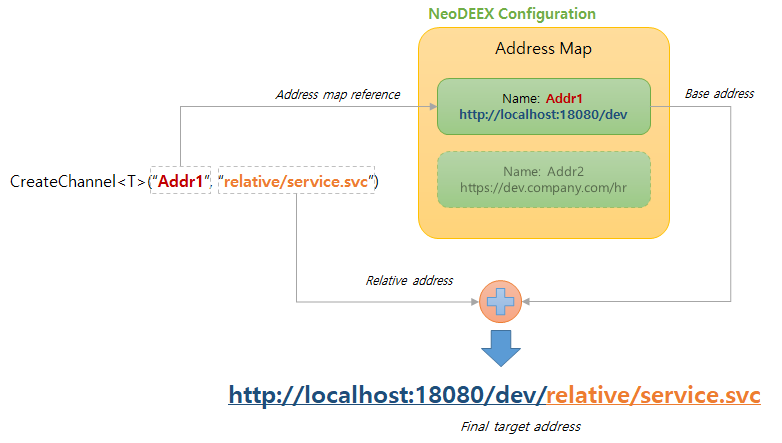

# 주소 맵(Address Map)

Fox Web Service의 주소 맵은 클라이언트가 WCF 서비스의 주소(URL)을 지정하고 변경하기 쉽게 하고 소스 코드 내에 하드 코드 되는 서비스 URL을 최소화하기 위해 사용됩니다. 바인딩 맵은 서비스와 클라이언트가 모두 참조하지만 주소 맵은 클라이언트에서만 사용됩니다 .

> WCF 서비스에서 다른 서비스를 호출하는 경우 서비스 측에서도 주소 맵을 사용할 수 있습니다만, 이 경우 다른 서비스를 호출하는 서비스는 호출되는 서비스의 클라이언트로 간주합니다.

  
[그림1. 주소 맵의 개념]

## 주소 맵 구성

주소 맵은 NeoDEEX 구성 파일의 `<service>` 요소에 `<addresses>` 요소를 추가함으로써 구성할 수 있습니다. 주소 맵은 서비스 주소들 기본 주소(base address)를 `baseUrl` 속성에 명시하고 코드에서는 이들 주소 맵을 참조하고 주소 맵의 주소로부터의 상대 주소만을 사용하면 됩니다.

> `<address>` 요소는 `baseUrl` 속성 이외에 `skip`, `host` 속성을 가질 수 있습니다만 이 두 속성은 여러 웹 어플리케이션을 병합할 때 복잡한 규칙이 필요한 경우에만 사용되며 현재는 사용되지 않습니다.

다음 코드는 NeoDEEX 구성 파일에 설정된 주소 맵의 예제를 보여주고 있습니다.

```xml
<?xml version="1.0" encoding="utf-8" ?>
<theone.configuration xmlns="http://schema.theonetech.co.kr/fx/config/2011/04/">
  <service defaultAddress="baseAddr">
    <addresses>
      <address name="baseAddr" baseUrl="http://localhost:32900/"/>
      <address name="serverAddr" baseUrl="http://prod.example.com/services/"/>
    </addresses>
  </service>
</theone.configuration>
```

주소 맵은 이름을 가진 여러 개의 주소 맵 항목들로 구성되어 있습니다. 이들 주소 맵 항목들 중 디폴트 주소 맵을 설정할 수도 있습니다. 디폴트 주소 맵은 주소 맵의 이름이 명시되지 않은 경우 사용되는 주소 맵 항목입니다.

## 주소 맵 선택

[FoxClientFactory](clientfactory.md)를 통해 WCF 서비스를 호출하는 경우 주소 맵의 이름이 사용되면 `FoxClientFactory`는 구성 설정에 명시된 주소 맵 항목들 중 주어진 이름을 가진 주소 맵 항목의 주소를 사용하여 서비스의 URL을 결정하게 됩니다.

```csharp
// baseAddr 이라는 이름의 주소 맵 항목을 사용하여 서비스 호출
using (var svc = FoxClientFactory.CreateChannel<IWcfService>("baseAddr", "WcfService.svc", "basicHttp"))
{
    var ds = svc.GetAllProducts();
    grdProducts.DataSource = ds.Tables[0];
}
```

바인딩 맵과 마찬가지로 서비스 호출 시 주소 맵이 명시되지 않은 경우 디폴트 주소 맵이 사용됩니다. 따라서 다음 코드는 디폴트 주소 맵 항목을 사용하여 WCF 서비스 호출이 이루어지게 됩니다.

```csharp
// 디폴트 주소 맵을 사용하여 서비스 호출
using (var svc = FoxClientFactory.CreateChannel<IWcfService>("WcfService.svc"))
{
    var ds = svc.GetAllProducts();
    grdProducts.DataSource = ds.Tables[0];
}
```

`FoxClientFactory` 클래스를 사용하는 상세한 방법은 [FoxClientFactory 항목](clientfactory.md)을 참조하십시오.

## 서비스 주소 변경

이와 같은 주소 맵 기능을 사용하면 WCF 서비스의 주소가 배포 등의 이유로 변경되더라도 서비스 호출 코드를 일일이 찾아 다니며 수정할 필요 없이 주소 맵의 주소만을 변경하면 됩니다. 예를 들어, WCF 서비스를 개발 서버(예를 들어, `dev.mycompany.com`)로 배포하였고 개발 서버의 WCF 서비스를 호출하고자 한다면 주소 맵의 주소를 변경하거나 추가적으로 주소 맵을 작성하고 디폴트 주소 맵을 변경함으로써 손쉽게 WCF 서비스 주소를 변경할 수 있습니다. 다음 주소 맵 예제는 개발자 로컬 PC, 개발 서버, 운영 서버에 대한 주소 맵을 명시하고 디폴트 주소 맵으로 개발자 로컬 PC의 주소를 사용합니다.

```xml
<service defaultBindingMap="basicHttp" defaultAddress="localPC">
  <bindingMaps>
    <bindingMap name="basicHttp"
                bindingName="defaultBinding" endpointBehavior=""/>
  </bindingMaps>
  <addresses>
    <address name="localPC" baseUrl="http://localhost:32900/"/>
    <address name="devServer" baseUrl="http://dev.mycompany.com/services/"/>
    <address name="realServer" baseUrl="http://app.mycompany.com/services/"/>
  </addresses>
</service>
```

개발자가 개발을 완료하고 테스트 및 검수를 위해 개발된 서비스를 개발 서버에 배포하고 개발 서버에 대해 테스트를 수행하고자 한다면 디폴트 주소 맵을 `devServer` 로 변경하기만 하면 클라이언트는 개발 서버의 서비스를 호출하게 됩니다. 그리고 최종적으로 클라이언트가 사용자에게 배포될 때에는 디폴트 주소 맵을 `realServer`로 설정한 구성 파일을 배포함으로써 운영 서버에 존재하는 서비스를 호출하도록 하면 됩니다.

---