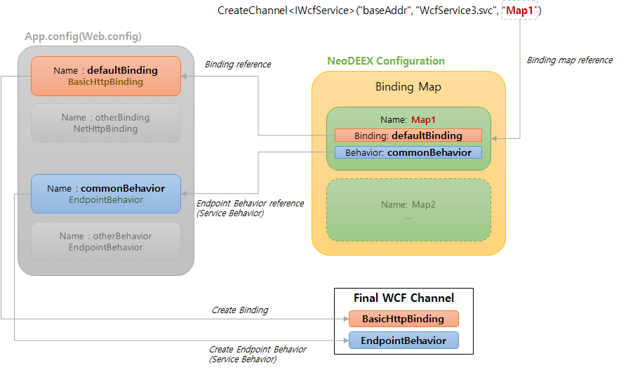

# 바인딩 맵(Binding Map)

Fox Web Service의 바인딩 맵은 WCF 서비스 구성에서 빈번하게 사용되는 바인딩과 서비스/종점 동작(service/endpoint behavior)을 하나로 묶어 서비스 측에서 사용하는 [FoxServiceHostFactory](servicefactory.md) 혹은 클라이언트 측에서 사용하는 [FoxClientFactory](clientfactory.md)에서 참조할 수 있도록 합니다. 바인딩 맵을 통해 다수의 서비스를 일관되게 구성할 수 있으며 서비스의 바인딩 변화를 손쉽게 처리할 할 수 있습니다. 또한 바인딩 맵은 클라이언트 측에서도 서비스 호출 시에 참조되며 `서비스 참조` 기능을 사용하지 않고도 WCF 서비스 호출을 손쉽게 해줍니다.

  
[그림1. 바인딩 맵의 개념]

## 바인딩 맵 구성

Fox Web Service의 바인딩 맵은 [NeoDEEX 구성 설정](configuration/README.md)의 `<service>` 항목에 `<bindingMaps>` 요소를 추가하여 구성할 수 있습니다. 다음은 NeoDEEX 구성 설정에서 사용된 바인딩 맵의 예를 보여주고 있습니다.

```xml
<?xml version="1.0" encoding="utf-8" ?>
<theone.configuration xmlns="http://schema.theonetech.co.kr/fx/config/2011/04/">
  <service defaultBindingMap="basicHttp">
    <bindingMaps>
      <bindingMap name="basicHttp"
                  bindingName="defaultBinding" serviceBehavior="commonBehavior"/>
      <bindingMap name="netHttp"
                  bindingName="fastBinding" serviceBehavior="commonBehavior"/>
    </bindingMaps>
  </service>
</theone.configuration>
```

위와 같은 바인딩 맵 구성은 `basicHttp`와 `netHttp`라는 이름을 가진 2개의 바인딩 맵 항목을 설정하고 있습니다. 위 바인딩 맵 항목은 각각 `defaultBinding`이라는 이름을 가진 바인딩과 `fastBindng`이라는 이름을 가진 바인딩을 서비스 바인딩으로 사용하며 공통적으로 `commonBehavior`라는 이름을 가진 서비스 동작(behavior)을 사용합니다.

바인딩 맵 항목에서 디폴트 바인딩 맵을 지정하기 위해 `<service>` 요소의 `defaultBindingMap` 속성을 사용하면 됩니다. `FoxServiceHostFactory`를 사용하여 서비스를 구성할 때 명시적으로 바인딩 맵 항목을 지정하지 않은 경우, `defaultBindingMap` 속성이 지정하는 디폴트 바인딩 맵 항목이 사용됩니다. 위 예제에서 디폴트 바인딩 맵은 `basicHttp` 입니다.

바인딩 맵에서 사용되는 바인딩 이름 및 서비스 동작 이름은 `web.config`(혹은 `app.config`)의 WCF 바인딩 설정 및 WCF 서비스 동작 설정에서 정의되어야 합니다. 만약 바인딩 맵에서 명시된 바인딩 이름 혹은 서비스 동작 이름을 `web.config`에서 찾을 수 없다면 서비스 구성 혹은 서비스 호출 시 예외를 유발합니다. 다음은 `web.config`에서 정의되어 있어야 할 바인딩 및 서비스 동작 설정의 예를 보여줍니다.

```xml
<!-- web.config 설정 내용 -->
<system.serviceModel>
    <behaviors>
      <serviceBehaviors>
        <behavior name="commonBehavior">
          <serviceMetadata httpGetEnabled="true" httpsGetEnabled="true" />
          <serviceDebug includeExceptionDetailInFaults="true" />
        </behavior>
      </serviceBehaviors>
    </behaviors>
    <serviceHostingEnvironment aspNetCompatibilityEnabled="true"
    <bindings>
      <basicHttpBinding>
        <binding name="defaultBinding" maxReceivedMessageSize="104857600" />
      </basicHttpBinding>
      <netHttpBinding>
        <binding name="fastBinding" maxReceivedMessageSize="104857600" />
      </netHttpBinding>
    </bindings>
  </system.serviceModel>
```

## 바인딩 맵 선택

바인딩 맵은 서비스 구성과 클라이언트의 서비스 호출에서 모두 사용됩니다. [FoxServiceHostFactory](servicefactory.md) 클래스를 사용하여 WCF 서비스를 구성하면 기본적으로 디폴트 바인딩 맵 항목을 사용하여 서비스의 바인딩과 동작(behavior)를 설정합니다. 디폴트 바인딩 맵 항목이 아닌 다른 바인딩 맵 항목을 사용하고자 하는 경우, `ServiceHost` 지시자의 `Service` 속성에 세미 콜론 문자로 구분하여 바인딩 맵 이름을 명시할 수 있습니다. 상세한 내용은 [서비스 팩터리의 바인딩 맵 명시](servicefactory.md#바인딩-맵-명시) 항목을 참고하십시오.

클라이언트에서 바인딩 맵 항목 선택은 [FoxClientFactory](clientfactory.md)를 사용하여 WCF 채널을 생성할 때 매개변수를 통해 바인딩 맵 항목을 명시할 수 있습니다. 다음 코드는 명시적으로 `netHttp` 라는 이름을 가진 바인딩 맵 항목을 사용하여 서비스를 호출하는 코드를 보여줍니다.

```csharp
using (var svc = FoxClientFactory.CreateChannel<IWcfService>("baseAddr", "WcfService3.svc", "netHttp"))
{
    var ds = svc.GetAllProducts();
    grdProducts.DataSource = ds.Tables[0];
}
```

`FoxClientFactory.CreateChannel<T>` 메서드에서 바인딩 맵을 매개변수로 제공하지 않거나 빈 문자열의 바인딩 이름이 사용된 경우 디폴트 바인딩 맵 항목을 사용합니다. `FoxClientFactory` 클래스를 사용하는 상세한 방법은 [FoxClientFactory 항목](clientfactory.md)을 참조하십시오.

## 바인딩 변경

WCF 서비스의 바인딩이 변경되었을 때 어떠한 작업이 필요한가를 살펴보겠습니다. WCF 서비스의 바인딩이 변경되는 상황은 종종 발생될 수 있습니다. 예를 들어, 인트라넷에서 성능 확보를 위해 `NetTcpBinding`을 사용하다가 방화벽 문제나 기업 네트워크 외부 사용자를 위해 `BasicHttpBinding`으로 바꾸는 상황을 생각해 볼 수 있습니다. 이러한 상황에서 전통적인 WCF 서비스 어플리케이션이라면 `web.config`와 `app.config`에 명시된 수십, 수백, 수천 개의 `<service>` 요소와 `<endpoint>` 요소의 바인딩 설정을 업데이트해야 합니다.

반면 바인딩 맵을 사용하는 경우, web.config의 `<service>` 요소와 `<endpoint>` 요소를 전혀 사용하지 않고 대부분의 서비스가 디폴트 바인딩 맵 항목을 사용하기 때문에 바인딩 맵 항목에서 바인딩의 이름만 변경하면 됩니다.

바인딩 맵을 쓰는 경우 개발/운영 시에도 편리함을 증대시킬 수 있습니다. 디버깅과 메시지 캡처([Fiddler](https://www.telerik.com/fiddler)와 같은 도구 활용)를 위해 개발 환경에서는 `BasicHttpBinding`을 사용하고 운영 환경에서는 성능을 고려하여 SSL이 적용된 `NetHttpBinding`을 사용하는 상황을 생각해 봅시다. 이러한 환경에서 개발용 바인딩 맵 항목과 운영용 바인딩 맵 항목을 둘 다 구성하고 개발 환경의 NeoDEEX 구성 설정에서는 디폴트 바인딩 맵을 개발용 바인딩 맵으로 지정하고 운영 환경에서는 디폴트 바인딩 맵 항목을 운영용 바인딩 맵으로 지정할 수 있습니다. 코드 수정이나 재컴파일 없이 단순히 구성 설정의 변경만으로 개발/운영에서 사용하는 WCF 서비스의 바인딩을 변경할 수 있습니다.

---