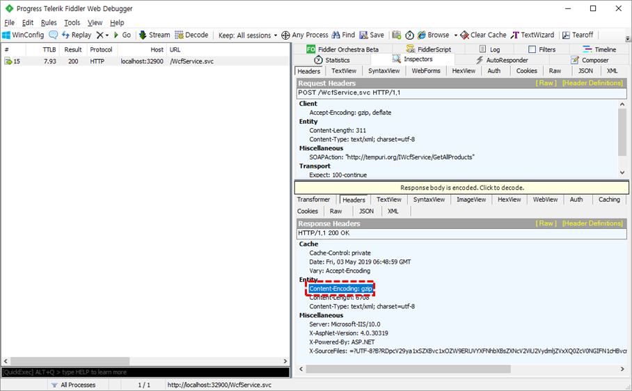
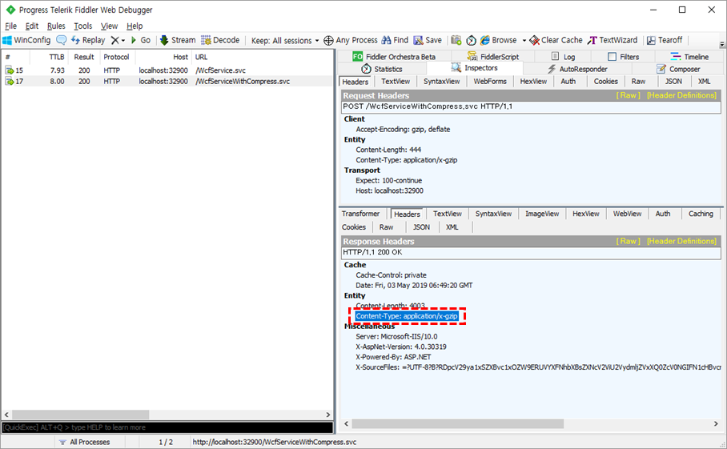

# 메시지 압축

WCF 서비스 호출은 SOAP/XML 메시지를 전송하고 호출 결과로서 SOAP/XML 메시지를 수신합니다. SOAP/XML 메시지는 그 특성상 중복된 태그와 네임스페이스 등이 많이 사용됩니다. 특히, 서비스 호출 혹은 결과에 `DataSet`이나 `IDictionary<string, object>`와 같은 객체가 포함되면 메시지의 크기가 크게 증가합니다.

> WCF 서비스는 바인딩 구성에 따라 XML 메시지 뿐만 아니라 바이너리 메시지 등 다양한 메시지를 주고 받을 수 있습니다.

일반적으로 CPU나 메모리, 디스크에 비해 네트워크의 처리 속도가 매우 느리기 때문에 서비스와 클라이언트가 주고 받는 메시지의 크기가 증가하면 전체적인 성능을 떨어뜨리는 요인이 됩니다. 따라서 송/수신되는 메시지의 크기를 줄이는 것은 성능 향상에 큰 도움이 됩니다. 메시지 압축 기능은 네트워크 속도가 느릴 수록, 메시지 크기가 클 수록 전체적인 성능 향상 효과를 낼 수 있습니다.

WCF 서비스 호출/응답에 적용할 수 있는 메시지 압축 방식은 다양합니다. WCF 서비스를 IIS와 같은 웹 서버에서 호스팅하는 경우, 웹 서버가 제공하는 압축 기능을 적용할 수 있습니다. 만약, WCF 서비스가 웹 서버를 사용하지 않는 독립 호스트라면 Fox Web Service가 제공하는 메시지 압축 인코더를 사용할 수 있습니다.

일반적으로 IIS에 호스팅 되는 WCF 서비스는 IIS의 압축 기능을 사용하는 것이 효율적이며, 그렇지 않은 경우 Fox Web Service에서 제공하는 메시지 압축 인코더를 사용해야 합니다.

## IIS 압축 설정

WCF 서비스가 IIS에 호스팅 되는 경우 IIS에서 제공하는 압축 기능을 WCF 서비스에도 적용할 수 있습니다. IIS의 `동적 컨텐츠 압축 기능`이 설치되어 있어야 하며, `web.config`를 통해 압축 기능을 활성화 해야 합니다. IIS의 압축 기능 활성화는 `<urlCompression>` 요소를 사용합니다. 이 요소의 `doDynamicCompression` 속성을 true로 지정하면 동적 컨텐츠(`.aspx`, `.svc` 등) 압축이 사용됩니다.

WCF 서비스 호출/응답이 정상적으로 압축되기 위해서는 추가적으로 `<httpCompress>` 요소에 WCF 서비스가 사용하는 MIME 타입을 명시해야 합니다. XML 메시지를 주고 받는 WCF 서비스가 사용하는 MIME 타입은 text/xml 이기 때문에 다움과 같은 설정을 수행해 주면 됩니다.

```xml
<system.webServer>
  <urlCompression doDynamicCompression="true" />
  <httpCompression>
    <dynamicTypes>
      <add enabled="true" mimeType="text/xml"/>
    </dynamicTypes>
  </httpCompression>
</system.webServer>
```

IIS의 압축 설정에 대한 상세한 내용은 이 문서의 범위를 벗어나므로 다음 내용을 참조하십시오.

* [&lt;urlCompression&gt;](https://docs.microsoft.com/en-us/iis/configuration/system.webserver/urlcompression)

* [&lt;httpCompression&gt;](https://docs.microsoft.com/en-us/iis/configuration/system.webserver/httpcompression/)

> IIS Express를 사용하는 경우, applicationhost.config 파일(대부분 .vs 폴더 하위에 존재함)에 `<httpCompression>` 요소를 다음과 같이 편집해야 합니다.
>
> ```xml
> <httpCompression directory="%TEMP%\iisexpress\IIS Temporary Compressed Files">
>   <scheme name="gzip" dll="%Windir%\system32\inetsrv\gzip.dll" />
> </httpCompression>
> ```
>
> IIS는 압축 기능 설치와 더불어 위 설정이 자동으로 수행됩니다.

IIS 압축이 적용된 경우 [Fiddler](https://www.telerik.com/fiddler)와 같은 도구를 사용하여 서비스 호출이 압축되었는지 확인할 수 있습니다. HTTP 압축은 `Content-Encoding` HTTP 헤더의 값이 `gzip` 혹은 `deflate`로 설정됩니다.



## 메시지 압축 인코더

Fox Web Service의 메시지 압축 기능은 WCF의 커스텀 메시지 인코더를 통해 제공됩니다. 커스텀 메시지 인코더는 WCF 바인딩을 구성하는 여러 요소(element)들 중 한 요소로서 사용될 수 있습니다. `BasicHttpBinding` 이나 `NetTcpBinding`과 같은 WCF에서 기본적으로 제공되는 바인딩에는 바인딩 요소(binding element)가 고정되어 있으므로 커스텀 메시지 인코더를 사용할 수 없습니다. 따라서 메시지 압축 인코더를 적용하기 위해서는 바인딩 요소를 선택하고 조합할 수 있는 커스텀 바인딩(custom binding)을 사용해야 합니다.

> WCF의 커스텀 바인딩에 대한 내용은 이 문서의 범위를 벗어납니다. [커스텀 바인딩에 대한 상세한 내용](https://docs.microsoft.com/en-us/dotnet/framework/wcf/extending/custom-bindings)은 MSDN 문서를 참고 하십시오.

커스텀 바인딩에 메시지 압축 인코더 요소를 사용하기 위해서는 먼저 메시지 압축 인코더 요소에 대한 정의가 필요합니다. `<system.serviceModel/extensions/bindingElementExtensions>` 요소에 새로운 항목을 다음과 같이 추가 합니다.

```xml
<system.serviceModel>
  <extensions>
    <bindingElementExtensions>
      <add name="gzipMessageEncoding" type="TheOne.ServiceModel.FoxGZipMessageEncodingElement, TheOne.ServiceModel.4.5, Version=4.5.0.0, Culture=neutral, PublicKeyToken=6895727a3cc10e00"/>
    </bindingElementExtensions>
  </extensions>
</system.serviceModel>
```

위 설정은 `FoxGZipMessageEncodingElement` 클래스가 구현하는 커스텀 메시지 인코더를 `gzipMessageEncoding` 이라는 이름으로 등록하게 됩니다. 이와 같은 설정을 통해 이제 `gzipMessageEncoding` 요소를 커스텀 바인딩의 바인딩 요소로 사용할 수 있습니다. 다음은 메시지 압축을 수행하는 커스텀 바인딩의 예를 보여줍니다.

```xml
<system.serviceModel>
  <bindings>
    <customBinding>
      <binding name="customCompressBinding">
        <gzipMessageEncoding innerMessageEncoding="textMessageEncoding" mode="enabled" />
        <httpTransport />
      </binding>
    </customBinding>
  </bindings>
</system.serviceModel>
```

위 바인딩 설정 예는 `httpTransport` 요소를 사용하여 HTTP 트랜스포트를 사용하며 메시지 압축을 수행하는 바인딩 입니다. 즉,  `BasicHttpBinding`의 기본 설정에 압축이 적용되는 것과 동등한 커스텀 바인딩을 정의 합니다.

`<gzipMessageEncoding>` 요소는 `innerMessageEncoding` 속성과 `mode` 속성을 통해 압축 메시지 인코더의 작동 방식을 제어할 수 있습니다.

* `innerMessageEncoding` 속성

   `<gzipMessageEncoding>` 요소는 압축만을 수행하기 때문에 압축 대상이 되는 실제 메시지 인코더를 명시해야 합니다. `innerMessageEncoding` 속성이 압축 대상이 되는 실제 메시지 인코더를 나타냅니다. 사용 가능한 값은 `textMessageEncoding`과 `binaryMessageEncoding` 입니다. 이 두 값은 WCF가 서비스와 통신할 때 사용하는 메시지 포맷으로 각각 텍스트(XML)와 바이너리를 선택할 수 있습니다.

   > `BasicHttpBinding`, `WSHttpBinding` 등의 바인딩은 텍스트 메시지를 사용하며 `NetTcpBinding`, `NetNamedPipeBinding` 등은 바이너리 메시지를 사용합니다. 하지만 커스텀 바인딩은 HTTP/TCP 와 무관하게 메시지 포맷을 선택할 수 있습니다.

* `mode` 속성

  메시지 압축 인코더의 작동 방식을 결정하는 속성으로 `enabled`, `disabled`, `auto` 값을 가질 수 있습니다. `enabled` 값은 항상 메시지를 압축하며 `disabled` 값은 메시지 압축을 수행하지 않습니다. `auto` 값은 Request 메시지가 압축되어 전송된 경우에만 Response 메시지를 압축하여 반환 합니다.

`<gzipMessageEncoding>` 을 포함하는 커스텀 바인딩에 대한 정의는 서버와 클라이언트에 모두 적용되어야 합니다. 즉, 서버 측 web.config와 클라이언트 측 app.config에 동일한 커스텀 바인딩을 정의해야만 서비스 호출이 정상적으로 작동합니다.

메시지 압축 인코더가 적용된 커스텀 바인딩을 정의 했다면 서버와 클라이언트의 [바인딩 맵](bindingmap.md)에 항목을 추가(`neodeex.server.config` 파일 및 `neodeex.client.config` 파일)하여 커스텀 바인딩을 사용하는 바인딩 맵을 추가 합니다.

```xml
<bindingMaps>
  <!-- ... 다른 바인딩 맵 항목 (생략) ... -->
  <bindingMap name="customCompress"
              bindingName="customCompressBinding" serviceBehavior="commonBehavior"/>
</bindingMaps>
```

이제 서비스 측에서는 .svc 파일에서 @ServiceHost 지시자의 Service 속성 값에 바인딩 맵을 명시하여 해당 서비스가 압축을 사용하도록 설정할 수 있습니다. 상세한 내용은 [서비스 팩터리의 바인딩 맵 명시](servicefactory.md#바인딩-맵-명시)을 참고하십시오.

```aspx
<%@ ServiceHost Language="C#" Debug="true"
    Service="WcfServiceWeb.WcfServiceWithCompress;customCompress" CodeBehind="WcfServiceWithCompress.svc.cs"
    Factory="TheOne.ServiceModel.Activation.FoxServiceHostFactory" %>
```

클라이언트 역시 FoxClientFactory 클래스를 사용하여 압축을 사용하는 바인딩 맵을 선택하면 됩니다. 상세한 내용은 [바인딩 맵 선택](bindingmap.md#바인딩-맵-선택) 항목을 참고하십시오.

```csharp
// 메시지 압축 인코더를 사용하여 압축이 적용된 WCF 서비스 호출
using (var svc = FoxClientFactory.CreateChannel<IWcfServiceWithCompress>("", "WcfServiceWithCompress.svc", "customCompress"))
{
    var ds = svc.GetAllProducts();
    grdProducts.DataSource = ds.Tables[0];
}
```

메시지 압축 인코더를 사용한 경우에도 바인딩이 HTTP를 사용하는 경우 `Fiddler`를 통해 압축 여부를 확인할 수 있습니다. 메시지 압축 인코더는 `Content-Type` HTTP 헤더의 값이 `application/x-gzip`으로 표시됩니다.



---