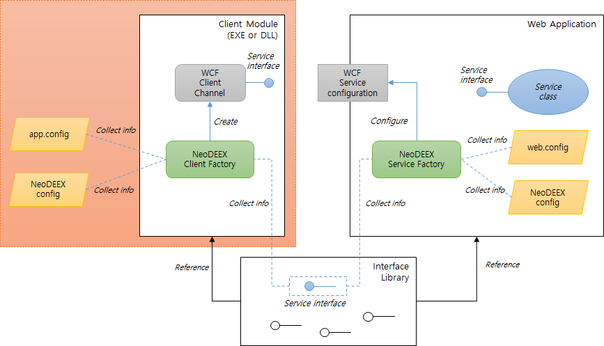
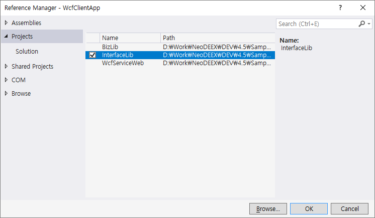
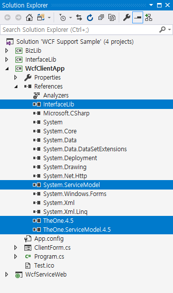
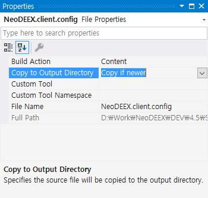
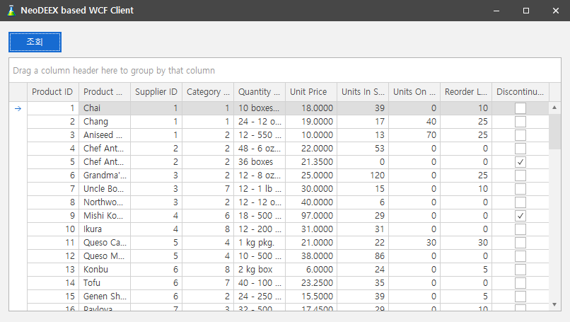

# How-to: WCF 클라이언트 구성

Fox Web Services가 제공하는 WCF 지원 기능을 사용하면 클라이언트 측에서 `서비스 참조(Service Reference)`를 사용하지 않고도 손쉽게 WCF 클라이언트를 작성할 수 있습니다. [그림1]에서 이 예제가 다루는 부분은 클라이언트 모듈 입니다. 클라이언트가 서비스 인터페이스 라이브러리를 참조하지만 인터페이스 라이브러리는 대개 [WCF 서비스 개발](howto-service.md#WCF-서비스-추가)과 동시에 이루어지기 때문에 이 예제에서는 다루지 않습니다.

  
[그림1. Fox Web Services 기반 WCF 서비스/클라이언트 구성도]

> [Fox Web Service를 사용한 WCF 클라이언트 예제 보러 가기](https://github.com/NeoDEEX/Samples/tree/master/WebService/WCF/WCF%20Support%20Sample/WcfClientApp)

목차

* [클라이언트 프로젝트 구성](#클라이언트-프로젝트-구성)

* [App.config 구성](#App.config-구성)

* [바인딩 맵과 주소 맵 구성](#바인딩-맵과-주소-맵-구성)

* [서비스 호출 코드 작성](#서비스-호출-코드-작성)

* [추가적인 서비스 호출](#추가적인-서비스-호출)

## 클라이언트 프로젝트 구성

WCF 클라이언트는 콘솔 어플리케이션, WinForm 어플리케이션, WPF 어플리케이션 등 다양할 수 있습니다. 하지만 이들 클라이언트를 작성할 때 프로젝트에서 필요한 구성 설정은 동일합니다. 이 문서에서 예제는 WinForm 기반의 클라이언트를 사용할 것입니다.

클라이언트 프로젝트를 작성하고 Fox Web Services의 WCF 지원 기능에 관련된 어셈블리들을 참조해야 합니다. 필요한 최소의 어셈블리들은 다음과 같습니다.

* `TheOne.4.5.dll`

* `TheOne.ServiceModel.4.5.dll`

* `System.ServiceModel.dll`

또한, 이 WCF 클라이언트는 서비스 참조를 사용하지 않기 때문에 WCF 서비스 인터페이스 타입을 알 수 있어야 합니다. 따라서 [앞서 WCF 서비스 작성 시 만들어 두었던 서비스 인터페이스 라이브러리](howto-service.md#서비스-인터페이스-라이브러리-작성)를 참조합니다. [그림1]은 프로젝트 참조를 통해 서비스 인터페이스 라이브러리를 참조하는 대화 상자를 보여주고 있습니다.

  
[그림1. 서비스 인터페이스 라이브러리 참조]

[그림2]는 필요한 어셈블리들을 참조한 후의 참조 관계를 보여주고 있습니다.

  
[그림2. 클라이언트의 어셈블리 참조]

## App.config 구성

이제 WCF 서비스 호출을 위해 `app.config` 파일에 WCF 설정을 수행해야 합니다. `App.config` 파일의 설정은 서버 측 `web.config` 설정을 복사하면 되므로 상대적으로 간단합니다. 바인딩 설정은 WCF 서비스가 사용하는 바인딩을 그대로 사용하는 것이 좋습니다. 다음의 바인딩 설정의 예에서 볼 수 있듯이 서버 측과 동일하게 `BasicHttpBinding`을 사용하고 있습니다.

```xml
<system.serviceModel>
  <bindings>
    <basicHttpBinding>
      <binding name="defaultBinding" maxReceivedMessageSize="104857600" />
    </basicHttpBinding>
  </bindings>
</system.serviceModel>
```

클라이언트 측에서도 종점 동작(endpoint behavior)을 사용할 수 있습니다. 추후 설명할 WCF 서비스 인증이나 압축 기능을 사용하면 종점 동작을 구성해야 합니다만 아직까지 이러한 설정을 수행할 필요는 없습니다.

## 바인딩 맵과 주소 맵 구성

서버 측에서 수행했던 것과 비슷하게 클라이언트 측에서도 바인딩 맵이 사용되고, 추가적으로 서비스 주소를 지정하기 위해 주소 맵이 사용됩니다. 바인딩 맵과 주소 맵은 NeoDEEX 구성 파일을 통해 설정되므로 웹 프로젝트에서 수행했던 것과 동일한 방법으로 NeoDEEX 구성 파일을 추가합니다. 클라이언트 측 NeoDEEX 구성 파일은 서버 측과 구분하기 위해 `NeoDEEX.client.config`라는 이름을 사용하는 것이 좋습니다. NeoDEEX 구성 파일을 추가하는 구체적인 방법은 [바인딩 맵 작성](howto-service.md#바인딩-맵-작성) 항목을 참고하십시오.

서버 측에서 했던 것과 동일하게 NeoDEEX 구성 설정 파일 이름을 app.config의 `<appSttings>`에 명시합니다.

```xml
<appSettings>
  <add key="ConfigurationFileName" value="NeoDEEX.client.config"/>
</appSettings>
```

클라이언트 측에서 NeoDEEX 구성 파일을 추가할 때 주의할 점은 NeoDEEX 구성 파일의 위치입니다. 웹 프로젝트에서는 어플리케이션과 동일한 디렉터리(web.config 파일이 존재하는 디렉터리)에 NeoDEEX 구성 파일이 존재하기 때문에 별다른 작업을 수행할 필요가 없었지만 클라이언트 프로젝트는 .exe 파일이 존재하는 디렉터리에 NeoDEEX 구성 파일이 존재해야 합니다.

> NeoDEEX 구성 파일은 그 위치에 제약을 받지 않습니다. `<appSettings>`에 NeoDEEX 구성 파일을 명시할 때 상대 경로 혹은 절대 경로를 명시하여 NeoDEEX 구성 파일을 지정할 수 있습니다. 하지만 혼동을 막기 위해 `app.config` 파일과 동일한 위치에 NeoDEEX 구성 파일을 두는 것이 권장됩니다.

이를 위해 솔루션 탐색기에서 `NeoDEEX.client.config` 파일을 선택하고 속성 창에서 `출력 디렉터리에 복사(Copy to Output Directory)` 속성의 값을 `새 버전이면 복사(Copy if newer)`로 설정합니다.  다음은 속성 창에서 이와 같은 설정을 수행한 모습을 보여주고 있습니다.

  
[그림3. NeoDEEX 구성 파일 복사 설정]

> 속성 값을 `항상 복사(Copy Always)`로 선택하면 불편한 상황이 발생합니다. '항상 복사` 값을 사용하면 코드를 수정하지 않더라도 Visual Studio는 프로젝트를 빌드하게 됩니다.

이제 NeoDEEX 구성 파일에 바인딩 맵과 주소 맵을 작성하면 됩니다. 다음은 클라이언트 측에서 사용하는 바인딩 맵과 주소 맵을 보여주고 있습니다.

```xml
<?xml version="1.0" encoding="utf-8" ?>
<theone.configuration xmlns="http://schema.theonetech.co.kr/fx/config/2011/04/">
  <service defaultBindingMap="basicHttp" defaultAddress="baseAddr">
    <bindingMaps>
      <bindingMap name="basicHttp"
                  bindingName="defaultBinding" endpointBehavior=""/>
    </bindingMaps>
    <addresses>
      <address name="baseAddr" baseUrl="http://localhost:32900/"/>
    </addresses>
  </service>
</theone.configuration>
```

바인딩 맵은 `<service>` 요소 하위에 `<bindingMaps>` 요소에 추가하면 됩니다. 서버 측 구성과 동일하게 바인딩 맵의 이름을 `name` 속성에 명시하고 사용할 바인딩의 이름을 `bindingName` 속성에 명시합니다. 서버 측과 다른 부분은 `serviceBehavior` 속성 대신 종점 동작의 이름을 `endpointBehavior` 속성에 명시해야 합니다. 이 예제에서는 아직 종점 동작을 사용하지 않으므로 이 속성을 명시하지 않거나 공백으로 비워 두면 됩니다.

주소 맵은 WCF 서비스의 주소에 이름을 부여하여 서비스 호출 코드가 주소 이름(address name)을 사용하여 주소 조합을 사용할 수 있도록 해 줍니다. 이 설정에서는 WCF 서비스 웹 프로젝트의 베이스 주소를 사용하였습니다. Iisexpress 를 사용하는 경우 위와 같은 주소를 사용하면 되며 로컬 IIS를 사용하는 경우 웹 어플리케이션의 기본 경로를 포함하여 명시하면 됩니다(예를 들어 `http://localhost/WebProjectName/`). 주소 맵에 주소를 명시할 때 최종 WCF 서비스의 주소(`.svc`를 포함하는 주소)를 사용하지 않아야 합니다. 추후 서비스 호출 코드에서 주소 맵에 명시된 주소로부터 WCF 서비스의 상대 주소만을 사용하기 때문입니다.

마지막으로, 주소 맵에서도 디폴트 주소 맵을 지정할 수 있습니다. `<service>` 요소에서 `defaultAddress` 속성에서 주소 맵의 이름을 표시하여 주소 맵이 명시되지 않은 경우 디폴트 주소 맵을 사용하도록 지정이 가능합니다.

## 서비스 호출 코드 작성

WCF 클라이언트는 WCF의 채널 팩터리(`ChannelFactory`)를 구성하고 이 채널 팩터리로부터 채널 객체를 생성하고 호출하게 됩니다. Visual Studio의 서비스 참조나 `svcutil.exe` 유틸리티가 자동으로 생성해주는 코드들도 채널 팩터리와 채널을 구성하는 코드입니다.

Fox Web Services의 WCF 지원 기능은 `FoxClientFactory` 클래스를 통해 채널 팩터리와 채널을 자동으로 구성해 줍니다. `FoxClientFactory` 클래스의 `CreateChannel<T>` 메서드는 바인딩 맵과 주소 맵을 참조하여 채널 팩터리를 구성하고 구성된 채널 팩터리에서 채널 객체를 생성하여 반환해 줍니다. 구체적인 서비스 호출 코드는 다음과 같습니다.

```csharp
private void btnQuery_Click(object sender, EventArgs e)
{
    using (var svc = FoxClientFactory.CreateChannel<IWcfService>("WcfService.svc"))
    {
        var ds = svc.GetAllProducts();
        grdProducts.DataSource = ds.Tables[0];
    }
}
```

`CreateChanel<T>` 제너릭 메서드의 타입 매개변수는 호출하고자 하는 WCF 서비스의 서비스 인터페이스입니다(위 코드 예의 경우 `IWcfService` 타입). 이미 서비스 인터페이스 라이브러리를 참조하고 있기 때문에 서비스 인터페이스를 사용할 수 있습니다. 또한 `CreateChannel<T>` 메서드가 반환하는 값은 채널 객체로서 그 타입이 서비스 인터페이스인 `IWcfService` 타입입니다. 따라서 이 인터페이스의 메서드를 호출할 수 있습니다.

위 코드 예제에서 `using` 문장은 WCF 클라이언트에서 중요합니다. 채널 객체가 해제되지 않으면 서비스 연결 자원(HTTP 연결, 네트워크 소켓 등)이 즉시 해제되지 않기 때문입니다. 따라서 호출이 완료되면 채널 객체를 해제하도록 `using` 문을 사용해야 합니다. 이 `using` 문을 사용하기 위해서 서비스 인터페이스가 `IDisposable` 인터페이스에서 파생된 것입니다.

> Using 문장에 의해 채널 객체가 해제되더라도 서비스 측의 Dispose 메서드가 호출되지 않습니다. 서비스 측 Dispose 메서드는 서비스 객체가 더 이상 사용되지 않을 때에 호출되며 클라이언트와 무관합니다.

`CreateChannel<T>` 메서드의 매개변수는 주소 맵이 지정하는 주소로부터의 상대 주소입니다. `NeoDEEX.client.config` 파일에서 설정된 디폴트 주소 맵(baseAddr)의 주소는 `http://localhost:32900/` 이었습니다. `CreateChannel<T>` 메서드 호출 시 매개변수로 전달된 서비스의 상대 주소는 `WcfService.svc` 이었으므로 최종적으로 호출에 사용되는 서비스의 주소는 `http://localhost:32900/WcfService.svc` 가 됩니다.

Iisexpress 대신 로컬 IIS를 사용했다면 주소 맵의 주소를 `http://localhost/WcfServiceWeb` 으로 설정해야 하며 `CreateChannel<T>` 메서드 호출에 사용된 상대 주소를 조합하면 최종 주소는 `http://localhost/WcfServiceWeb/WcfService.svc` 가 될 것입니다.

위 코드 예제에서 사용된 `CreateChannel<T>` 메서드는 호출하고자 하는 WCF 서비스에 대한 상대 주소 만을 매개변수로 사용합니다. 이 경우, `CreateChannel<T>` 메서드는 디폴트 주소 맵과 디폴트 바인딩 맵을 사용하여 WCF 호출을 구성합니다. 하지만 `CreateChannel<T>` 메서드는 이외에도 주소 맵의 이름과 바인딩 맵의 이름을 매개변수로 명시할 수 있습니다. 위 코드의 `CreateChannel<T>` 메서드 호출은 다음 코드와 완전히 동등합니다.

```csharp
var svc = FoxClientFactory.CreateChannel<IWcfService>("baseAddr", "WcfService.svc", "basicHttp")
```

이제 WCF 서비스를 호출하기 위한 클라이언트 측의 설정과 코드 작성이 완료되었습니다. 솔루션을 빌드하고 WCF 서비스 웹 프로젝트와 클라이언트 프로젝트를 구동하여 테스트를 수행하면 됩니다. 다음은 이 예제의 클라이언트를 수행한 결과를 보여주고 있습니다.


[그림4. 클라이언트 수행 예]

> 이 예제는 DevExpress 컴포넌트 슈트의 폼(XtraForm), 데이터그리드(XtraGrid) 및 테마(Beizer)를 사용하여 작성한 예제 입니다.

## 추가적인 서비스 호출

지금까지 `app.config`와 `NeoDEEX.client.config` 파일 구성을 통해 WCF 서비스 호출 설정을 모두 수행했기 때문에 다른 WCF 서비스 호출을 위해 추가적인 구성 설정이 전혀 필요 없습니다.

호출하고자 하는 WCF 서비스가 동일한 바인딩을 사용하고 동일한 웹 어플리케이션에 존재한다면 주소 맵이나 바인딩 맵을 추가/수정하는 작업 없이 `CreateChannel<T>` 메서드를 호출할 수 있습니다. 다음 코드는 앞서 예제에서 추가했던 `WcfService2.svc` 서비스를 호출하는 예제 코드입니다.

```csharp
using (var svc = FoxClientFactory.CreateChannel<IWcfService2>("WcfService2.svc"))
{
    svc.DoWork();
}
```

---