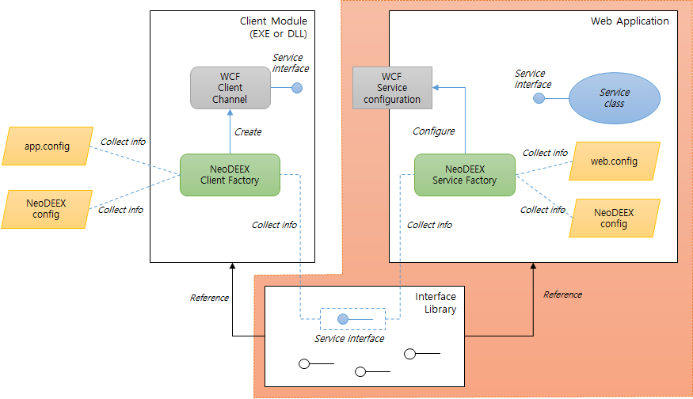
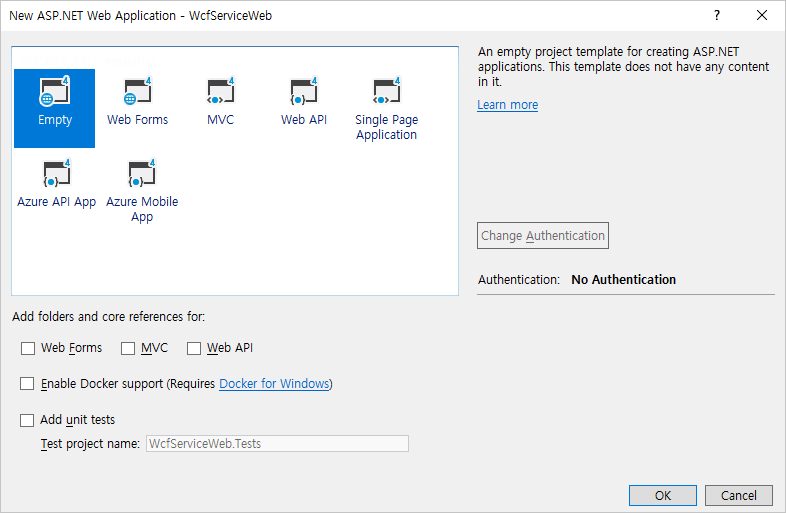
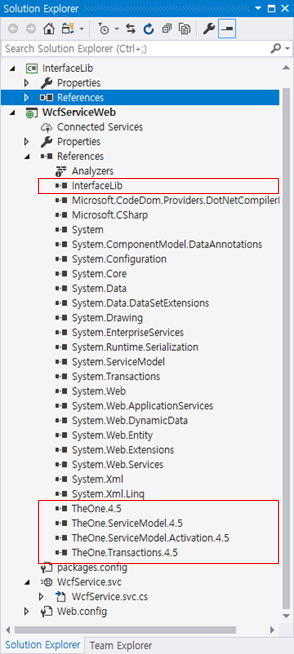
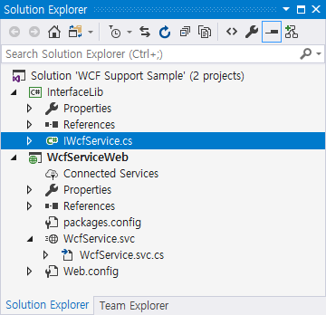
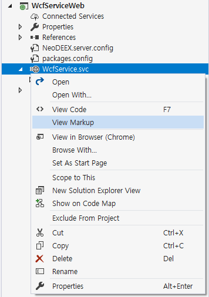
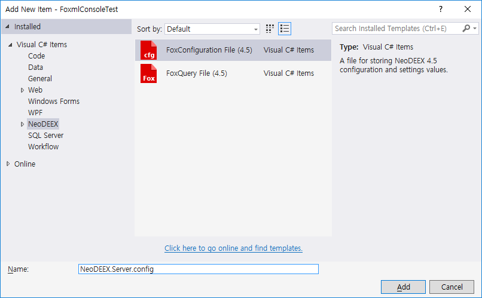
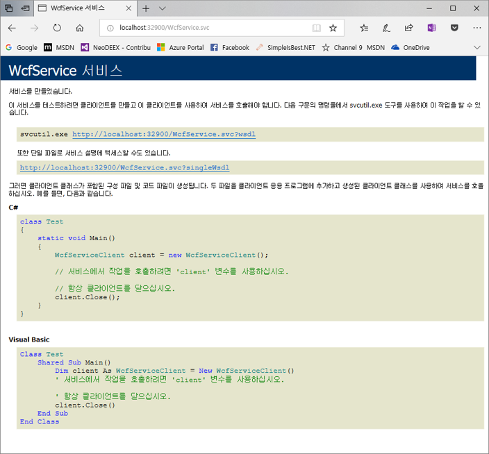

# How-To: WCF 서비스 구성

Fox Web Services가 제공하는 WCF 기능들을 활용하여 WCF 서비스를 구성하는 방법에 대해 단계적이고 상세하게 설명합니다. [그림1]에서 이 예제가 다루는 부분은 WCF 인터페이스를 선언하는 인터페이스 라이브러리와 WCF 서비스를 호스팅하는 웹 어플리케이션 부분에 해당합니다.

  
[그림1. Fox Web Services 기반 WCF 서비스/클라이언트 구성도]

> [Fox Web Service를 사용한 WCF 서비스 예제 보러 가기](https://github.com/NeoDEEX/Samples/tree/master/WebService/WCF/WCF%20Support%20Sample)

목차

* [서비스 인터페이스 라이브러리 작성](#서비스-인터페이스-라이브러리-작성)

* [WCF 웹 프로젝트 작성](#WCF-웹-프로젝트-작성)

* [WCF 서비스 추가](#WCF-서비스-추가)

* [WCF 서비스 구현](#WCF-서비스-구현)

* [Web.config 구성](#Web.config-구성)

* [바인딩 맵 작성](#바인딩-맵-작성)

* [WCF 서비스 테스트](#WCF-서비스-테스트)

* [추가적인 WCF 서비스 구성](#추가적인-WCF-서비스-구성)

## 서비스 인터페이스 라이브러리 작성

WCF 서비스의 서비스 인터페이스는 별도의 DLL 라이브러리에 작성할 것입니다. 따라서 Visual Studio의 `라이브러리 프로젝트` 템플릿을 선택하고, 서비스 인터페이스 선언에 필요한 `System.ServiceModel` 어셈블리를 참조합니다. 추후에 WCF 서비스를 추가할 때 자동으로 생성되는 서비스 인터페이스를 이 프로젝트로 옮겨올 것입니다.

## WCF 웹 프로젝트 작성

WCF 서비스를 호스팅하는 웹 프로젝트를 작성하는 방법은 매우 간단합니다. WCF는 MVC나 Web API와 달리 별다른 프로젝트 템플릿을 적용할 필요가 없습니다. [그림1]과 같이 단순히 ASP.NET 웹 프로젝트 생성 대화상자에서 Empty 템플릿을 선택하면 됩니다.

  
[그림1. 웹 프로젝트 선택]

> 동일한 웹 프로젝트에서 [Fox Biz Service](/webservice/bizservice/README.md) 혹은 [Fox Data Service](/webservice/dataservice/README.md)의 REST API를 사용하고자 한다면 Web API 사용 체크 박스를 미리 설정해 두는 것이 좋습니다.

이제 WCF 지원을 위한 NeoDEEX 어셈블리와 서비스 인터페이스 라이브러리를 `참조 추가(Add Reference)` 합니다. WCF 지원을 위해 필요한 NeoDEEX 어셈블리들은 다음과 같습니다.

* `TheOne.4.5.dll`

* `TheOne.ServiceModel.4.5.dll`

* `TheOne.ServiceModel.Activation.4.5.dll`

* `TheOne.Transactions.4.5.dll`  
    (WCF 서비스에서 트랜잭션 컴포넌트를 호출하는 경우에만 필요)

[그림2]는 서비스 인터페이스 라이브러리 프로젝트와 NeoDEEX 어셈블리들을 참조한 웹 프로젝트의 참조 상황을 보여주고 있습니다.

  
[그림2. 프로젝트 참조 상황]

## WCF 서비스 추가

이제 Visual Studio의 WCF 서비스 아이템 템플릿을 사용하여 WCF 서비스(예를 위해 서비스 이름을 `WcfService` 라고 가정합니다)를 추가합니다. Visual Studio는 WCF 서비스 정의를 위해 `WcfService.svc` 파일을, 서비스 클래스 구현을 위해 `WcfService.cs` 파일을, 그리고 서비스 인터페이스를 위해 `IWcfService.cs` 파일을 추가하며 `web.config`에 적절한 구성 설정을 추가해 줍니다.

앞서 언급한 대로 서비스 인터페이스는 별도의 라이브러리에 포함시켜야 할 것이므로 `IWcfService.cs` 파일을 `잘라내기(Cut)`하여 서비스 인터페이스 라이브러리 프로젝트에 붙여 넣습니다(Paste).

이때 서비스 인터페이스를 `IDisposable` 인터페이스에서 파생시키는 것이 중요합니다. 비록 서비스 구현에서 `Dispose` 메서드에서 구현할 내용이 없더라도 클라이언트 측 구현에서 필요한 사항이므로 `IDisposable` 인터페이스에서 서비스 인터페이스가 파생되도록 구성해야 합니다. 또한 인터페이스의 네임스페이스를 라이브러리 프로젝트에 맞도록 수정하는 것이 좋습니다. 다음은 예제로 사용된 `IWcfService.cs`의 내용입니다.

```csharp
using System;
using System.Data;
using System.ServiceModel;

namespace InterfaceLib
{
    //
    // 서비스 인터페이스 선언. IDisposable 에서 파생해야 한다.
    // (웹 프로젝트에서 복사해 왔다면 네임스페이스 변경에 주의해야 한다)
    //
    [ServiceContract]
    public interface IWcfService : IDisposable
    {
        [OperationContract]
        DataSet GetAllProducts();
    }
}
```

지금까지의 작업이 정상적으로 수행되었다면 웹 프로젝트와 서비스 인터페이스 라이브러리 프로젝트는 다음 [그림3]과 같은 모습을 갖추게 될 것입니다.

  
[그림3. 서비스 인터페이스 이동 후 프로젝트 구성]

이제 `WcfService.svc` 파일을 열어 서비스 팩터리를 설정해야 합니다. `Svc` 파일을 선택하고 마우스 오른쪽을 클릭하여 컨텍스트 메뉴를 표시하고 `마크업 표시(View Markup)` 메뉴를 선택합니다.


[그림4. 마크업 표시 메뉴]

`Svc` 파일의 기존 내용에서 `Factory` 속성을 추가하고 NeoDEEX의 서비스 팩터리인 `FoxServiceHostFactory` 클래스를 추가합니다(네임스페이스를 포함하는 전체 이름 사용). 다음은 `WcfService.svc` 파일의 내용을 보여주고 있습니다.

```aspx
<%@ ServiceHost Language="C#" Debug="true"
    Service="WcfServiceWeb.WcfService" CodeBehind="WcfService.svc.cs"
    Factory="TheOne.ServiceModel.Activation.FoxServiceHostFactory" %>
```

`FoxServiceHostFactory` 클래스는 서비스 클래스(이 경우 `WcfService` 클래스)에서 서비스 인터페이스를 파악해 내고, NeoDEEX 구성 파일로부터 바인딩 정보를 읽어 WCF 서비스를 자동으로 구성해 줍니다. 이 서비스 팩터리를 사용함으로써 `web.config`에서 `<service>` 요소와 `<endpoint>` 요소를 작성하지 않아도 됩니다. 서비스 팩터리에 대한 상세한 내용은 [서비스 팩터리](servicefactory.md) 항목을 참고하십시오.

## WCF 서비스 구현

WCF 서비스 구현은 서비스 클래스인 `WcfService.cs` 파일의 코드를 작성하면 됩니다. 이 예제에서는 Fox Transaction 기능을 사용한 비즈니스 로직 컴포넌트를 호출합니다. 비즈니스 로직 컴포넌트들은 별도의 어셈블리에 구현하는 것이 좋습니다. 이는 여러 개발자들이 분업과 협업을 하는데 유리하며 비즈니스 로직 변화 시 비즈니스 로직 어셈블리만을 배포하면 되므로 배포에도 유리하기 때문입니다. 이 문서에서 비즈니스 로직 어셈블리를 작성하는 방법에 대해서 기술하지 않습니다. 상세한 내용은 [Fox Transaction 문서](/transaction/README.md)를 참고하십시오. 다만, 비즈니스 로직 컴포넌트의 소스 코드만을 소개할 것입니다.

다음 코드는 `WcfService.cs` 파일에서 구현한 서비스 클래스를 보여주고 있습니다. 서비스 클래스인 `WcfService` 클래스는 서비스 인터페이스인 `IWcfService` 인터페이스를 구현하고 있으며, 이미 언급한 대로 비즈니스 로직 어셈블리(`BizLib.dll`)에 존재하는 비즈니스 로직 컴포넌트(`BizLogicClass`)를 호출하고 있습니다. 서비스 인터페이스인 `IWcfService` 인터페이스가 `IDisposable` 인터페이스에서 파생되었기 때문에 `Dispose` 메서드 역시 포함되어 있지만 특별한 자원 해제가 필요하지 않으므로 비워둡니다.

```csharp
using BizLib;
using InterfaceLib;
using System.Data;

namespace WcfServiceWeb
{
    //
    // 서비스 클래스 구현
    //
    public class WcfService : IWcfService
    {
        public DataSet GetAllProducts()
        {
            // 비즈니스 로직을 호출한다.
            using (var comp = new BizLogicClass())
            {
                return comp.GetAllProducts();
            }
        }

        public void Dispose()
        {
            // 구현 내용이 없다.
        }
    }
}
```

다음 코드는 비즈니스 로직 컴포넌트의 구현을 보여줍니다. 비즈니스 로직 컴포넌트는 트랜잭션 제어 특성(`FoxTransactionAttribute`)을 사용하여 트랜잭션(이 경우 조회이므로 트랜잭션을 사용하지 않도록 설정)을 구성하고 데이터 액세스 컴포넌트(`DataAccessClass`)를 호출합니다.

```csharp
using System.Data;
using TheOne.Transactions;

namespace BizLib
{
    // 비즈니스 로직 컴포넌트 예제
    public class BizLogicClass : FoxBizBase
    {
        [FoxTransaction(FoxTransactionOption.Suppress)]
        public DataSet GetAllProducts()
        {
            using (var dac = new DataAccessClass())
            {
                // 데이터 액세스 컴포넌트를 호출한다.
                return dac.GetAllProducts();
            }
        }
    }
}
```

마지막으로 다음 코드는 데이터 액세스 컴포넌트의 구현을 보여주고 있습니다. 데이터 액세스 컴포넌트 역시 트랜잭션 제어 특성을 사용하고, `FoxDacBase` 클래스의 기능을 사용하여 데이터를 조회하여 반환합니다.

```csharp
using System.Data;
using TheOne.Transactions;

namespace BizLib
{
    // 데이터 액세스 컴포넌트 예제
    [FoxTransaction(FoxTransactionOption.Supported)]
    class DataAccessClass : FoxDacBase
    {
        public DataSet GetAllProducts()
        {
            // FoxDbAccess 를 사용하여 데이터를 조회하여 반환한다.
            return this.DbAccess.ExecuteSqlDataSet("SELECT * FROM Products");
        }
    }
}
```

## Web.config 구성

이제 WCF 서비스가 사용할 바인딩 및 서비스 동작(behavior) 등 `web.config`에 필요한 설정을 수행해야 합니다. .NET Framework 4.0부터 기본 바인딩 기능을 제공하므로 HTTP 프로토콜은 `BasciHttpBinding`을, TCP 프로토콜은 `NetTcpBinding`을 사용합니다. 하지만 이들 바인딩의 디폴트 설정은 최대 버퍼 크기 등의 제약이 많으므로 명시적으로 바인딩 구성을 하는 것이 좋습니다. 비슷하게 서비스 동작에서도 예외 정보 설정, NeoDEEX 인증 여부 등의 설정이 필요하므로 명시적으로 서비스 동작을 정의해 두어야 합니다.

이 예제에서는 기본적으로 `BasicHttpBinding`을 사용할 것이며 추후에 추가적인 바인딩 설정을 추가하는 예를 보일 것입니다. 다음 설정은 이 예제에서 사용할 `BasicHttpBinding` 설정을 보여주고 있습니다. 이 설정은 클라이언트로부터 전송될 수 있는 최대 메시지 크기를 100MB로 지정하고 있습니다. 주목할 부분은 `<binding>` 요소의 `name` 속성을 통해 바인딩의 이름을 구체적으로 설정한 것입니다. 이는 다음에 설명할 바인딩 맵에서 이 바인딩을 참조하기 위함 입니다.

```xml
<bindings>
  <basicHttpBinding>
    <binding name="defaultBinding" maxReceivedMessageSize="104857600" />
  </basicHttpBinding>
</bindings>
```

Visual Studio의 WCF 서비스 아이템 템플릿은 `web.config`에 기본적인 서비스 동작 설정을 추가해 줍니다. 이 서비스 동작 설정은 클라이언트가 HTTP/HTTPS GET을 통해 서비스의 메타 정보(WSDL)를 조회할 수 있도록 해주며, 예외가 발생했을 때 예외의 상세 정보를 반환하도록 하는 설정입니다. 현재로서는 이 설정을 그대로 사용해도 됩니다. 다만, 앞서 바인딩 설정과 마찬가지로 서비스 동작 설정에 이름을 명시하여 바인딩 맵에서 참조할 수 있도록 해 줍니다. 다음은 이 예제에서 사용하는 서비스 동작 설정입니다.

```xml
<behaviors>
  <serviceBehaviors>
    <behavior name="commonBehavior">
      <serviceMetadata httpGetEnabled="true" httpsGetEnabled="true" />
      <serviceDebug includeExceptionDetailInFaults="true" />
    </behavior>
  </serviceBehaviors>
</behaviors>
```

다음은 바인딩 설정과 서비스 동작 설정을 포함하여 WCF와 관련된 구성 설정 전체를 보여주고 있습니다.

```xml
<?xml version="1.0" encoding="utf-8"?>
<configuration>
  ...... 다른 구성 설정들 (생략) ......
  <system.serviceModel>
    <behaviors>
      <serviceBehaviors>
        <behavior name="commonBehavior">
          <serviceMetadata httpGetEnabled="true" httpsGetEnabled="true" />
          <serviceDebug includeExceptionDetailInFaults="true" />
        </behavior>
      </serviceBehaviors>
    </behaviors>
    <serviceHostingEnvironment aspNetCompatibilityEnabled="true"
      multipleSiteBindingsEnabled="true" />
    <bindings>
      <basicHttpBinding>
        <binding name="defaultBinding" maxReceivedMessageSize="104857600" />
      </basicHttpBinding>
    </bindings>
  </system.serviceModel>
</configuration>
```

## 바인딩 맵 작성

Fox Web Service에서 제공하는 바인딩 맵(BindingMap) 기능은 WCF에서 사용하는 바인딩 종류와 바인딩 구성, 그리고 서비스/클라이언트 동작(behavior)에 대한 템플릿을 구성하여 WCF 서비스와 클라이언트가 참조할 수 있도록 도와줍니다. `FoxServiceHostFactory` 클래스는 바인딩 맵에서 바인딩에 관련된 정보를 획득하여 WCF 서비스를 구성하게 됩니다. 바인딩 맵은 NeoDEEX 구성 설정의 `<bindingMaps>` 요소를 통해 정의됩니다. NeoDEEX 구성 설정 기능에 대한 상세한 내용은 [Fox Configuration 문서](/configuration/README.md)를 참고하십시오.

먼저, NeoDEEX 구성 설정을 추가해야 합니다. 다음 그림과 같이 Visual Studio에서 NeoDEEX 구성 설정 아이템 템플릿 을 통해 구성 설정 파일을 추가합니다. 구성 설정 파일 이름은 임의의 이름을 사용할 수 있지만 서버 측에서 사용되는 NeoDEEX 구성 설정임을 알릴 수 있도록 `NeoDEEX.Server.config` 라는 이름을 사용하였습니다.

  
[그림5. NeoDEEX 구성 파일 템플릿]

만약, NeoDEEX 구성 설정 아이템 템플릿이 존재하지 않는다면, XML 파일 아이템 템플릿을 추가하고 다음과 같이 `<theone.configuration>` 요소를 추가합니다.

```xml
<?xml version="1.0" encoding="utf-8" ?>
<theone.configuration  xmlns="http://schema.theonetech.co.kr/fx/config/2011/04/">
</theone.configuration>
```

이제, NeoDEEX 구성 설정 파일 이름을 web.config의 `<appSttings>`에 명시합니다.

```xml
<appSettings>
  <add key="ConfigurationFileName" value="NeoDEEX.Server.config"/>
</appSettings>
```

이제 `Neodeex.server.config` 파일에 `<service>` 요소와 `<bindingMaps>` 요소를 추가하여 바인딩 맵을 다음과 같이 명시합니다.

```xml
<?xml version="1.0" encoding="utf-8" ?>
<theone.configuration xmlns="http://schema.theonetech.co.kr/fx/config/2011/04/">
  <service defaultBindingMap="basicHttp">
    <bindingMaps>
      <bindingMap name="basicHttp"
                  bindingName="defaultBinding" serviceBehavior="commonBehavior"/>
    </bindingMaps>
  </service>
</theone.configuration>
```

이 바인딩 맵 설정은 `basicHttp`라는 이름을 가진 바인딩 맵 하나만 설정되어 있습니다. 이 바인딩 맵은 `web.config`에서 `defaultBinding`이라는 이름을 가진 바인딩과 `commonBehavior`라는 이름을 가진 서비스 동작(behavior)을 사용하여 WCF 서비스를 구성하도록 설정하고 있습니다. 바인딩 맵에서 바인딩의 종류는 불필요하며 바인딩 이름만을 사용함에도 주목하십시오.

위 바인딩 맵 설정에서 주목할 부분은 디폴트 바인딩 맵 설정입니다. `<service>` 요소에서 `defaultBindingMap` 속성이 지정하는 바인딩 맵이 디폴트 바인딩 맵으로서 구체적으로 바인딩 맵 이름이 명시되지 않으면 `basicHttp` 라는 이름을 가진 바인딩 맵이 사용된다는 의미입니다. 앞서 수행했던 `.svc` 파일에서 구체적으로 바인딩 맵 이름을 지정하지 않으면 디폴트 바인딩 맵을 사용하여 WCF 서비스를 구성함에 유의하십시오. 디폴트 바인딩 맵 대신 바인딩 맵의 이름을 명시하여 WCF 서비스를 구성하는 방법을 포함하여 바인딩 맵에 대한 상세한 기능은 [바인딩 맵 항목](bindingmap.md)에서 상세히 설명할 것입니다.

## WCF 서비스 테스트

이제 WCF 서비스 구성 설정이 정상적으로 완료되었는지 확인해야 할 차례입니다. WCF 서비스 구성 설정을 확인하는 방법은 WCF 서비스의 주소를 웹 브라우저에서 탐색하면 됩니다. 브라우저를 구동하고 주소 창에 직접 WCF 서비스 주소를 입력합니다. 이 예제의 경우, WCF 서비스의 주소는 `http://localhost:32900/wcfservice.svc` 입니다.

> 이 예제는 Iisexpress를 사용하였습니다. 로컬 IIS를 사용하였다면 서비스의 주소가 달라질 수 있습니다.

[그림6]은 WCF 서비스 주소를 브라우징 했을 때 나타나는 서비스 도움말 페이지의 예를 보여주고 있습니다. 다음과 같은 페이지가 정상적으로 나타난다면 NeoDEEX를 사용하여 WCF 서비스를 정상적으로 구동한 것이 됩니다.

  
[그림6. 서비스 테스트 결과]

## 추가적인 WCF 서비스 구성

지금까지 Fox Web Services가 제공하는 WCF 지원 기능을 통해 간략한 WCF 서비스를 작성하고 구성하는 방법을 살펴보았습니다. 여기까지의 과정이 NeoDEEX를 사용하지 않았을 때 보다 복잡하다고 생각할 수도 있습니다. 하지만 Fox Web Services의 WCF 지원 기능은 최초의 구성 시에만 작업 양이 많을 뿐 이 이후에 추가적으로 WCF 서비스들을 추가할 때에는 매우 간단한 작업만을 요구합니다. 지금까지 살펴보았던 과정이 이미 완료된 상황이라면 WCF 서비스 아이템 템플릿을 추가하고 `.svc` 파일만을 수정하면 WCF 서비스의 사용이 가능합니다. 구체적으로 이 과정을 살펴보도록 하겠습니다.

[WCF 서비스 추가](#WCF-서비스-추가) 항목에서 수행했던 대로 새로운 WCF 서비스(이 예에서는 `WcfService2.svc`)를 추가합니다

* 서비스 인터페이스(`IWcfService2.cs`) 클래스를 인터페이스 라이브러리(`InterfaceLib`) 프로젝트로 이동시킵니다(Cut & Paste).

* 서비스 인터페이스의 네임스페이스를 적절히 수정합니다.

* `WcfService2.svc` 파일의 마크 업을 열어 서비스 팩터리에 `FoxServiceHostFactory`를 지정합니다.

* 서비스 클래스(`WcfService2.svc.cs`) 파일을 열어 서비스 구현을 완료합니다.

* (옵션) `web.config`에서 WCF 서비스 아이템 템플릿이 추가한 `<serviceBehavior>` 항목을 제거합니다.

    > Visual Studio 2017을 기준으로 WCF 서비스 아이템 템플릿은 이름이 없는(empty string) 서비스 동작의 존재 여부를 검사하여 존재하지 않는 경우 추가합니다. 따라서 추가된 서비스 동작을 삭제하지 않고 그대로 두면 WCF 서비스를 추가할 때마다 `<serviceBehavior>` 항목이 추가되는 것을 피할 수 있습니다.

이제 이 새로운 서비스는 앞서 구성한 디폴트 바인딩 맵을 사용하여 구성이 완료되었습니다. 웹 프로젝트를 빌드하고, 브라우저에서 새로이 추가된 WCF 서비스의 주소를 입력하여 정상 설정을 확인할 수 있습니다.

Fox Web Services의 WCF 지원 기능은 이렇게 한번의 설정으로 여러 WCF 서비스들을 작성할 때 반복적으로 `web.config`의 설정을 추가할 필요가 없게 해 줍니다. 또한 일관된 바인딩 설정을 여러 서비스들이 공유할 수 있게 해줍니다.

---