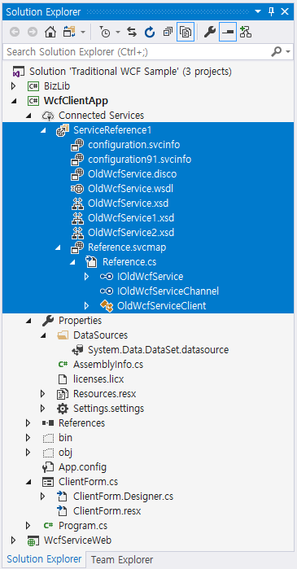

# 전통적인 WCF 서비스 기반 어플리케이션의 문제점

ASP.NET 웹 어플리케이션 상에서 WCF 서비스를 작성하는 전형적인 방식은 다음과 같습니다.

* 서비스 인터페이스 작성

* 서비스 호스트(ServiceHost)를 구성하는 .svc 파일 추가

* 서비스 클래스 구현

* 서비스 바인딩 및 동작(behavior) 구성

Visual Studio와 .NET Framework에서 제공하는 WCF 지원 기능은 위와 같은 작업을 손쉽게 시작할 수 있는 아이템 템플릿을 제공하여 작업을 좀 더 편리하게 해줍니다. 하지만 이러한 방식으로 수십 수백개의 서비스를 제공해야 하는 대규모 어플리케이션은 커다란 한계에 봉착합니다.

목차

* [서버측 WCF 구성 설정의 문제점](#서버측-WCF-구성-설정의-문제점)

* [클라이언트 측 WCF 구성 설정의 문제점](#클라이언트-측-WCF-구성-설정의-문제점)

* [해결 방법](#해결-방법)

## 서버측 WCF 구성 설정의 문제점

IIS를 사용하는 WCF 서비스는 `.svc` 파일로부터 WCF 서비스가 어떤 서비스 클래스를 사용하는지를 나타내며 WCF 서비스에 대한 URL 주소를 나타내는데 사용합니다. 그 이외의 설정, 즉 서비스가 사용하는 서비스 인터페이스, 바인딩, 서비스 동작(behavior)은 모두 `web.config` 파일을 사용합니다. 다음은 하나의 WCF 서비스(`OldWcfService.svc`)를 Visual Studio를 통해 구성했을 때의 `web.config`에서 WCF와 관련된 구성 설정들을 보여주고 있습니다.

```xml
<system.serviceModel>
  <bindings>
    <basicHttpBinding>
      <binding name="" maxReceivedMessageSize="104857600" />
    </basicHttpBinding>
  </bindings>
  <behaviors>
    <serviceBehaviors>
      <behavior name="">
        <serviceMetadata httpGetEnabled="true" httpsGetEnabled="true" />
        <serviceDebug includeExceptionDetailInFaults="false" />
      </behavior>
    </serviceBehaviors>
  </behaviors>
  <serviceHostingEnvironment aspNetCompatibilityEnabled="true" multipleSiteBindingsEnabled="true" />
</system.serviceModel>
```

위에서 보인 `web.config`는 복잡하지 않으며 문제가 없어 보입니다. 특히 `<services>` 구성 설정이 없으며 바인딩 설정 역시 간단합니다. 이는 Visual Studio 템플릿과 IIS에 의해 WCF 서비스의 주소(`OldWcfService.svc`), 바인딩(`BasicHttpBinding`), 서비스 인터페이스(`IOldWcfService`)가 자동으로 결정되기 때문입니다. 하지만 자동으로 구성된 바인딩이 아닌 다른 바인딩을 사용해야 하는 경우, `<services>` 구성 설정이 반드시 필요하게 됩니다. 다음은 `BasicHttpBinding` 대신 `NetHttpBinding` 을 사용하는 경우 `web.config`에서 WCF 관련 구성 설정을 보여주고 있습니다.

```xml
<system.serviceModel>
  <bindings>
    <basicHttpBinding>
      <binding name="" maxReceivedMessageSize="104857600" />
    </basicHttpBinding>
    <netHttpBinding>
      <binding name="HttpBinaryBinding" maxReceivedMessageSize="104857600" />
    </netHttpBinding>
  </bindings>
  <behaviors>
    <serviceBehaviors>
      <behavior name="">
        <serviceMetadata httpGetEnabled="true" httpsGetEnabled="true" />
        <serviceDebug includeExceptionDetailInFaults="false" />
      </behavior>
    </serviceBehaviors>
  </behaviors>
  <serviceHostingEnvironment aspNetCompatibilityEnabled="true"
                                multipleSiteBindingsEnabled="true" />
  <services>
    <service name="WcfServiceWeb.OldWcfService">
      <endpoint address=""
                 binding="netHttpBinding" bindingConfiguration="HttpBinaryBinding"
                 contract="WcfServiceWeb.IOldWcfService" />
    </service>
  </services>
</system.serviceModel>
```

> `NetHttpBinding`은 `BasicHttpBinidng`과 마찬가지로 HTTP 트랜스포트를 사용하지만 XML 대신 WCF 고유의 바이너리 데이터를 사용하여 SOAP 메시지를 구성하여 성능적으로 약간 더 우수합니다. 따라서 클라이언트가 닷넷 기반이라면 `NetHttpBinding`을 사용하는 것이 유리할 수 있습니다. 또한 `NetHttpBinding`은 `BasicHttpBinding`과 달리 서비스가 클라이언트를 호출하는 콜백(푸쉬) 기능을 사용할 수 있습니다.

위의 구성 설정 예와 같이 `BasicHttpBinding`이 아닌 바인딩을 사용하면 반드시 `<service>` 요소를 포함하는 구성 설정이 필요하게 됩니다. 또한, 2개 이상의 바인딩을 사용할 때에도 `<service>` 요소가 필요합니다. 개발시에는 `BasicHttpBinding`을 사용하고, 운영시에는 `NetHttpBinding`을 사용할 수도 있기 때문에 서비스 종점(`<endpoint>` 요소)을 정의하고 필요에 따라 바인딩을 바꾸어 줄 수 있어야 하기 때문입니다.

어플리케이션에서 사용하는 WCF 서비스가 10여개 정도라면 10개의 `<service>` 및 `<endpoint>` 요소를 구성하고 유지하는 것은 어렵지 않을 수 있습니다. 하지만 기업의 대규모 어플리케이션이라면 이야기가 달라집니다. WCF 서비스의 개수가 수백 개일 수도 있으며 때때로 1000개가 넘는 WCF 서비스를 유지해야 할 수도 있습니다. WCF 서비스 개수가 늘어남에 따라서 `<service>` 요소의 개수 역시 수백, 수천 개에 다다를 수 있으며 이들을 일일이 관리해야 하는 것은 유지보수에 있어서 커다란 부담이 될 것입니다.

## 클라이언트 측 WCF 구성 설정의 문제점

WCF 서비스의 클라이언트를 작성할 때 표준적인 방법은 Visual Studio의 `서비스 참조(Service Reference)`를 사용하거나 `svcutil.exe`와 같은 도구를 사용하여 클라이언트 측에서 WCF 구성 설정과 관련된 코드를 생성하는 것입니다. Visual Studio의 `서비스 참조`는 서비스에서 제공하는 서비스의 메타데이터(WSDL)를 사용하여 `app.config`에 서비스의 바인딩을 구성해 주며 서비스의 주소를 포함하는 `<endpoing>` 요소를 추가해 줍니다. 뿐만 아니라 서비스가 공개하는 서비스 인터페이스 코드를 생성해 주기 때문에 손쉽게 서비스 호출이 가능합니다.

다음은 서비스 참조를 수행했을 때 `app.config`에서 설정되는 WCF 관련 구성 설정을 보여주고 있습니다.

```xml
<system.serviceModel>
  <bindings>
    <netHttpBinding>
      <binding name="NetHttpBinding_IOldWcfService">
      </binding>
    </netHttpBinding>
  </bindings>
  <client>
    <endpoint address="http://localhost:3912/OldWcfService.svc"
              binding="netHttpBinding"
              bindingConfiguration="NetHttpBinding_IOldWcfService"
              contract="ServiceReference1.IOldWcfService"
      name="NetHttpBinding_IOldWcfService" />
  </client>
</system.serviceModel>
```

대규모의 어플리케이션에서 위와 같은 WCF 구성 설정의 문제점은 앞서 언급한 대로 WCF 서비스의 개수가 늘어남에 따라 대량의 `<endpoint>` 요소를 유지해야 합니다. 이외에도 서비스의 주소가 직접 기록되어 있기 때문에 개발 시점에서 개발자의 개발 PC의 서비스를 호출하거나 개발 서버의 서비스를 호출할 때의 구성 설정과 운영 시점에서 운영 서버의 서비스를 호출할 때 서비스 주소를 일일이 모두 수정해 주어야 한다는 문제를 갖습니다. WCF 서비스의 개수가 늘어남에 따라 이 문제는 더욱 유지보수성을 낮추게 됩니다.

Visual Studio가 수행해 주는 서비스 참조의 또다른 문제점은 클라이언트 어플리케이션이 EXE와 여러 개의 DLL로 나뉘어 졌을 때입니다. EXE 모듈에서 서비스 참조를 수행했을 때에는 유효한 `app.config`에 적절한 구성이 수행될 것이지만 DLL 모듈 내에서 서비스 참조를 수행하면 서비스에 대한 구성 설정이 DLL을 위한 `app.config` 파일에 기록되지만 이 `app.config`의 내용이 런타임에는 적용되지 않으므로 설정을 EXE 모듈의 `app.config` 파일로 옮겨야 합니다. 이러한 문제는 참조하는 WCF 서비스의 개수가 늘어남에 따라 더욱 문제를 복잡하게 만듭니다.

이외에도 서비스 참조는 대량의 코드를 생성하고 업데이트 하기 위해 여러 개의 파일을 생성합니다. [그림1]은 서비스 참조 시 생성되는 다양한 파일들을 보여주고 있습니다.

  
[그림1. Visual Studio 서비스 참조 수행시 생성되는 파일들]

서비스를 참조할 때마다 다수의 파일들이 생성되므로 이들을 유지해야하는 것 역시 개발자와 유지보수의 몫입니다. 참조하는 서비스의 개수가 많을수록 이러한 파일들의 개수도 크게 늘어나게 됩니다.

## 해결 방법

NeoDEEX 개발팀은 오랫동안 WCF 관련 프로젝트를 지원하면서 WCF 구성 설정에서 발생하는 문제를 해결하는데 필요한 사항을 관찰하였습니다.

* WCF 기반 어플리케이션에서 사용하는 바인딩은 2-3개 정도이다.

* WCF 서비스의 주소는 WCF 주소 전체가 아닌 서버 주소(IP)나 상대 경로 수준에서 변경된다.

* 하나의 WCF 서비스는 하나의 서비스 인터페이스만을 사용(구현)한다.

WCF 기반 어플리케이션은 대규모의 어플리케이션일지라도 2-3개 정도의 바인딩만을 사용합니다. 대개 조직 내부 사용자를 위해 성능 관점에서 우수한 `NetTcpBinding`을, 조직 외부에서 액세스하는 경우에는 방화벽 통과가 용이한 HTTP를 사용하는 `WSHttpBinding`을, 닷넷이 아닌 다양한 클라이언트를 위해 호환성이 가장 우수한 `BasicHttpBinding`을 사용하곤 합니다. 그리고 이들 바인딩 중에서 서버가 어떤 목적(내부 사용자, 외부 사용자)으로 사용되는가에 따라서 1개의 바인딩을 사용하곤 합니다.

WCF 서비스의 주소는 개발 당시 결정된 주소에서 변경될 수 있습니다. 개발자가 개발자 PC에서 iisexpress 혹은 로컬 IIS를 사용하여 WCF 서비스를 개발한 후, 전체 테스트를 수행하기 위해 개발 서버에 WCF 서비스를 배포한다면 서비스의 주소가 변경될 것입니다.

비슷하게, 개발이 완료된 후에 운영 서버에 WCF 서비스가 배포될 때에도 마찬가지입니다. 이 때 서비스 주소의 변경은 전체적으로 변경되지 않고 서버의 주소(IP, 호스트 이름)만 바뀌거나 상대 경로만이 바뀝니다. 예를 들어 개발자가 로컬 iisexpress를 이용하여 WCF 서비스를 개발하였고 이 서비스의 주소가 `http://localhost:12345/myservice.svc` 이었다고 가정해 봅시다. 이 서비스가 개발서버에 배포될 때에는 `http://dev.company.com/svc/myservice.svc` 와 같이 서버의 IP와 서비스의 상대 주소부분만이 변경됩니다.

이와 같은 관찰 결과에 기반하여 Fox Web Service는 WCF 서비스를 사용하는 어플리케이션의 구조를 제시하며, 추가적으로 몇 가지 기능을 통해 WCF 서비스 구성의 복잡도를 크게 낮추어 줍니다. 다음은 Fox Web Service에서 제시하는 WCF 서비스 및 클라이언트의 구성입니다.

  
[그림2. Fox Web Services 기반 WCF 서비스/클라이언트 구성도]

먼저, 서비스 인터페이스를 별도의 라이브러리 프로젝트에서 정의하도록 합니다. 그리고 이 라이브러리를 클라이언트와 웹 어플리케이션이 참조(reference)합니다. 이렇게 서비스 인터페이스를 클라이언트와 서비스 측이 공유함으로써 클라이언트 측에서 Visual Studio의 서비스 참조 기능을 사용하지 않아도 되도록 합니다.

또한 Fox Web Service의 WCF 지원 기능은 [서비스 팩터리](servicefactory.md) 기능을 사용하여 `web.config`에 복잡한 구성 설정이 없어도 되도록 해 줍니다. NeoDEEX 구성 설정으로부터 [바인딩 맵(binding map)](bindingmap.md) 기능을 사용하여 `<service>` 요소나 `<endpoint>` 요소를 작성하지 않고 .svc 파일만을 사용하여 WCF 서비스의 구성이 가능하도록 해 줍니다.

클라이언트 역시 [클라이언트 팩터리](clientfactory.md)를 사용하여 NeoDEEX 구성 설정에서 바인딩 맵을 읽어 `<endpoint>` 요소의 필요성을 제거해 줍니다. 특히, 클라이언트 측에서는 NeoDEEX 구성 요소에서 [주소 맵(address map)](addressmap.md)을 읽어 서비스의 주소를 결정하기 때문에 WCF 서비스의 주소가 일부 변경되더라도 손쉽게 변경이 가능하게 만듭니다.

Fox Web Service가 제공하는 `서비스 팩터리`, `클라이언트 팩터리`, `바인딩 맵`, `주소 맵`에 대한 상세한 내용은 WCF 지원 기능 문서에 상세히 다룹니다. 이들 기능 외에도 Fox Web Service의 WCF 지원은 WCF 서비스의 [인증 기능](authentication.md), [메시지 압축](compress.md) 등 다양한 기능을 통해 WCF 서비스 기반 어플리케이션 구성에 필요한 기능을 제공합니다.

---