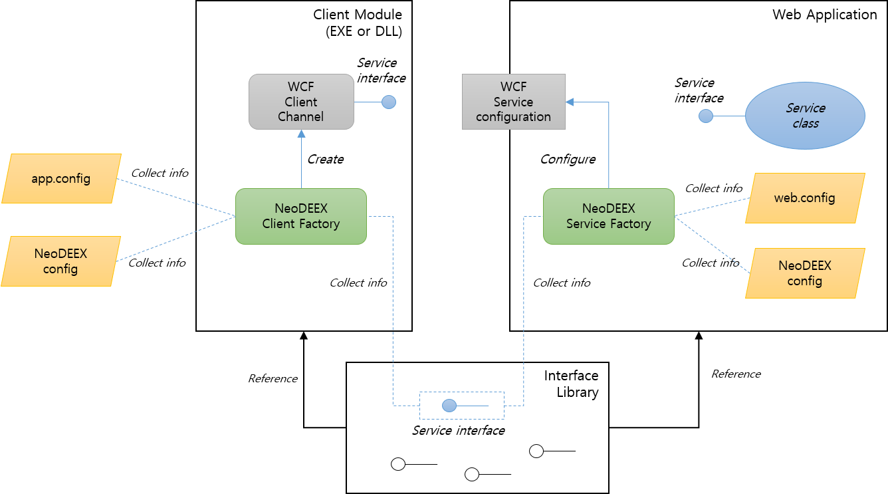

# Fox Web Services 기반 WCF 서비스/클라이언트 작성

이 문서는 Fox Web Services의 기능들을 사용하여 WCF 서비스와 클라이언트를 작성하는 방법에 대해 구체적이고 단계적으로 설명합니다. 이 과정에서 서비스 팩터리, 바인딩 맵 기능 등을 사용하는 방법도 소개할 것입니다. [WCF 기능들](features.md)에서 이들 기능의 상세한 설명을 찾아 볼 수 있습니다.

  
[그림1. Fox Web Services 기반 WCF 서비스/클라이언트 구성도]

* [How-to: WCF 서비스 구성](howto-service.md)

  * [서비스 인터페이스 라이브러리 작성](howto-service.md#서비스-인터페이스-라이브러리-작성)

  * [WCF 웹 프로젝트 작성](howto-service.md#WCF-웹-프로젝트-작성)

  * [WCF 서비스 추가](howto-service.md#WCF-서비스-추가)

  * [WCF 서비스 구현](howto-service.md#WCF-서비스-구현)

  * [Web.config 구성](howto-service.md#Web.config-구성)

  * [바인딩 맵 작성](howto-service.md#바인딩-맵-작성)

  * [WCF 서비스 테스트](howto-service.md#WCF-서비스-테스트)

  * [추가적인 WCF 서비스 구성](howto-service.md#추가적인-WCF-서비스-구성)

* [How-to: WCF 클라이언트 구성](howto-client.md)

  * [클라이언트 프로젝트 구성](howto-client.md#클라이언트-프로젝트-구성)

  * [App.config 구성](howto-client.md#App.config-구성)

  * [바인딩 맵과 주소 맵 구성](howto-client.md#바인딩-맵과-주소-맵-구성)

  * [서비스 호출 코드 작성](howto-client.md#서비스-호출-코드-작성)

  * [추가적인 서비스 호출](howto-client.md#추가적인-서비스-호출)

---